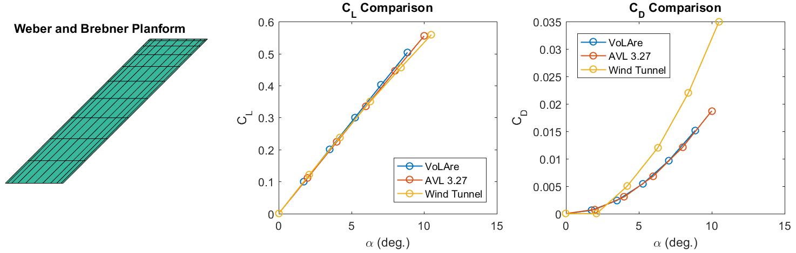
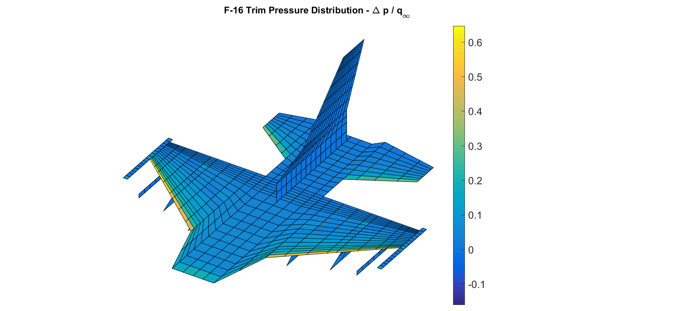

")

Vortex Lattice for Aeroelasticity (VoLAre) is a vortex lattice code that solves steady three-dimensional potential-flow aerodynamic trim problems.  VoLAre was created to provide nonlinear aeroelastic trim analysis that was needed for methods research in aeroelastic scaled-model design [1-2].

General-purpose commercial aeroelastic codes (e.g., Nastran) support aeroelastic trim, but not with nonlinear structures.  The research version of VoLAre was paired with custom spline tools and interfaced with Nastran for nonlinear aeroelastic trim analysis.  Implementation details are provided in [3].

This publicly-released version of VoLAre is significantly modified from the research version.  The main differences are:

1. [ZAERO]( https://www.zonatech.com/zaero.html)-formatted input is used for model definition.  Download and reference the ZAERO User’s Manual from ZONA Technology, Inc. while reading through VoLAre’s example input files. 
2. Trailing vortices now remain in the planar reference surface rather than curving along the mean camber surface. This approach significantly reduces the computational cost of calculating induced velocities while having a negligible impact on accuracy for most cases.  
3. Splining and aeroelastic coupling are not implemented in the public version yet (the irony with respect to the code’s name is acknowledged).  

If the original author adds aeroelastic capability to the public VoLAre version, it will probably be accomplished by merging VoLAre features into [Nastran CoFE]( https://github.com/vtpasquale/NASTRAN_CoFE) as part of a new static aeroelastic solution sequence.  That effort is not on the author’s current schedule.

Examples 1(a)-1(c) provide limited verification and validation through comparison of VoLAre to Weber and Brebner [4] wind tunnel results, results from Athena Vortex Lattice (AVL) [5], and results in Bertin [6].  The following figure shows lift and drag coefficient results for Example 1(b).  

Examples 3(a) and 3(b) are modifications of a publicly-available F-16 aeroelastic model (F16MA41) published by ZONA Technology, Inc. [7].  The examples demonstrate the convenience of ZAERO input formatting and VoLAre's ability to handle large and complex models (though vortex lattice method accuracy will be questionable for low aspect ratio delta wings).  The following figure shows a trim pressure contour for Example 3(b). 

References
==========

1. Ricciardi, A. P., Canfield, R. A., Patil, M. P., and Lindsley, N., ``Nonlinear Aeroelastic Scaled-Model Design,'' doi: [10.2514/1.C033171]( https://dx.doi.org/10.2514/1.C033171). Journal of Aircraft, Vol. 53, No. 1 (2016), pp. 20-32.
2. Ricciardi, A. P., Eger, C. A. G., Canfield, R. A., Patil, M. P., and Lindsley, N., ``Nonlinear Aeroelastic Scaled-Model Optimization Using Equivalent Static Loads,'' doi: [10.2514/1.C032539]( https://dx.doi.org/10.2514/1.C032539). Journal of Aircraft, Vol. 51, No. 6 (2014), pp. 1842-1851.
3. Ricciardi, A. P., ``Geometrically Nonlinear Aeroelastic Scaling,'' [Ph.D. Dissertation](http://hdl.handle.net/10919/24913), Virginia Tech, December 2013.
4. Weber, J. and Brebner, G. G. ``Low-speed Tests on 45-deg Sweptback Wings, Part I: Pressure Measurements on Wings of Aspect Ratio 5. In Reports and Memoranda 2882, Aeronautical Research Council,'' 1958.
5. Drela, M. and Youngren, H., ``[AVL User Primer](http://web.mit.edu/drela/Public/web/avl/avl_doc.txt)'', Accessed 2013.  
6. Bertin, J., ``Aerodynamics for Engineers 4th Edition'', Prentice Hall, 2001.  
7. ZAERO Version 9.2 Applications Manual Vol. 1. Section 2.5 Case 5: F-16 Aircraft with External Stores (F16MA41).  November 2016.  