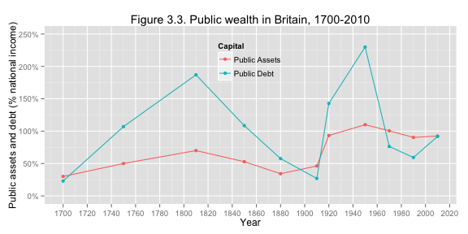
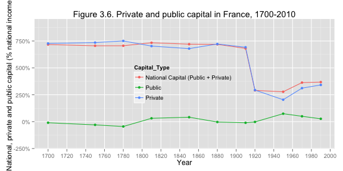

The Metamorphoses of Capital: Chapter 3
========================================================

### Data provenance

The data were downloaded as Excel files from: http://piketty.pse.ens.fr/en/capital21c2. 

### Loading relevant libraries and data

This document depends on the [xlsx](http://cran.r-project.org/web/packages/xlsx/index.html), [reshape2](http://cran.r-project.org/web/packages/reshape2/index.html), [scales](http://cran.r-project.org/web/packages/scales/index.html), and [ggplot2](http://cran.r-project.org/web/packages/ggplot2/index.html) packages.


```r
library(ggplot2)
library(xlsx)
library(reshape2)
### scales for percent of the axes
library(scales)
```


## Figures 3.1 and 3.2

These figures are based on Table TS3.1 and TS3.1. Here we read
data from the excel file and name the data series.


```r
## Table TS3.1
tab = read.xlsx("../Piketty2014FiguresTables/Chapter3TablesFigures.xlsx", sheetName = "TS3.1", 
    rowIndex = 9:19, colIndex = 1:10, header = FALSE)
names(tab) = c("year", "nat", "nat_land", "nat_house", "nat_dom", "nat_foreign", 
    "public", "public_ass", "public_debt", "private")
```


```r
## Table TS3.1
tab32 = read.xlsx("../Piketty2014FiguresTables/Chapter3TablesFigures.xlsx", 
    sheetName = "TS3.2", rowIndex = 9:19, colIndex = 1:10, header = FALSE)
names(tab32) = c("year", "nat", "nat_land", "nat_house", "nat_dom", "nat_foreign", 
    "public", "public_ass", "public_debt", "private")
```


The caption of the table lists the sources for this table
as 

> Source: Piketty-Zucman 2013, UK.xls, links frozen on 01-24-2013.   				

Let's make a function that will 

```r
run31_32 = function(tab, num, country) {
    fdat <- tab[, c("year", "nat_land", "nat_house", "nat_dom", "nat_foreign")]
    names(fdat) <- c("year", "Agricultural land", "Housing", "Other Domestic Capital", 
        "Net foreign capital")
    
    # Make the data long for stacking
    fdat <- melt(fdat, id.var = "year")
    names(fdat) <- c("year", "capital_type", "percent")
    
    qplot(year, percent, data = fdat, geom = "ribbon", position = "stack", fill = capital_type, 
        xlab = "Year", ylab = "Value of National Capital (% National Income)") + 
        scale_y_continuous(labels = percent, limits = c(0, 8)) + ggtitle(paste0("Figure ", 
        num, ". Capital in ", country, ", 1700-2010")) + theme(legend.position = "bottom", 
        legend.background = element_rect(fill = "transparent")) + scale_x_continuous(breaks = seq(1700, 
        2020, by = 20))
}
```


Now we make Figure F3.1:


```r
run31_32(tab, num = "3.1", "Britain")
```

```
## Warning: Removed 3 rows containing missing values (position_stack).
```

```
## ymax not defined: adjusting position using y instead
```

 


Figure F3.2:


```r
run31_32(tab32, num = "3.2", "France")
```

```
## ymax not defined: adjusting position using y instead
```

 


In Figure 3.1 and 3.2 of Piketty, the axes are equally spaced, but correspond to different periods of time such as the first two tickmarks represent 1700-1750, a period of 50 years, whereas the last 2 tickmarks represent 1990-2010, spanning 30 years, and the ones before span 1970-1990, only 20 years.  

## Figures 3.3 and 3.4
Let's make another function to create the plot for 3.3 and 3.4

```r
run_33_34 = function(tab, num, country) {
    fdat <- tab[, c("year", "public_ass", "public_debt")]
    names(fdat) <- c("year", "Public Assets", "Public Debt")
    fdat <- melt(fdat, id.var = "year")
    names(fdat) <- c("year", "Capital", "percent")
    
    qplot(year, percent, data = fdat, geom = c("line", "point"), colour = Capital, 
        xlab = "Year", ylab = "Public assets and debt (% national income)") + 
        scale_y_continuous(labels = percent, limits = c(0, 2.5)) + ggtitle(paste0("Figure ", 
        num, ". Public wealth in ", country, ", 1700-2010")) + theme(legend.position = c(0.5, 
        0.8), legend.background = element_rect(fill = "transparent")) + scale_x_continuous(breaks = seq(1700, 
        2020, by = 20))
}
```


Figure 3.3


```r
run_33_34(tab, "3.3", "Britain")
```

 


Figure 3.4


```r
run_33_34(tab32, "3.4", "France")
```

 


## Figures 3.5 and 3.6
Let's make another function to create the plot for 3.3 and 3.4

```r
run_35_36 = function(tab, num, country) {
    fdat <- tab[, c("year", "nat", "public", "private")]
    names(fdat) <- c("year", "National Capital (Public + Private)", "Public", 
        "Private")
    fdat <- melt(fdat, id.var = "year")
    names(fdat) <- c("year", "Capital_Type", "percent")
    
    qplot(year, percent, data = fdat, geom = c("line", "point"), colour = Capital_Type, 
        xlab = "Year", ylab = "National, private and public capital (% national income)") + 
        scale_y_continuous(labels = percent, limits = c(-2, 9)) + ggtitle(paste0("Figure ", 
        num, ". Private and public capital in ", country, ", 1700-2010")) + 
        theme(legend.position = c(0.5, 0.5), legend.background = element_rect(fill = "transparent")) + 
        scale_x_continuous(breaks = seq(1700, 2020, by = 20))
}
```


Figure 3.3


```r
run_35_36(tab, "3.5", "Britain")
```

 


Figure 3.4


```r
run_35_36(tab32, "3.6", "France")
```

 

