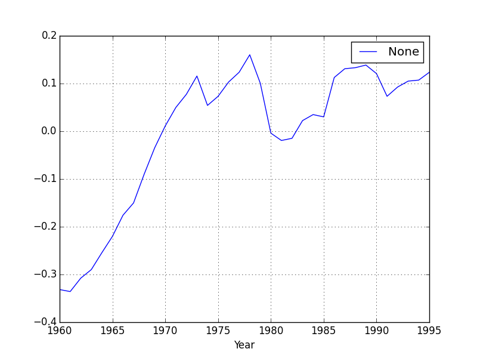

```python
import pandas as pd

df = pd.read_csv('TableF2-2.txt',sep='\s*')
df['Ln_G_Pop'] = np.log(df.G/df.Pop)
df = df.dropna()
df.plot(x='Year',y='Ln_G_Pop')
plt.savefig('test_01.png')
plt.hold(False)
```




