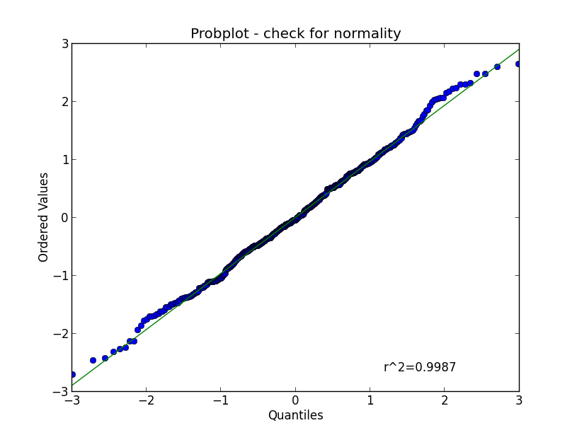
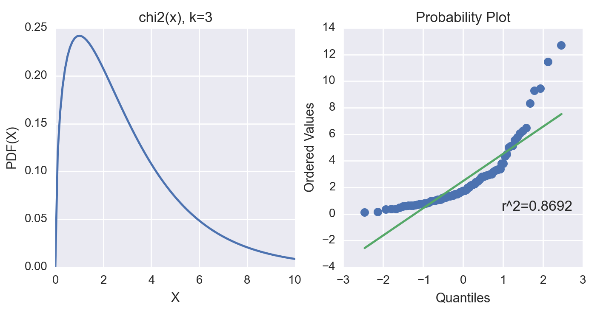
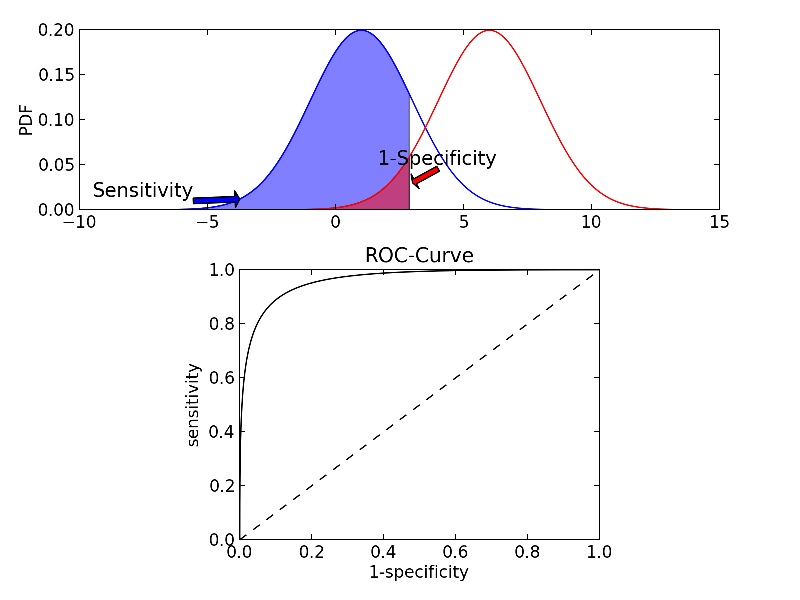
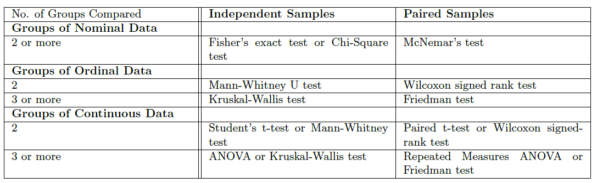
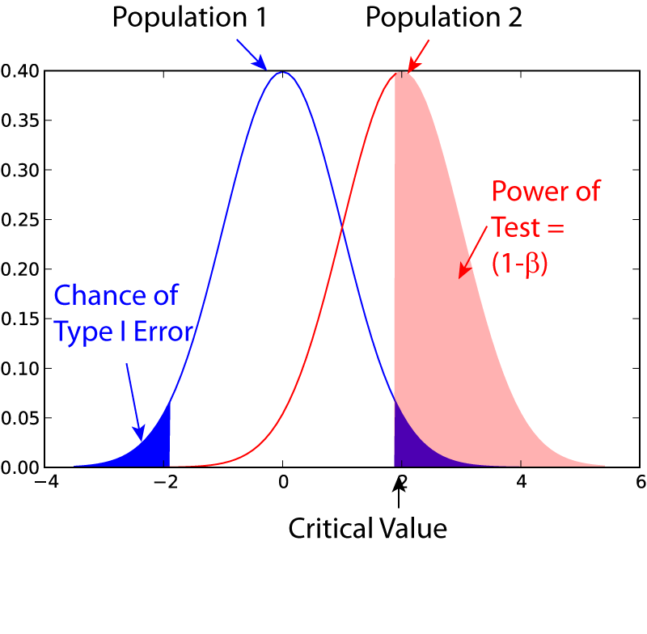
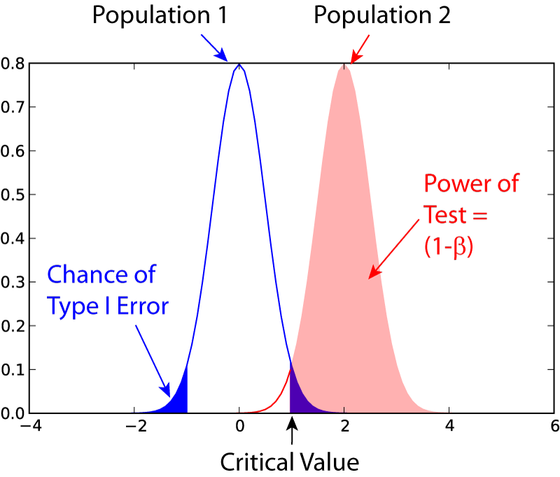
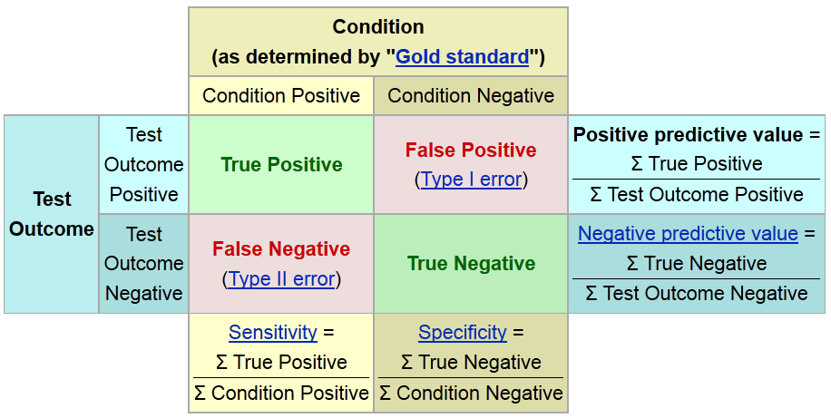
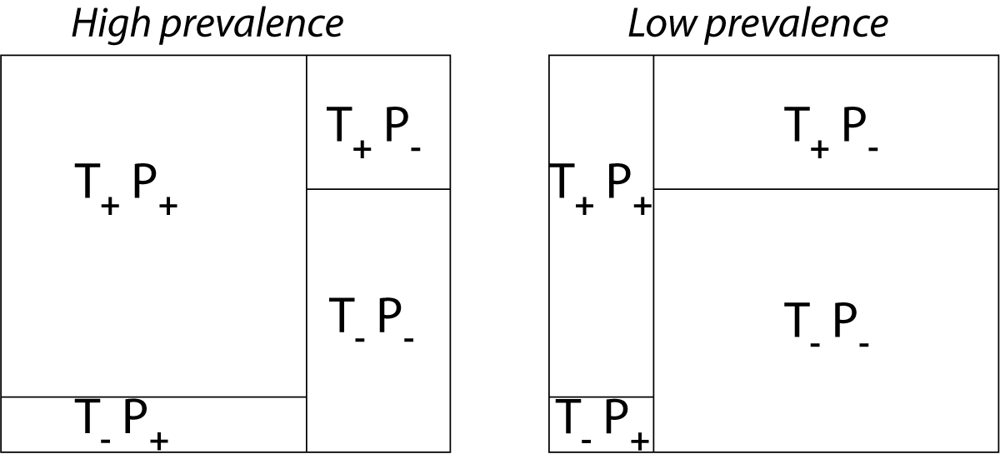
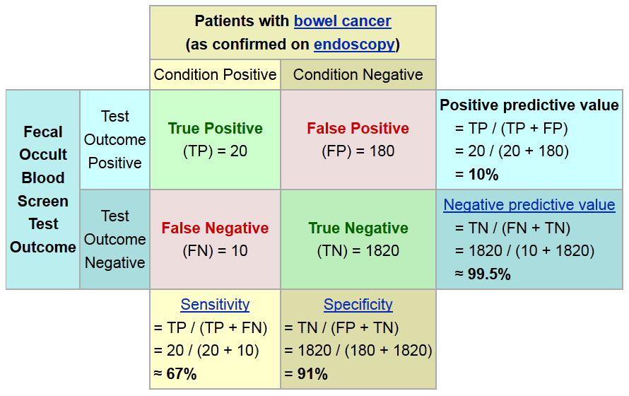

.. image:: ..\Images\title_tests.png
    :height: 100 px

.. Statistical Data Analysis
.. =========================

Typical Analysis Procedure
--------------------------

In "the old days" (before computers with almost unlimited computational power were available), the statistical analysis of data was typically restricted to hypothesis tests: you formulate a hypothesis, collect your data, and then accept or reject the hypothesis. The resulting hypothesis tests form the basic framework for by far most analyses in  medicine and life sciences, and the most important hypotheses tests will be described in the following chapters.

The advent of powerful computers changed the game. Nowadays, the analysis of statistical data is (or at least should be) a highly interactive process: you look at the data, generate hypotheses and models, check these models, modify them to improve the correspondence between models and data; when you are happy, you calculate the confidence interval for your model parameters, and form your interpretation based on these values. An introduction into this type of statistical analysis is provided in chapter \ref{chapter:Models}.

In either case, you should start off with the following steps:

  - Visually inspect your data.
  - Find outliers, and check them carefully.
  - Determine the data-type of your values.
  - If you have continuous data, check whether or not they are normally distributed.
  - Select and apply the appropriate test, or start with the model-based analysis of your data.

Data Screening
~~~~~~~~~~~~~~

The first thing you have to do in your data analysis is simply *inspect your data visually*. Our visual system is enormously powerful, and if your data are properly displayed, you will often be able to see trends that may characterize the data. You should check for *missing data* in your data set, and *outliers* which can significantly influence the result of your analysis.

Outliers
^^^^^^^^

While there is no unique definition of *outliers*, they are often defined as data that lie either more than 1.5*IQR (inter-quartile range), or more than 2 standard deviations, from the mean corresponding data value. Outliers often fall in one of two groups: they are either caused by mistakes in the recording, in which case they should be excluded; or they constitute very important and valuable data points, in which case they have to be included in the data analysis. To decide which of the two is the case, you have to check the underlying raw data (for saturation or invalid data values), and the protocols from your experiments (for mistakes that may have occurred during the recording). If you find an underlying problem, then - and only then - may you eliminate the outliers from the analysis. In every other case, you have to keep them!

Normality Check
~~~~~~~~~~~~~~~

Statistical hypothesis tests can be grouped into *parametric tests* and *non-parametric tests*. Parametric tests assume that the data can be well described by a distribution that is defined by one or more parameters, in most cases by a normal distribution. For the given data set, the best-fit parameters for this distribution are then determined, together with their confidence intervals, and interpreted.

However, this approach only works if the given data set is in fact well approximated by the chosen distribution. If not, the results of the parametric test can be completely wrong. In that case non-parametric tests have to be used which are less sensitive, but therefore do not depend on the data following a specific distribution.

Here we will focus on tests for normality. Again, you should start out with a visual inspection of the data, here with a *QQ-plot*, sometimes also referred to as *probplot*. For a quantitative evaluation one of the many existing normality tests should then be applied.

    *QQ-Plot, to check for normality of distribution.*

QQ-plots
^^^^^^^^

In statistics, *QQ`plots* ("Q" stands for quantile)
are used for visual assessments of distributions. They are a graphical
method for comparing two probability distributions by plotting their
quantiles against each other. First, the set of intervals for the quantiles
are chosen. A point :math:`(x,y)` on the plot corresponds to one of the
quantiles of the second distribution (y-coordinate) plotted against the same
quantile of the first distribution (x-coordinate). Thus the line is a
parametric curve with the parameter which is the (number of the) interval
for the quantile.

If the two distributions being compared are similar, the points in the
:math:`Q-Q` plot will approximately lie on the line :math:`y = x`. If
the distributions are linearly related, the points in the :math:`Q-Q`
plot will approximately lie on a line, but not necessarily on the line
:math:`y = x`.

In Python, the plot can be generated with the command

::

    stats.probplot(data, plot=plt)

    *QQ-Plot for chi2-distribution (k=3), which is clearly non-normal.*

Hypothesis Tests for Normality
^^^^^^^^^^^^^^^^^^^^^^^^^^^^^^

Tests to evaluate normality or a specific distribution can be broadly divided into two categories:

  - Tests based on comparison ("best fit") with a given distribution, often specified in terms of its CDF. Examples are the Kolmogorov-Smirnov test, the Lilliefors test, the Anderson-Darling test, the Cramer-von Mises criterion, as well as the Shapiro-Wilk and Shapiro-Francia tests.
  - Tests based on descriptive statistics of the sample. Examples are the skewness test, the kurtosis test, the D'Agostino-Pearson omnibus test, or the Jarque-Bera test.

For example, the *Lilliefors test*, which is based on the *Kolmogorov--Smirnov test* , quantifies a distance between the empirical distribution function of the sample and the cumulative distribution function of the reference distribution, or between the empirical distribution functions of two samples. (The original Kolmogorov-Smirnov test should be used carefully, especially if the number of samples is ca. :math:`\leq 300`).

Altman mainly uses the *Shapiro-Wilk W test*, , which can also be used with :math:`\leq 50` samples, and which depends on the covariance matrix between the order statistics of the observations.

The Python command *stats.normaltest(x)* uses the D'Agostino-Pearson *omnibus test* . This test combines a skewness and kurtosis test to produce a single, global, "omnibus" statistic.

.. image:: ../Images/KS_example.png
    :scale: 50 %

*Illustration of the Kolmogorov-Smirnoff statistic. Red line is CDF, blue
line is an ECDF, and the black arrow is the K-S statistic(from Wikipedia).*

|python| `checkNormality.py <https://github.com/thomas-haslwanter/statsintro/blob/master/Code3/checkNormality.py>`_
shows how to check graphically and quantitatively if a given distribution is normal.

Transformation
~~~~~~~~~~~~~~

If your data deviate significantly from a normal distribution, it is
sometimes possible to make the distribution approximately normal by
transforming your data. For example, data often have values that can
only be positive (e.g. the size of persons), and that have long positive
tail: such data can often be made normal by applying a *log transform*.

Hypothesis tests
----------------

Statistical evaluations are based on the initially
often counterintuitive procedure of *hypothesis tests*. A hypothesis
test is a standard format for assessing statistical evidence. It is
ubiquitous in scientific literature, most often appearing in the form of
statements of *statistical significance* and quotations like
:math:`"p<0.01"` that pepper scientific journals. Thereby you proceed as
follows: you

-  state your hypothesis.

-  decide which value you want to test your hypothesis on.

-  calculate the *probability p* that you find the given value, assuming
   that your hypothesis is true

The first hypothesis is referred to as *null-hypothesis*, since we
assume that there is *null* difference between the hypothesis and the
result. The found probability for a specific target value is the
*p-value* that you typically find in the literature. If :math:`p<0.05`,
the difference between your sample and the value that you check is
*significant*. If :math:`p<0.001`, we speak of a *highly significant*
difference.

**Example 1:**  Let us compare the weight of two groups of subject. Then the
*null hypothesis* is that there is *null* difference in the weight
between the two groups. If a statistical comparison of the weight produces a
p-value of 0.03, this means that "the probability that the null hypothesis
is correct is 0.03, or 3\%". Since this probability is quite low, we say that
"there is a significant difference between the weight of the two groups".

**Example 2:** If we want to check the assumption that the mean value of a group
is 7, then the null hypothesis would be: "We assume that there is null
difference between the mean value in our population and the value 7."

Types of Error
~~~~~~~~~~~~~~~

In hypothesis testing, two types of errors can occur:

Type I errors
^^^^^^^^^^^^^

These are errors, where you get a significant result despite the fact
that the hypothesis is true. The likelihood of a Type I error is
commonly indicated with :math:`\alpha`, and *is set before you start the
data analysis*.

For example, assume that the population of young Austrian adults has a
mean IQ of 105 (i.e. we are smarter than the rest) and a standard
deviation of 15. We now want to check if the average FH student in Linz
has the same IQ as the average Austrian, and we select 20 students. We
set :math:`\alpha=0.05`, i.e. we set our significance level to 95%. Let
us now assume that the average student has in fact the same IQ as the
average Austrian. If we repeat our study 20 times, we will find one of
those 20 times that our sample mean is significantly different from the
Austrian average IQ. Such a finding would be a false result, despite the
fact that our assumption is correct, and would constitute a *type I
error*.

Type II errors and Test Power
^^^^^^^^^^^^^^^^^^^^^^^^^^^^^

If we want to answer the question "How much chance do we have to reject
the null hypothesis when the alternative is in fact true?" Or in other
words, "What’s the probability of detecting a real effect?" we are faced
with a different problem. To answer these questions, we need an
*alternative hypothesis*.

For the example given above, an *alternative hypothesis* could be: "We
assume that our population has a mean value of 6."

A *Type II error* is an error, where you do *not* get a significant
result, despite the fact that the null-hypothesis is false. The
probability for this type of error is commonly indicated with
:math:`\beta`. The *power* of a statistical test is defined as
:math:`(1-\beta)*100`, and is the chance of correctly accepting the
alternate hypothesis. Figure [fig:power1] shows the meaning of the
*power* of a statistical test. Note that for finding the power of a
test, you need an alternative hypothesis.

Sample Size
~~~~~~~~~~~

The power of a statistical test depends on four factors:

#. :math:`\alpha`, the probability for Type I errors

#. :math:`\beta`, the probability for Type II errors (
   :math:`\Rightarrow` power of the test)

#. :math:`d`, the *effect size*, i.e. the magnitude of the investigated effect relative to
   :math:`\sigma`, the standard deviation of the sample

#. :math:`n`, the sample size

Only 3 of these 4 parameters can be chosen, the :math:`4^{th}` is then
automatically fixed.

The size of the absolute difference *D* between mean treatment outcomes
that will answer the clinical question being posed is often called
*clinical significance* or *clinical relevance*.

| |image21|

*Power of a statistical test, for comparing the mean value of two given distributions.*

| |image22|

*Eect of an increase in sampling size on the power of a test.*

Examples for some special cases 
^^^^^^^^^^^^^^^^^^^^^^^^^^^^^^^^^
 
**Test on one mean:** if we have the hypothesis that the data population has
a mean value of :math:`x_1` and a standard deviation of :math:`\sigma`, and the actual
population has a mean value of :math:`x_1+D` and the same standard deviation, we
can find such a difference with a *minimum sample number* of

.. math:: n = \frac{{({z_{1 - \alpha /2}} + {z_{1 - \beta }})}^2}{d^2}

Here z is the standardized normal variable (see also chapter
"Normal Distribution")

.. Math:: z = \frac{x-\mu}{\sigma} .

and :math:`d = \frac{D}{\sigma}` the effect size.

In words, if the real mean has a value of :math:`x_1`, we want to detect this
correctly in at least :math:`1-\alpha\%` of all tests; and if the real mean is
shifted by :math:`D` or more, we want to detect this with a likelihood of at least
:math:`1-\beta\%`.

**Test between two different populations:**

For finding a difference between two normally distributed means, the
minimum number of samples we need in each group to detect an absolute difference *D* is

.. math:: {n_1} = {n_2} = \frac{{({z_{1 - \alpha /2}} + {z_{1 - \beta }})}^2(\sigma _1^2 + \sigma _2^2)}{D^2} .

Python Solution
^^^^^^^^^^^^^^^

*statsmodels* makes clever use of the fact that 3 of the 4 factors mentioned
above are independent, and combines it with the Python feature of
*named parameters* to provide a program that takes 3 of those
parameters as input, and calculates the remaining 4th parameter.

For example, 

::

    from statsmodels.stats import power
    print(power.tt_ind_solve_power(effect_size = 0.5, alpha =0.05, power=0.8))
    # Result: 63.77

tells us that if we compare two groups with the same number of subjects and
the same standard deviation, require an :math:`\alpha=0.05` a test power of
*80%*, and we want to detect a difference between the groups that is half
the standard deviation, we need to test 64 subjects.

Similarly, 

::

    effect_size = power.tt_ind_solve_power(alpha =0.05, power=0.8, nobs1=25)
    # Result: 0.81

tells us that if we have an :math:`\alpha=0.05`, a test power of *80\%*, and
25 subjects in each group, then the smallest difference between the groups
is 81\% of the sample standard deviation.

The corresponding command for one sample t-tests is *tt_solve_power*.

Programs: SampleSize 
^^^^^^^^^^^^^^^^^^^^^^

|python| `sampleSize.py <https://github.com/thomas-haslwanter/statsintro/blob/master/Code3/sampleSize.py>`_
*Sample size calculation for normally distributed groups with arbitrary standard deviations.*

The "p-value fallacy"
~~~~~~~~~~~~~~~~~~~~~

p values are often used to measure evidence against a hypothesis.
Unfortunately, they are often incorrectly viewed as an error probability
for rejection of the hypothesis, or, even worse, as the posterior
probability (i.e. after the data have been collected) that the
hypothesis is true. As an example, take the case where the alternative
hypothesis is that the mean is just a fraction of one standard deviation
larger than the mean under the null hypothesis: in that case, a sample
that produces a p-value of 0.05 may just as likely be produced if the
the alternative hypothesis is true as if the null hypothesis is true!

Sellke et al (2001) have investigated this question in detail, and recommend to use a
"calibrated p-value" to estimate the probability of making a mistake
when rejecting the null hypothesis, when the data produce a p-value
:math:`p`:

.. math::

   \label{eq:pFallacy}
       \alpha(p)= \frac{1}{1 + \frac{1}{-e \; p \; log(p)}}

with :math:`e=exp(1)`, and :math:`log` the natural logarithm. For
example, :math:`p=0.05` leads to :math:`\alpha=0.29`, and :math:`p=0.01`
to :math:`\alpha=0.11`.

Remember, p only indicates the likelihood of obtaining a certain value
for the test statistic if the null hypothesis is true - nothing else!

And keep in mind that improbable events do happen, even if not very
frequently. For example, back in 1980 a woman named Maureen Wilcox bought
tickets for both the Rhode Island lottery and the Massachusetts lottery. And
she got the correct numbers for both lotteries. Unfortunately for her, she
picked all the correct numbers for Massachusetts on her Rhode Island ticket,
and all the  right numbers for Rhode island on her Massachusetts ticket :(
Seen statistically, the p-value for such an event would be extremely small -
but it did happen anyway.

Sensitivity and Specificity 
-----------------------------

Some of the more confusing terms in statistical analysis are
*sensitivity* and *specificity* . A related topic are *positive
predictive value (PPV)* and *negative predictive value (NPV)* . The
following diagram shows how the four are related:

| |image23|

*Relationship between sensitivity, specicity, positive predictive value and negative
predictive value. (From: Wikipedia)*

-  **Sensitivity** = proportion of positives that are correctly
   identified by a test = probability of a positive test, given the
   patient is ill.

-  **Specificity** = proportion of negatives that are correctly
   identified by a test = probability of a negative test, given that
   patient is well.

-  **Positive predictive value** is the proportion of patients with
   positive test results who are correctly diagnosed.

-  **Negative predictive value** is the proportion of patients with
   negative test results who are correctly diagnosed.

While sensitivity and specificity are independent of prevalence, they do
not tell us what portion of patients with abnormal test results are
truly abnormal. This information is provided by the positive/negative
predictive value. However, as Fig. [fig:prevalence] indicates, these
values are affected by the *prevalence* of the disease. In other words,
we need to know the prevalence of the disease as well as the PPV/NPV of
a test to provide a sensible interpretation of the test results.

| |image24|

*Eect of prevalence on PPV and NPV. "T" stands for "test", and "P" for "patient".(For comparison with below: T+P+ = TP, T-P- = TN, T+P- = FP, and T-P+ = FN)*

The Figure gives a worked example:

| |image25|

*Worked example. (From: Wikipedia)*

Related calculations
~~~~~~~~~~~~~~~~~~~~~

-  False positive rate (:math:`\alpha`) = type I error =
   :math:`1-specificity` = :math:`\frac{FP}{FP + TN}` =
   :math:`\frac{180}{180+1820}` = 9%

-  False negative rate (:math:`\beta`) = type II error =
   :math:`1−sensitivity` = :math:`\frac{FN}{TP + FN}` =
   :math:`\frac{10}{20+10}` = 33%

-  Power = sensitivity = :math:`1−\beta`

-  Likelihood ratio positive = :math:`\frac{sensitivity}{1−specificity}`
   = :math:`\frac{66.67\%}{1−91\%}` = 7.4

-  Likelihood ratio negative = :math:`\frac{1−sensitivity}{specificity}`
   = :math:`\frac{1−66.67\%}{91\%}` = 0.37

Hence with large numbers of false positives and few false negatives, a
positive FOB screen test is in itself poor at confirming cancer (PPV =
10%) and further investigations must be undertaken; it did, however,
correctly identify 66.7% of all cancers (the sensitivity). However as a
screening test, a negative result is very good at reassuring that a
patient does not have cancer (NPV = 99.5%) and at this initial screen
correctly identifies 91% of those who do not have cancer (the
specificity).

ROC Curves
-----------
Closely related to *Sensitivity* and *Specificity* is the *receiver operating characteristic (ROC)* curve. This is a graph displaying the relationship between the true positive rate (on the vertical axis) and the false positive rate (on the horizontal axis). The technique comes from the field of engineering, where it was developed to find the predictor which best discriminates between two given distributions. In the ROC-curve (see figure below) this point is given by the value with the largest distance to the diagonal.

*Top: Probability density functions for two distributions. Bottom: corresponding ROC-curve*

Common Statistical Tests for Comparing Groups of Independent and Paired Samples
-------------------------------------------------------------------------------

The table below gives an overview of the most common statistical
tests for different combinations of data.

Examples
~~~~~~~~

  - **2 groups, nominal** male/female, blond-hair/black-hair. E.g. "Are females more blond than males?"
  - **2 groups, nominal, paired** 2 labs, analysis of blood samples. E.g. "Does the blood analysis from Lab1 indicate more infections than the analysis from Lab2?"
  - **2 groups, ordinal** black/white, ranking 100m sprint. E.g. "Are black sprinters more successful than white sprinters?"
  - **2 groups, ordinal, paired** sprinters, before/after diet. E.g. "Does a chocolate diet make sprinters more successful?"
  - **3 groups, ordinal** black/white/chinese, ranking 100m sprint. E.g. "Does ethnicity have an effect on the success of sprinters?"
  - **3 groups, ordinal, paired** sprinters, before/after diet. E.g. "Does a rice diet make Chinese sprinters more successful?"
  - **2 groups, continuous** male/female, IQ. E.g. "Are women more intelligent than men?"
  - **2 groups, continuous, paired** male/female, looking at diamonds. E.g. "Does looking at diamonds raise the female heart-beat more than the male?
  - **3 groups, continuous** Tyrolians, Viennese, Styrians; IQ. E.g. "Are Tyrolians smarter than people from other Austrian federal states?"
  - **3 groups, continuous, paired** Tyrolians, Viennese, Styrians; looking at mountains. E.g. "Does looking at mountains raise the heartbeat of Tyrolians more than those of other people?"

.. |ipynb| image:: ../Images/IPython.jpg
    :scale: 50 % 
.. |python| image:: ../Images/python.jpg
    :scale: 50 % 
