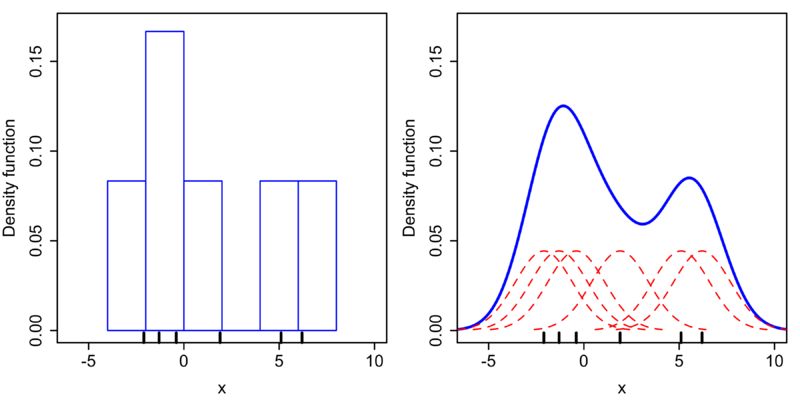
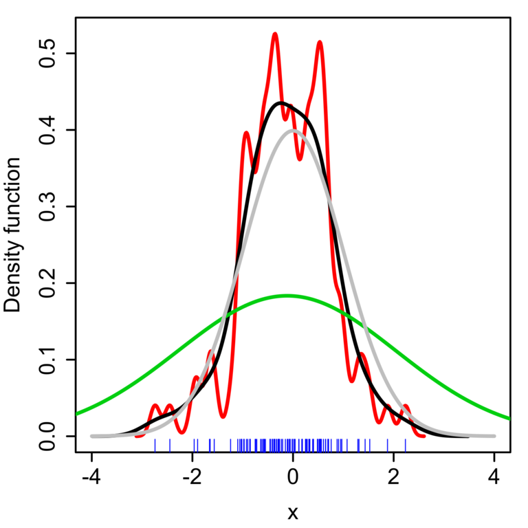
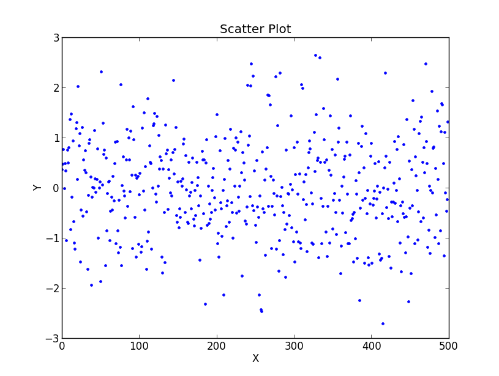
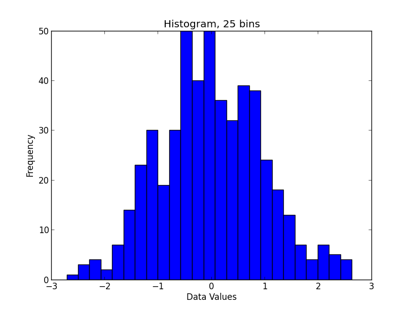
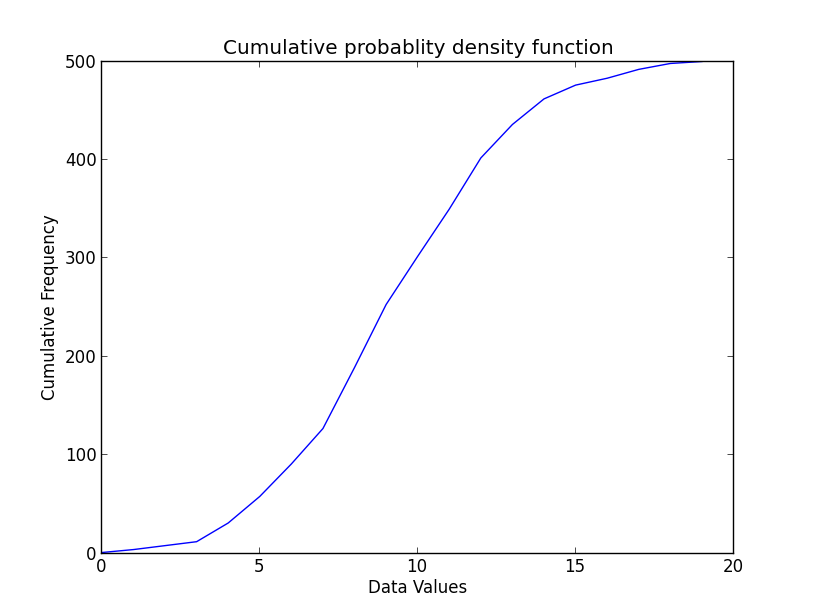
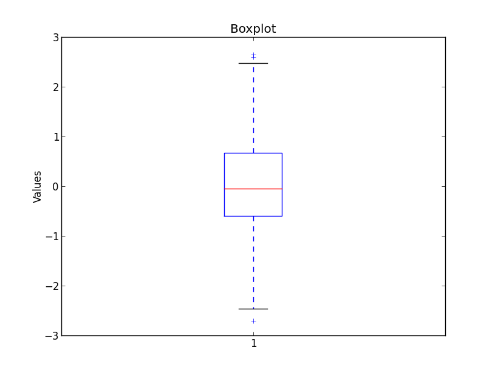

.. image:: ..\Images\title_basics.png
    :height: 100 px

.. Basic Principles
.. ================

Population and samples
----------------------

While the whole *population* of a group has certain characteristics, we
can typically never measure all of them. Instead, we have to confine
ourselves to investigate a representative *sample* of this group, and
estimate the properties of the population. Great care should be used to
make the sample representative for the population you study.

Datatypes
---------

The type of your data is essential for the choice of test that you have
to use for your data analysis. Your data can have one of the following
datatypes:

Categorical 
~~~~~~~~~~~

boolean 
^^^^^^^

Some data can only have two values. For example,

#. male/female

#. smoker/non-smoker

nominal 
^^^^^^^

Many classifications require more than two categories, e.g. *married /
single / divorced*

ordinal 
^^^^^^^

These are ordered categorical data, e.g. *very few / few / some / many
/ very many*

Numerical 
~~~~~~~~~

Numerical discrete 
^^^^^^^^^^^^^^^^^^^^

For example *Number of children: 0 1 2 3 4 5*

Continuous 
~~~~~~~~~~~~

Whenever possible, it is best to record the data in their original
continuous format, and only with a sensible number of decimal places.
For example, it does not make sense to record the body size with more
than 1 mm accuracy, as there are larger changes in body height between
the size in the morning and the size in the evening, due to compression
of the intervertebral disks.

Data Display
------------

When working with a statistical data set, you should *always* first look
at the raw-data. Our visual system is incredibly good at recognizing
patterns in visually represented data.

Scatter Plots 
~~~~~~~~~~~~~

This is the simplest way of representing your data: just plot each
individual data point. (In cases where many data points are superposed,
you may want to add a little bit of jitter to show each data point.)

| |image3|

Histograms 
~~~~~~~~~~~~

*Histograms* provide a first good overview of the distribution of your
data. If you divide by the overall number of data points, you get a
*relative frequency histogram*; and if you just connect the top center
points of each bin, you obtain a *relative frequency polygon*.

| |image4|

KDE Plots
~~~~~~~~~

For the kernel density estimate, we place a normal kernel with variance 2.25 (indicated by the red dashed lines) on each of the data points xi. The kernels are summed to make the kernel density estimate (solid blue curve). The smoothness of the kernel density estimate is evident compared to the discreteness of the histogram, as kernel density estimates converge faster to the true underlying density for continuous random variables.

*Comparison of the histogram (left) and kernel density estimate (right) constructed using the same data. The 6 individual kernels are the red dashed curves, the kernel density estimate the blue curves. The data points are the rug plot on the horizontal axis. (from Wikipedia)*

The bandwidth of the kernel is a free parameter which exhibits a strong influence on the resulting estimate. To illustrate its effect, we take a simulated random sample from the standard normal distribution (plotted at the blue spikes in the rug plot on the horizontal axis). The grey curve is the true density (a normal density with mean 0 and variance 1). In comparison, the red curve is undersmoothed since it contains too many spurious data artifacts arising from using a bandwidth h = 0.05 which is too small. The green curve is oversmoothed since using the bandwidth h = 2 obscures much of the underlying structure. The black curve with a bandwidth of h = 0.337 is considered to be optimally smoothed since its density estimate is close to the true density.

*Kernel density estimate (KDE) with different bandwidths of a random sample of 100 points from a standard normal distribution. Grey: true density (standard normal). Red: KDE with h=0.05. Green: KDE with h=2. Black: KDE with h=0.337. (from Wikipedia)*

It can be shown that under certain conditions the optimal choice for h is

.. math:: h = \left(\frac{4\hat{\sigma}^5}{3n}\right)^{\frac{1}{5}} \approx 1.06 \hat{\sigma} n^{-1/5},

where :math:`\hat{\sigma}` is the standard deviation of the samples.

Cumulative Frequencies 
~~~~~~~~~~~~~~~~~~~~~~~~

*Cumulative frequency* curves indicate the number (or percent) of data
with less than a given value. This is important for the statistical
analysis (e.g. when we want to know the data range containing 95% of all
the values). Cumulative frequencies are also useful for comparing the
distribution of values in two or more different groups of individuals.

When you use percentage points, the cumulative frequency presentation
has the additional advantage that it is bounded:

.. math:: 0 \leq x \leq 1

| |image5|

Box Plots 
~~~~~~~~~~~

*Box plots* are frequently used in scientific publications to indicate
values in two or more groups. The error bars typically indicate the
*range*. However, outliers are often excluded, and plotted separately.
There are a number of tests to check for outliers. One of them is to
check for data which lie more than 1.5 \* *inter-quartile-range* (IQR)
above or below the first/third quartile.

| |image6|

*Boxplot, with outliers indicated by "\*"*

Boxplots are often combined with KDE-plots to produce so-called
*violin-plots* as shown in the Figure below.

.. image:: ..\Images\violinplot.png
    :scale: 75 %

*Violinplot, produced with the Python package "seaborn".*

Programs: Data Display 
~~~~~~~~~~~~~~~~~~~~~~~~
|ipynb| `20_figs_BasicPrinciples.ipynb <http://nbviewer.ipython.org/url/raw.github.com/thomas-haslwanter/statsintro/master/ipynb/20_figs_BasicPrinciples.ipynb>`_

Study Design 
--------------

To design a medical study properly is not only advisable - it is even
required by ISO 14155-1:2003, for *Clinical investigations of medical
devices for human subjects*. This norm specifies many aspects of your
clinical study. It enforces the preparation of a *Clinical Investigation
Plan (CIP)*, specifying

-  The designation of a *monitor* for the investigation.

-  The designation of a *clinical investigator*.

-  Specification the data handling.

-  Specification of the inclusion/exclusion criteria for the subjects.

-  Specification of the paradigm.

-  Specification and justification of the chosen sample numbers.

-  Description of the data analysis.

Types of Studies
~~~~~~~~~~~~~~~~

Observational or experimental 
^^^^^^^^^^^^^^^^^^^^^^^^^^^^^^^

With *observational* studies the researcher only collects information,
but does not interact with the study population. In contrast, in
*experimental* studies the researcher deliberately influences events
(e.g. treats the patient with a new type of treatment) and investigates
the effects of these interventions.

Prospective or retrospective 
^^^^^^^^^^^^^^^^^^^^^^^^^^^^^^

In *prospective* studies the data are collected, starting with the
beginning of the study. In contrast, a *retrospective* study takes data
acquired from previous events, e.g. routine tests taken at a hospital.

Longitudinal or cross-sectional 
^^^^^^^^^^^^^^^^^^^^^^^^^^^^^^^^^

In *longitudinal* investigations, the researcher collects information
over a period of time, maybe multiple times from each patient. In
contrast, in *cross-sectional* studies individuals are observed only
once. For example, most surveys are cross-sectional, but experiments are
usually longitudinal.

Case control and Cohort studies 
^^^^^^^^^^^^^^^^^^^^^^^^^^^^^^^^^

In *case control* studies, first the patients are treated, and then they
are selected for inclusion in the study, based on some characteristic
(e.g. if they responded to a certain medication). In contrast, in
*cohort studies*, first subjects of interest are selected, and then
these subjects are studied over time, e.g. for their response to a
treatment.

Design of Experiments 
~~~~~~~~~~~~~~~~~~~~~~~

Bias 
^^^^^^

In general, when selecting our subject you try to make them
representative of the population that you want to study; and you try to
conduct your experiments in a way representative of investigations by
other researchers. However, it is *very* easy to get a *bias* into your
data. Bias can arise from a number of sources:

-  The selection of subjects.

-  The structure of the experiment.

-  The measurement device.

-  The analysis of the data.

Care should be taken to avoid bias as much as possible.

Randomized controlled trial 
^^^^^^^^^^^^^^^^^^^^^^^^^^^^^

The gold standard for experimental scientific clinical trials is the
*randomized controlled trial*. Thereby bias is avoided by splitting the
subjects to be tested into an *intervention group* and a *control
group*. The group allocation is made *random*. By having the groups
differ in only one aspect, i.e. is the factor *treatment*, we should be
able to detect the effect of the treatment on the patients. Factors that
can affect the outcome of the experiment are called *covariates* or
*confoundings*. Through *randomization*, covariates should be balanced
across the groups.

Randomization 
^^^^^^^^^^^^^^^

This may be one of the most important aspects of experimental planning.
Randomization is used to avoid bias as much as possible, and there are
different ways to randomize an experiment. For the randomization,
*random number generators*, which are available with most computer
languages, can be used. To minimize the chance of bias, the randomly
allocated numbers should be presented to the experimenter as late as
possible.

Depending on the experiment, there are different ways to randomize the
group assignment.

Simple randomization
''''''''''''''''''''

This procedure is robust against selection and accidental bias. The
disadvantage is that the resulting groupsize can differ significantly.

For many types of data analysis it is important to have the same sample
number in each group. To achieve this, other options are possible:

Block randomization
'''''''''''''''''''

This is used to keep the number of subjects in the different groups
closely balanced at all times. For example, if you have two types of
treatment, A and B, you can allocate them to two subjects in the
following blocks:

#. AABB

#. ABAB

#. ABBA

#. BBAA

#. BABA

#. BAAB

Based on this, you can use a random number generator to generate random
integers between 1 and 6, and use the corresponding blocks to allocate
the respective treatments. This will keep the number of subjects in each
group always almost equal.

Minimization
''''''''''''

A closely related, but not completely random way to allocate a treatment
is *minimization*. Thereby you take whichever treatment has the smallest
number of subjects, and allocate this treatment with a probability
greater than 0.5 to the next patient.

Stratified randomization
''''''''''''''''''''''''

Sometimes you may want to include a wider variety of subjects, with
different characteristics. For example, you may choose to have younger
as well as older subjects. In that case you should try to keep the
number of subjects within each *stratum* balanced. For this you will
have to keep different lists of random numbers for each group of
subjects.

Crossover studies 
^^^^^^^^^^^^^^^^^^^

An alternative to randomization is the *crossover* design of studies. A
crossover study is a longitudinal study in which subjects receive a
sequence of different treatments. Every subject receives every
treatment. To avoid causal effects, the sequence of the treatment
allocation should be randomized.

Blinding 
^^^^^^^^^^

Consciously or not, the experimenter can significantly influence the outcome
of an experiment. For example, a young researcher with a new "brilliant"
idea for a new treatment will be bias in the execution of the experiment, as
well in the analysis of the data, to see his hypothesis confirmed. To avoid
such a subjective influence, ideally the experimenter as well as the subject
should be blinded to the therapy. This is referred to as *double blinding*.
If also the person who does the analysis does not know which group the
subject has been allocated to, we speak about *triple blinding*.

Replication 
^^^^^^^^^^^^^

For variable measurements it is helpful to have a number of independent
repetitions of each measurement.

Sample selection 
^^^^^^^^^^^^^^^^^^

When selecting your subjects, you should take care of two points:

#. Make sure that the samples are representative of the population.

#. In comparative studies, care is needed in making groups similar with
   respect to known sources of variation.

For example, if you select your subjects randomly from patients at a
hospital, you automatically bias your sample towards subjects with
health problems.

Sample size 
^^^^^^^^^^^^^

Many studies fail, because the sample size is too small to observed an
effect of the desired magnitude. To plan your sample size, you have to
know

-  What is the variance of the parameter in the population you are
   investigating.

-  What is the magnitude of the effect you are interested in, relative
   to the standard deviation of the parameter.

Structure of Experiments
~~~~~~~~~~~~~~~~~~~~~~~~

In a designed experiment, there may be several conditions, called
*factors*, that are controlled by the experimenter. If each combination
of factors is tested, we talk about a *factorial design* of the
experiment.

In planning the analysis, you have to keep the important distinction
between *within subject* comparisons, and *between subjects*
comparisons.

Data Management
~~~~~~~~~~~~~~~

Documentation 
^^^^^^^^^^^^^^^

Make sure that you document all the factors that may influence your
results:

-  The date and time of the experiment.

-  Information about the experimenters and the subjects.

-  The exact paradigm that you have decided on.

-  Anything noteworthy that happens during the experiment.

Data Handling 
^^^^^^^^^^^^^^^

You can already significantly facilitate the data handling by storing
your data with telltale names. For example, if you execute your
experiments in Vienna and in Linz, you can store your rawdata with the
format "[town][year][month][day].dat". For example, an experiment in
Vienna on April 1, 2013 would be stored as "vi20130401.dat".

When you have finished recording the data, back up your data right away.
Best do that into a directory that is separate from the one where you do
your data analysis afterwards.

Clinical Investigation Plan 
~~~~~~~~~~~~~~~~~~~~~~~~~~~~~

To design a medical study properly is not only advisable - it is even
required by ISO 14155-1:2003, for *Clinical investigations of medical
devices for human subjects*. This norm specifies many aspects of your
clinical study. It enforces the preparation of a *Clinical Investigation
Plan (CIP)*, specifying

#. Type of study (e.g. double-blind, with or without control group
   etc.).

#. Discussion of the control group and the allocation procedure.

#. Description of the paradigm.

#. Description and justification of primary endpoint of study.

#. Description and justification of chosen measurement variable.

#. Measurement devices and their calibration.

#. Inclusion criteria for subjects.

#. Exclusion criteria for subjects.

#. Point of inclusion ("When is a subject part of the study?")

#. Description of the measurement procedure.

#. Criteria and procedures for the dropout of a subject.

#. Chosen sample number and level of significance, and their
   justification.

#. Procedure for documentation of negative effects or side-effects.

#. List of factors that can influence the measurement results or their
   interpretation.

#. Procedure for documentation, also for missing data.

#. Statistical analysis procedure.

#. The designation of a *monitor* for the investigation.

#. The designation of a *clinical investigator*.

#. Specification the data handling.

Exercises
---------

#. 

   #. Read in the data from ’Data\\amst\\babyboom.dat.txt’.

   #. Inspect them visually, and give a numerical description of the
      data.

   #. Are the data normally distributed?

   #. How would you design the corresponding study? 
         * How do you make sure you have enough younge/middle aged/older women?
         * Which information do you need from the women?
         * What are useful inclusion/exclusion criteria?

.. |ipynb| image:: ../Images/IPython.jpg
    :scale: 50 % 
.. |python| image:: ../Images/python.jpg
    :scale: 50 % 

