.. image:: ..\Images\title_distribution.png
    :height: 100 px

.. Distributions of one Variable
.. =============================

Characterizing a Distribution
-----------------------------

Population and samples
~~~~~~~~~~~~~~~~~~~~~~

While the whole *population* of a group has certain characteristics, we
can typically never measure all of them. In many cases, the population
distribution is described by an idealized, continuous distribution
function.

In the analysis of measured data, in contrast, we have to confine
ourselves to investigate a (hopefully representative) *sample* of this
group, and estimate the properties of the population from this sample.

Continuous Distribution Functions
~~~~~~~~~~~~~~~~~~~~~~~~~~~~~~~~~

A continuous distribution function describes the distribution of a
population, and can be represented in several equivalent ways:

Probability Density Function (PDF)
^^^^^^^^^^^^^^^^^^^^^^^^^^^^^^^^^^

The PDF, or density of a continuous random variable, is a function that
describes the relative likelihood for a random variable :math:`X` to
take on a given value :math:`x`. In the mathematical fields of
probability and statistics, a *random variate x* is a particular outcome
of a *random variable X*: the random variates which are other outcomes
of the same random variable might have different values.

Since the likelihood to find any given value cannot be less than zero,
and since the variable has to have some value, the PDF has the following
properties:

-  :math:`PDF(x) \geq 0\,\forall \,x \in \mathbb{R}`

-  :math:`\int\limits_{ - \infty }^\infty  {PDF(x)dx = 1}`

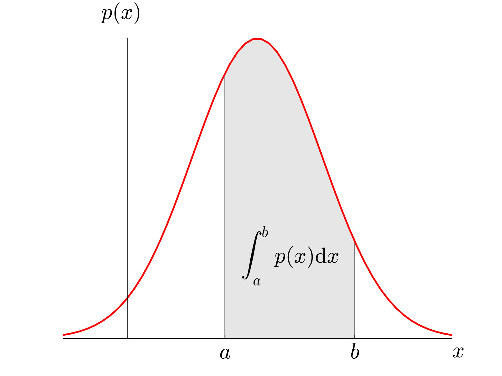

    *Probability Density Function (PDF) of a value x. The integral over the PDF between a and b gives the likelihood of finding the value of x in that range.*

Cumulative Density Function (CDF)
^^^^^^^^^^^^^^^^^^^^^^^^^^^^^^^^^

The probability to find a value between :math:`a` and :math:`b` is given
by the integral over the PDF in that range (see Fig. [fig:PDF]), and the
*Cumulative Density Function* tells you for each value which percentage
of the data has a lower value (see Figure below). Together, this gives
us

.. math:: \mathbb{P}(a \leq X \leq b) = \int\limits_a^b {PDF(x)dx} = CDF(b) - CDF(a)

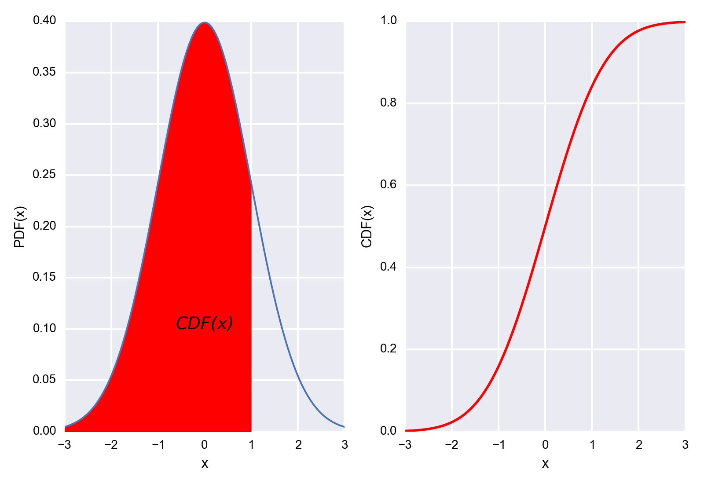

    *Probability Density Function* (left) and *Cumulative density function* (right) of a normal distribution. 

Other important presentations of Probability Densities
^^^^^^^^^^^^^^^^^^^^^^^^^^^^^^^^^^^^^^^^^^^^^^^^^^^^^^

The Figure :ref:`fig-DistributionFunctions` shows a number of functions are
commonly used to select appropriate points a distribution function:

-  *Probability density function (PDF)*: note that to obtain the
   probability for the variable appearing in a certain interval, you
   have to *integrate* the PDF over that range.

-  *Cumulative distribution function (CDF)*: gives the probability of
   obtaining a value smaller than the given value

-  *Survival function (SF) = 1-CDF*: gives the probability of obtaining a
    value larger than the given value. It can also be interpreted as the proportion of data "surviving" above a certain value.

-  *Percentile point function (PPF)*: the inverse of the CDF. Answers
   the question "Given a certain probability, what is the corresponding
   value for the CDF?"

-  *Inverse survival function (ISF)*: the name says it all.

.. _fig-DistributionFunctions: 

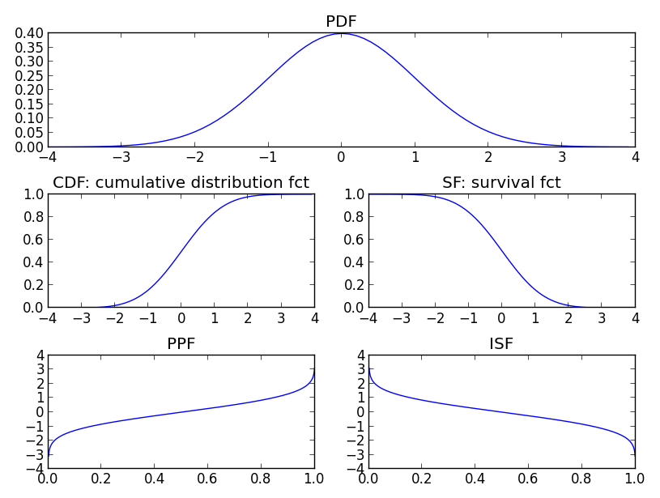

    Distribution Functions

    Utility functions for continuous distributions, here for the normal distribution.

Distribution Center 
~~~~~~~~~~~~~~~~~~~~~

Mean 
^^^^^^

By default, when we talk about the *mean value* we mean the *arithmetic
mean* :math:`\bar{x}`:

.. math:: \bar{x} = \frac{{\sum\limits_{i = 1}^n {{x_i}} }}{n}

Median 
^^^^^^^^

The *median* is that value that comes half-way when the data are ranked
in order. In contrast to the mean, it is not affected by outlying data
points.

Mode 
^^^^^^

The *mode* value is the most frequently occurring value in a
distribution.

Geometric Mean 
^^^^^^^^^^^^^^^^

In some situations the *geometric mean* can be useful to describe the
location of a distribution. It is usually close to the median, and can
be calculated via the arithmetic mean of the log of the values.

Quantifying Variability 
~~~~~~~~~~~~~~~~~~~~~~~~~

Range 
^^^^^^^

This one is fairly easy: it is the difference between the highest and
the lowest data value. The only thing that you have to watch out for:
after you have acquired your data, you have to check for *outliers*,
i.e. data points with a value much higher or lower than the rest of the
data. Often, such points are caused by errors in the selection of the
sample or in the measurement procedure. There are a number of tests to
check for outliers. One of them is to check for data which lie more than
1.5\*\ *inter-quartile-range* (IQR) above or below the first/third
quartile (see below).

Percentiles 
^^^^^^^^^^^^

The *Cumulative distribution function (CDF)* tells you for each value which
percentage of the data has a lower value (Figure :ref:`fig-lDistributionFunctions`).
The value below which a given percentage of the values occur is called *centile* or *percentile*, and corresponds to a value with a specified cumulative frequency.

For example, when you look for the data range which includes 95% of the
data, you have to find the :math:`2.5^{th}` and the :math:`97.5^{th}`
percentile of your sample distribution.

The :math:`50^{th}` percentile is the *median*.

Also important are the *quartiles*, i.e. the :math:`25^{th}` and the :math:`75^{th}`
percentile. The difference between them is sometimes referred to as
*inter-quartile range (IQR)*.

Median, upper and lower quartile are used for the data display in box
plots.

Standard Deviation and Variance 
^^^^^^^^^^^^^^^^^^^^^^^^^^^^^^^^^

The *variance* (SD) of a distribution is defined as

.. math:: var = \frac{{\sum\limits_{i = 1}^n {({x_i-\bar{x}})^2} }}{n-1}

Note that we divide by *n-1* rather than the more obvious n: dividing by
:math:`n` gives the variance of the observations around the sample mean,
but we virtually always consider our data as a sample from some larger
population and wish to use the sample data to estimate the variability
in the population. Dividing by :math:`n-1` gives us a better estimate of
the population variance.

The Figure below indicates why the sample standard deviation underestimates
the standard deviation of the underlying distribution.

.. figure:: ../Images/mean_std.png
    :scale: 50 %

*Gaussian distributions fitted to selections of data from the underlying
distribution: While the average mean of a number of samples converges to
the real mean, the sample standard deviation underestimates the standard
deviation from the distribution.*

Since the t-distribution has longer tails than the normal distribution, it is much less sensitive to outliers (see Figure Since the t-distribution has longer tails than the normal distribution, it is much less sensitive to outliers (see FigureSince the t-distribution has longer tails than the normal distribution, it is much less sensitive to outliers (see Figure Since the t-distribution has longer tails than the normal distribution, it is much less sensitive to outliers (see Figure  
The *standard deviation* is simply given by the square root of the
variance:

.. math:: s = \sqrt{var}

In statistics it is often common to denote the population standard
deviation with :math:`\sigma`, and the sample standard deviation with
:math:`s`.

Watch out: in Python, by default the variance is calculated for "n". You
have to set "ddof=1" to obtain the variance for "n-1":

::

        In[19]: data = arange(7,14)

        In[20]: std(data, ddof=0)
        Out[20]: 2.0

        In[21]: std(data, ddof=1)
        Out[21]: 2.1602468994692865

Standard Error 
^^^^^^^^^^^^^^^^

While the standard deviation is a good measure for the distribution of
your values, often you are more interested in the distribution of the
mean value. For example, when you measure the response to a new
medication, you might be interested in how well you can characterize
this response, i.e. is how well you know the mean value. This measure is
called the *standard error of the mean*, or sometimes just the *standard
error*. In a single sample from a population with a standard deviation
of :math:`\sigma` the variance of the sampling distribution of the mean
is :math:`\sigma^2/n`, and so the standard error of the mean is
:math:`\sigma/\sqrt{n}`.

For the *sample standard error of the mean*, which is the one you will be working with most of the time, we have

.. math::  SE = \frac{s}{\sqrt{n}} = \sqrt{\frac{{\sum\limits_{i = 1}^n {({x_i-\bar{x}})^2} }}{n-1}} \cdot \frac{1}{\sqrt{n}}

Confidence Intervals
^^^^^^^^^^^^^^^^^^^^

The most informative parameter that you can give for a statistical variable is arguably its \emph{confidence interval}. The confidence interval reports the range that contains the true value for your parameter with a likelihood of :math:`\alpha`\%.

Most of the time you want to determine the confidence interval for normally distributed data, which is given by

.. math::  ci = mean \pm std * t_{df,\alpha}

where *std* is the sample standard deviation, and :math:`t_{df,\alpha}` the *t* statistic (which will be covered later in this chapter) for *df* degrees of freedom. For the 95\% two-sided confidence intervals, for example, you have to set :math:`\alpha=0.025` and :math:`\alpha=0.975` .

**Note:** If you want to know the confidence interval for the mean value, you have to replace the *standard deviation* by the *standard error*! In Python, the 95\% confidence interval for the mean can be obtained with a one-liner:

::

    alpha = 0.95
    df = len(data)-1
    ci = stats.t.interval(alpha, df, loc=mean(data), scale=stats.sem(data))

Parameters Describing a Distribution
~~~~~~~~~~~~~~~~~~~~~~~~~~~~~~~~~~~~

Location
^^^^^^^^

A *location parameter* *x_0*  determines the "location" or shift of a
distribution.

.. math::  f_{x0}(x)=f(x-x_0)

Examples of location parameters include the mean, the median, and the mode.

Scale
^^^^^

The *scale parameter* describes the width of a probability distribution.  If
s is large, then the distribution will be more spread out; if s is small
then it will be more concentrated. If the probability density exists for all
values of *s*, then the density (as a function of the scale parameter only)
satisfies

.. math::   f_s(x) = f(x/s)/s,

where f is the density of a standardized version of the density.

Shape Parameters
^^^^^^^^^^^^^^^^

A shape parameter is any parameter of a probability distribution that is
neither a location parameter nor a scale parameter. If *location* and
*shape* already completely determine the distribution (as is the case
for e.g. the normal distribution or the exponential distribution, etc.),
then these distributions don't have any *shape parameter*. It follows
that the *skewness* and *kurtosis* of these distribution are
constants.

Skewness
^^^^^^^^

Distributions are *skewed* if they depart from symmetry. For example, if you
have a measurement that cannot be negative, which is usually the case, then
we can infer that the data have a skewed distribution if the standard
deviation is more than half the mean. Such an asymmetry is referred to as
*positive skewness*. The opposite, negative skewness, is rare.

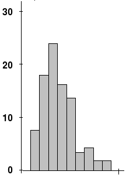

    Skewness: Example of experimental data with non-zero (positive)
    skewness (from Wikipedia).

Kurtosis
^^^^^^^^

Kurtosis is any measure of the "peakedness" of the probability distribution.
Distributions with negative or positive excess kurtosis are called
platykurtic distributions or leptokurtic distributions respectively.

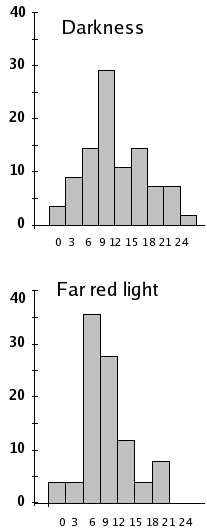

  Kurtosis: The "Darkness" data is platykurtic (-0.194), while "Far Red
  Light" shows leptokurtosis (0.055) (from Wikipedia)

Distribution Functions
----------------------

The variable for a standardized distribution function is often called
*statistic*. So you often find expressions like "the z-statistic" (for
the normal distribution function), the "t-statistic" (for the
t-distribution) or the "F-statistic" (for the F-distribution).

Probability and Samples
~~~~~~~~~~~~~~~~~~~~~~~

Normal Distribution
~~~~~~~~~~~~~~~~~~~

The *Normal distribution* or *Gaussian distribution* is by far the most
important of all the distribution functions. This is due to the fact
that the mean values of *all* distribution functions approximate a
normal distribution for large enough sample numbers. Mathematically, the
normal distribution is characterized by a mean value :math:`\mu`, and a
standard deviation :math:`\sigma`:

.. math::

   \label{eq_normal}
        f_{\mu,\sigma} (x) = \frac{1}{\sigma \sqrt{2 \pi}} e^{-( x - \mu )^2 /2 \sigma^2}

where :math:`-\infty<x<\infty`, and :math:`f_{\mu,\sigma}` is the
*probability density function (PDF)* .

| |image8|

*Normal Distribution*

For smaller sample numbers, the sample distribution can show quite a bit
of variability. For example, look at 25 distributions generated by
sampling 100 numbers from a normal distribution:

| |image9|

*25 randomly generated normal distributions of 100 points.*

Some examples of applications are:

-  If the average man is 175 cm tall with a standard deviation of 6 cm, what is
   the probability that a man found at random will be 183 cm tall?

-  If the average man is 175 cm tall with a standard deviation of 6 cm and the
   average woman is 168 cm tall with a standard deviation of 3 cm, what is the
   probability that the average man from a given sample will be shorter
   than the average woman from a given sample?

-  If cans are assumed to have a standard deviation of 4 grams, what does the
   average weight need to be in order to ensure that the 99% of all cans
   have a weight of at least 250 grams?

The normal distribution with parameters :math:`\mu` and :math:`\sigma`
is denoted as :math:`N(\mu,\sigma)`. If the *random variate (rv)* *X* is
normally distributed with expectation :math:`\mu` and standard deviation
:math:`\sigma`, one denotes: :math:`\,X \sim N(\mu,\sigma)` or
:math:`\,X \in N(\mu,\sigma)`.

**Note:**

In Python, the most elegant way of working with distribution function is a two-step procedure:

  - In the first step, you create your distribution (e.g. *nd = stats.norm()*). Note that is a *distribution* (in Python parlance a "frozen distribution"), not a function yet!
  - In the second step, you decide which function you want to use from this distribution, , and calculate the function value for the desired x-input (e.g. *y = nd.cdf(x)*)

|ipynb| `30_figs_DistributionNormal.ipynb <http://nbviewer.ipython.org/url/raw.github.com/thomas-haslwanter/statsintro/master/ipynb/30_figs_DistributionNormal.ipynb>`_

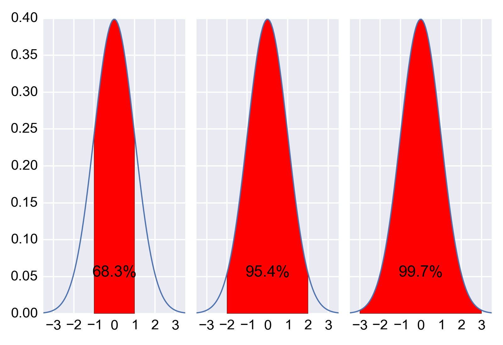

    Area under +/- 1, 2, and 3 standard deviations of a normal distribution.

==================== ===================== ======================
Range                Prob. of being within Prob. of being outside 
==================== ===================== ======================
mean :math:`\pm` 1SD 0.683                  0.317
mean :math:`\pm` 2SD 0.954                  0.046
mean :math:`\pm` 3SD 0.9973                 0.0027
==================== ===================== ======================

Since a very frequent computational steps is the calculation of the
intervals containing 95% of the data, I give an explicit code example of
that step:

::

      In [33]:  from scipy import stats
      In [34]:  mu = -2
      In [35]:  sigma = sqrt(0.5)
      In [36]:  myDistribution = stats.norm(mu, sigma)
      In [37]:  significanceLevel = 0.05
      In [38]:  myDistribution.ppf([significanceLevel/2, 1-significanceLevel/2])
      Out[38]:  array([-3.38590382, -0.61409618]

*Example of how to calculate the interval of the PDF containing 95% of the data, for the green curve in the Figure above.*

Central Limit Theorem 
~~~~~~~~~~~~~~~~~~~~~~

The central limit theorem states that for identically distributed
independent random variables (also referred to as *random variates*),
the mean of a sufficiently large number of these variables will be
approximately normally distributed.

The figure below shows that averaging over 10 uniformly distributed data
already produces a smooth, almost Gaussian distribution.

.. figure:: ../Images/centralLimitTheorem.png
  :scale: 33 %

*Demonstration of the "Central Limit Theorem": Left) Histogram of random
data between 0 and 1. Center) Histogram of average over two datapoints.)
Right) Histogram of average over 10 datapoints.*

.. literalinclude:: ..\Code3\fig_centralLimitTheorem.py

Application Example
~~~~~~~~~~~~~~~~~~~

To illustrate the ideas behind the use of distribution functions, let us
go step-by-step through the analysis of the following problem:

The average weight of a newborn child in the US is 3.5 kg, with a
standard deviation of 0.76 kg. If we want to check all children that are
*significantly different* from the typical baby, what should we do with
a child that is born with a weight of 2.6 kg?

-  Find the distribution that characterizes healthy babies.

-  Calculate the CDF at the interesting value (*CDF(2.6 kg) = 0.118*).

-  Interpret the result (*“If the baby is healthy, the chance that its
   weight deviates by at least the observed value from the mean is
   2\*11.8% = 23.6% - This is not significant”*).

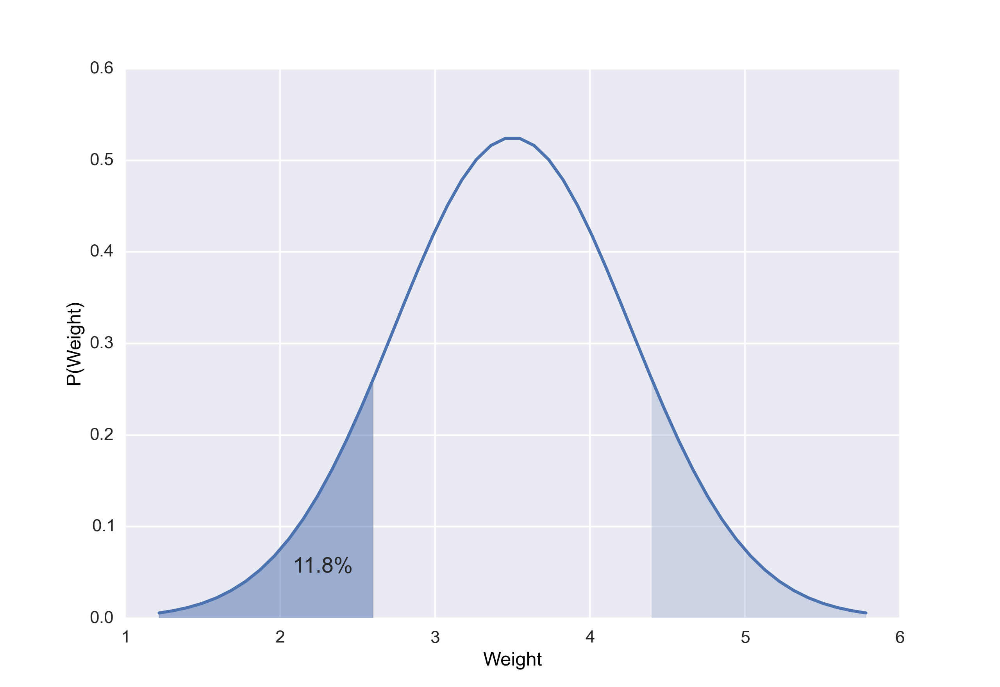

    *The chance that a healthy baby weighs 2.6 kg or less is 11.8\% (darker blue area). The chance that the difference from the mean is that much is twice that much, as the lighter blue area must be added.*

Other Continuous Distributions
~~~~~~~~~~~~~~~~~~~~~~~~~~~~~~

The distributions you will encounter most frequently are:

- **Normal distribution** - the "ideal" continuous probability distribution
- **t-distribution** - for sample distributions (What you will probably use most often.)
- **Chi-square distribution** - for describing  variability
- **F-distribution** - for comparing variability

In the following, we will describe these distributions in more detail.

t Distribution
^^^^^^^^^^^^^^

For a small number of samples (ca *<10*) from a normal
distribution, the distribution of the mean deviates slightly from the
normal distribution. The reason is that the sample mean does not
coincide exactly with the population mean. This modified distribution is
the *t-distribution*, and converges for larger values towards the normal
distribution.

The t-distribution was first described by a researcher working under the
pseudonym of "Student", and the corresponding test is therefore sometimes
referred to as *Student's t-test*.

If :math:`\bar{x}` is the sample mean, and *s* the sample standard deviation, then

.. math::  t = \frac{\bar{x}-\mu}{s/ \sqrt{n}}

A very frequent application of the t-distribution is in the calculation of `Confidence intervals`_:

::

    In [28]: n = 20
    In [29]: alpha = 0.05
    In [30]: stats.t(20).ppf(1-alpha/2)
    Out[30]: 2.0859634472658364

    In [31]: stats.norm.ppf(1-alpha/2)
    Out[31]: 1.959963984540054

*Calculating the t-values for confidence intervals, for n = 20 and alpha=0.05. For comparison, I also calculate the corresponding value from the normal distribution.*

| |image11|

*t Distribution*

Since the t-distribution has longer tails than the normal distribution, it
is much less sensitive to outliers (see Figure below).

.. image:: ..\Images\ttest_stability.png
    :scale: 33 %

*The t-distribution is much more robust against outliers than the normal
distribution.*

Chi-square Distribution
^^^^^^^^^^^^^^^^^^^^^^^

The *Chi-square distribution* is related to normal distribution in a
simple way: If a random variable :math:`X` has a normal distribution
(:math:`X \in N(0,1)`), then :math:`X^2` has a chi-square distribution,
with one degree of freedom (:math:`X^2 \in \chi_{1}^2`). The sum squares
of :math:`n` independent and standard normal random variables has a
chi-square distribution with :math:`n` degrees of freedom:

.. math:: \sum\limits_{i = 1}^n {X_i^2} \in \chi_{n}^2

| |image12|

*Chi-square Distribution*

**Application Example**

A pill producer is ordered to deliver pills with a standard deviation of
:math:`\sigma=0.05`. From the next batch of pills you pick :math:`n=13`
random samples. These samples :math:`x_1, x_2, . . . , x_n` have a
weight of 3.04, 2.94, 3.01, 3.00, 2.94, 2.91, 3.02, 3.04, 3.09, 2.95,
2.99, 3.10, 3.02 g.

*Question:* is the standard deviation larger than allowed?

*Answer:*

Since the Chi-square distribution describes the distribution of the
summed squares of random variates from a *standard normal distribution*,
we have to normalize our data before we calculate the corresponding
CDF-value:

.. math:: 1 - CD{F_{{\chi ^2}_{(n - 1)}}}\left( {\sum {(\frac{{x - \bar x}}{\sigma }} {)^2}} \right) = 0.1929

*Interpretation:* if the batch of pills is from a distribution with a
standard deviation of :math:`\sigma=0.05`, the likelihood of obtaining a
chi-square value as large or larger than the one observed is about 19%,
so it is not atypical. In other words, the batch matches the expected
standard deviation.

.. _`F Distribution`:

F Distribution
^^^^^^^^^^^^^^

Named after Sir Ronald Fisher, who developed the F distribution for use
in determining critical values in ANOVAs (*ANalysis Of VAriance*). The
cutoff values in an F table are found using three variables:

-  ANOVA numerator degrees of freedom

-  ANOVA denominator degrees of freedom

-  significance level

ANOVA compares the size of the variance between two different samples.
This is done by dividing the larger variance over the smaller variance.
The formula for the resulting *F statistic* is:

.. math:: F(r_1, r_2) = \frac{\chi_{r1} ^2 /r_1}{\chi_{r2} ^2 /r_2}

where :math:`\chi_{r1}^2` and :math:`\chi_{r2}^2` are the chi-square
statistics of sample one and two respectively, and :math:`r_1` and
:math:`r_2` are their degrees of freedom, i.e. the number of
observations.

F-Test of Equality of Variances
'''''''''''''''''''''''''''''''

If you want to investigate whether two groups have the same variance, you have to calculate the ratio of the sample standard deviations squared:

.. math:: F = \frac{S_x^2}{S_y^2}

where :math:`S_x` ist he sample standard deviation of the first sample,
and :math:`S_y` the sample standard deviation for the second sample.

Take for example the case that you want to compare two methods to
measure eye movements. The two methods can have different accuracy and
different precision. With your test you want to determine if the
precision of the two methods is equivalent, or if one method is more
precise than the other.

    Accuracy and precision of a measurement are two different characteristics!

When you look 20 deg to the right, you get the following results: Method
1: [20.7, 20.3, 20.3, 20.3, 20.7, 19.9, 19.9, 19.9, 20.3, 20.3, 19.7,
20.3] Method 2: [ 19.7, 19.4, 20.1, 18.6, 18.8, 20.2, 18.7, 19. ]

The F statistic is :math:`F = 0.494`, and has :math:`n-1` and
:math:`m-1` degrees of freedom, where :math:`n` and :math:`m` are the
number of recordings with each method. The code sample below shows that
the F statistic is close to the center of the distribution, so we cannot
reject the hypothesis that the two methods have the same precision.

::

      In [1]:  method1 = array([20.7,  20.3,  20.3,  20.3,  20.7,  19.9,  19.9,  19.9,  20.3,
            20.3,  19.7,  20.3])
      In [2]:  method2 = array([ 19.7,  19.4,  20.1,  18.6,  18.8,  20.2,  18.7,  19. ])
      In [3]:  fval = var(method1, ddof=1)/var(method2, ddof=1)
      In [4]:  fd = stats.f(len(method2)-1,len(method2)-1)
      In [5]:  p = fd.cdf(fval)
      In [6]:  print p
      Out[6]:  0.041
      In [7]:  if (p<0.025) or (p>0.975):
                  print 'There is a significant difference between the two distributions.'

| |image13|

*F Distribution*

Lognormal Distribution
^^^^^^^^^^^^^^^^^^^^^^

In some circumstances a set of data with a positively skewed
distribution can be transformed into a symmetric distribution by taking
logarithms. Taking logs of data with a skewed distribution will often
give a distribution that is near to normal (see Figure below).

| |image14|

*Plotted against a linear abscissa.*

| |image15|

Plotted against a logarithmic abscissa.
*Plotted against a logarithmic abscissa.*

Weibull Distribution
^^^^^^^^^^^^^^^^^^^^

The Weibull distribution is the most commonly used distribution for modeling reliability data or "survival" data. It has two parameters, which allow it to handle increasing, decreasing or constant failure-rates (see Figure below).
It is defined as

.. math::

    \label{eq_weibull}
    f_x (x) =
  \begin{cases}
    k \frac{x^{k-1}}{\lambda^k} e^{-(x/\lambda)^{k}} & x\geq0 \\
    0 & x<0 ,
    \end{cases}

where *k > 0* is the *shape parameter* and :math:`\lambda > 0` is the *scale parameter* of the distribution. Its complementary cumulative distribution function is a stretched exponential function.

If the quantity x is a "time-to-failure", the Weibull distribution gives a distribution for which the failure rate is proportional to a power of time. The shape parameter, k, is that power plus one, and so this parameter can be interpreted directly as follows:

-  A value of k < 1 indicates that the failure rate decreases over time. This happens if there is significant "infant mortality", or defective items failing early and the failure rate decreasing over time as the defective items are weeded out of the population.

-  A value of k = 1 indicates that the failure rate is constant over time. This might suggest random external events are causing mortality, or failure.

-  A value of k > 1 indicates that the failure rate increases with time. This happens if there is an "aging" process, or parts that are more likely to fail as time goes on.

In the field of materials science, the shape parameter k of a distribution of strengths is known as the Weibull modulus.

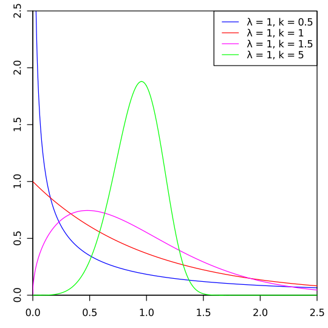

*Weibull Distribution*

Exponential Distribution
^^^^^^^^^^^^^^^^^^^^^^^^

For a stochastic variable X with an *exponential distribution*, the
probability distribution function is:

.. math::

   \label{eq_exponential}
   f_x (x) =
     \begin{cases}
   \lambda e^{- \lambda x}, & \mbox{if } x \ge 0 \\
   0, & \mbox{if } x < 0
   \end{cases}

The exponential PDF is shown in the figure below

| |image16|

*Exponential Distribution*

Uniform Distribution
^^^^^^^^^^^^^^^^^^^^

This is a simple one: an even probability for all data values (see Figure
below). Not very common for real data.

| |image17|

*Uniform Distribution*

Programs: Continuous Distribution Functions 
^^^^^^^^^^^^^^^^^^^^^^^^^^^^^^^^^^^^^^^^^^^^^
Working with distribution functions in Python takes a bit to get used to. But once you get the concept, it is marvellously easy. In my opinion, the most logical way is first to define the function, with all the parameters that it requires; and then, to use the methods of this function, e.g. PDF or CDF:

::

    In [1]: from scipy import stats
    In [2]: myDF = stats.norm(5,3)
    In [3]: x = linspace(-5, 15, 101)
    In [4]: y = myDF.pdf(x)

|ipynb| `31_figs_DistContinuous.ipynb <http://nbviewer.ipython.org/url/raw.github.com/thomas-haslwanter/statsintro/master/ipynb/31_figs_DistContinuous.ipynb>`_

Discrete Distributions
~~~~~~~~~~~~~~~~~~~~~~

While the functions describing continuous distributions are referred to
as *probability distribution functions*, discrete distributions are
described by *probability mass functions*.

Binomial Distribution
^^^^^^^^^^^^^^^^^^^^^

The Binomial is associated with the question "Out of a given number of
trials, how many will succeed?" Some example questions that are modeled
with a Binomial distribution are:

-  Out of ten tosses, how many times will this coin land ”heads”?

-  From the children born in a given hospital on a given day, how many
   of them will be girls?

-  How many students in a given classroom will have green eyes?

-  How many mosquitos, out of a swarm, will die when sprayed with
   insecticide?

We conduct :math:`n` repeated experiments where the probability of
success is given by the parameter :math:`p` and add up the number of
successes. This number of successes is represented by the random
variable :math:`X`. The value of :math:`X` is then between 0 and
:math:`n`.

When a random variable X has a Binomial Distribution with parameters
:math:`p` and :math:`n` we write it as :math:`\,X \sim Bin(n,p)` or
:math:`\,X \sim B(n,p)` and the probability mass function is given at
:math:`X=k` by the equation:

.. math:: P\left[X = k\right] = \begin{cases} {n \choose k} p^k \left(1-p\right)^{n-k}\ & 0 \le k \le n \\ 0 & \mbox{otherwise} \end{cases} \quad 0 \leq p \leq 1, \quad n \in \mathbb{N}

where :math:`{n \choose k}={n! \over k!(n-k)!}`

| |image18|

*Binomial Distribution*

The binomial distribution for *n = 1* is sometimes referred to as *Bernoulli
Distribution*.

For *n* trials, we have the following properties:

   * mean: *np*
   * variance: *n p (1-p)*

Poisson Distribution
^^^^^^^^^^^^^^^^^^^^

Any French speaker will notice that "Poisson" means "fish", but really
there's nothing fishy about this distribution. It's actually pretty
straightforward. The name comes from the mathematician Siméon-Denis
Poisson (1781-1840).

The Poisson Distribution is very similar to the Binomial Distribution.
We are examining the number of times an event happens. The difference is
subtle. Whereas the Binomial Distribution looks at how many times we
register a success over a fixed total number of trials, the Poisson
Distribution measures how many times a discrete event occurs, over a
period of continuous space or time. There isn't a "total" value n. As
with the previous sections, let's examine a couple of experiments or
questions that might have an underlying Poisson nature.

-  How many pennies will I encounter on my walk home?

-  How many children will be delivered at the hospital today?

-  How many products will I sell after airing a new television
   commercial?

-  How many mosquito bites did you get today after having sprayed with
   insecticide?

-  How many defects will there be per 100 metres of rope sold?

What's a little different about this distribution is that the random
variable :math:`X` which counts the number of events can take on *any
non-negative integer* value. In other words, I could walk home and find
no pennies on the street. I could also find one penny. It's also
possible (although unlikely, short of an armored-car exploding nearby)
that I would find 10 or 100 or 10,000 pennies.

Instead of having a parameter p that represents a component probability
like in the Binomial distribution, this time we have the parameter
"lambda" or :math:`\lambda` which represents the "average or expected"
number of events to happen within our experiment. The probability mass
function of the Poisson is given by

.. math:: P(X=k)=\frac{e^{-\lambda}\lambda^k}{k!}

The Poisson distribution has the following properties:

   * mean: :math:`\lambda`
   * variance: :math:`\lambda`

| |image19|

*Poisson Distribution*

Programs: Discrete Distribution Functions 
^^^^^^^^^^^^^^^^^^^^^^^^^^^^^^^^^^^^^^^^^^^
|ipynb| `32_figs_DistDiscrete.ipynb <http://nbviewer.ipython.org/url/raw.github.com/thomas-haslwanter/statsintro/master/ipynb/32_figs_DistDiscrete.ipynb>`_

Exercises
---------

Numpy
~~~~~

#. Create an numpy-array, containing the data 1,2,3,...,10.

#. Calculate mean and sample(!)-standard deviation.
    (Correct answer: 3.03)

Distributions
~~~~~~~~~~~~~

#.  Generate and plot the Probability Density Function (PDF) of a normal distribution, with a mean of 5 and a standard deviation of 3.
#.  Generate 1000 random data from this distribution.
#.  Calculate the standard error of the mean of these data.
    (Correct answer: ca. 0.096)

#.  Plot the histogram of these data.
#.  From the PDF, calculate the interval containing 95% of these data.
     (Correct answer: [ -0.88, 10.88])

Analysis
~~~~~~~~

#. 

   #. Read in the data from ’Data\\amstat\\calcium.dat.txt’.

   #. Check for erroneous entries.

   #. Check the Alkaline Phosphatase levels for normality. Use a
      log-transform on the data, and re-check.

Continuous Distributions 
~~~~~~~~~~~~~~~~~~~~~~~~~
#.  **Normal Distribution:** Your doctor tells you that he can use hip implants for surgery even if they are 1 mm bigger or smaller than the specified size. And your financial officer tells you that you can discard 1 out of 1000 hip implants, and still make a profit.

    What is the required standard deviation for the producer of the hip implants, to simultaneously satisfy both requirements?
    (Correct answer: SD = 0.304 mm)

#.  **T-Distribution:** Measuring the weight of your collogues, you have obtained the following weights: 52, 70, 65, 85, 62, 83, 59 kg.
    Calculate the corresponding mean, and the 99% confidence interval for the mean. Note: with n values you have n-1 DOF for the t-distribution.
    (Correct answer: 68.0 +/- 17.2 kg)

#.  **Chi-square Distribution** Create 3 normally distributed datasets (mean = 0, SD = 1), with 1000 samples each. Then square them, sum them (so that you have 1000 data-points), and create a histogram with 100 bins. This should be similar to the curve for the Chi-square distribution, with 3 DOF (i.e. it should come down at the left).

#.  **F Distribution** You have two apple trees. There are three apples from the first tree that weigh 110, 121 and 143 grams respectively, and four from the other which weigh 88, 93, 105 and 124 grams respectively. Are the variances from the two trees different?
    Note: calculate the corresponding F-value, and check if the CDF for the corresponding F-distribution is <0.025.
    (Correct answer: no)

#.  **Binomial Distribution** "According to research, pure blue eyes in Europe approach greatest frequency in Finland, Sweden and Norway(at 72\%), followed by Estonia, Denmark(69\%); Latvia, Ireland(66\%); Scotland(63\%); Lithuania(61\%); The Netherlands(58\%); Belarus, England(55\%); Germany(53\%); Poland, Wales(50\%); Russia, The Czech Republic(48\%); Slovakia(46\%); Belgium(43\%); Austria, Switzerland, Ukraine(37\%); France, Slovenia(34\%); Hungary(28\%); Croatia(26\%); Bosnia and Herzegovina(24\%); Romania(20\%); Italy(18\%); Serbia, Bulgaria(17\%); Spain(15\%); Georgia, Portugal(13\%); Albania(11\%); Turkey and Greece(10\%). Further analysis shows that the average occurrence of blue eyes in Europe is 34\%, with 50\% in Northern Europe and 18\% in Southern Europe."

    If we have 15 Austrian students in the class-room, what ist the chance of finding 3, 6, or 10 students with blue eyes?
     (Correct answer: 9%, 20.1%, and 1.4%)

#.  **Poisson Distribution** On the streets of Austria there were 62 fatal accidents in 2012. Assuming that those are evenly distributed, we have on average
    62 /(365/7)=1.19 fatal accidents per week. How big is the chance that in a given week there are no, 2, or 5 accidents?
    (Correct answer: 30.5%, 21.5%, 0.6%)

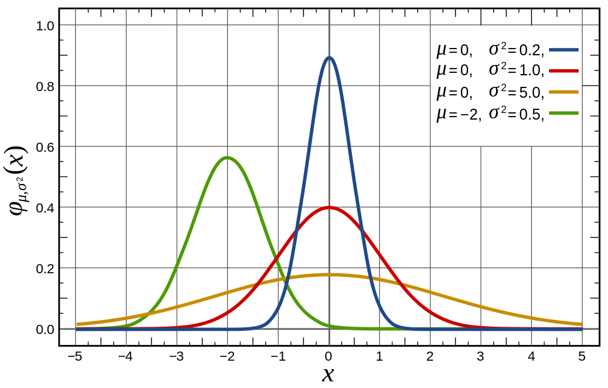
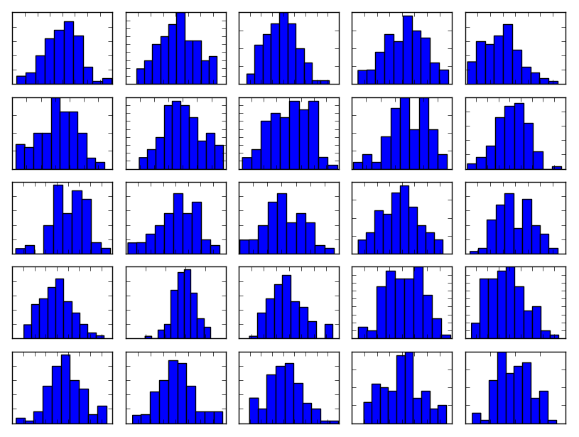
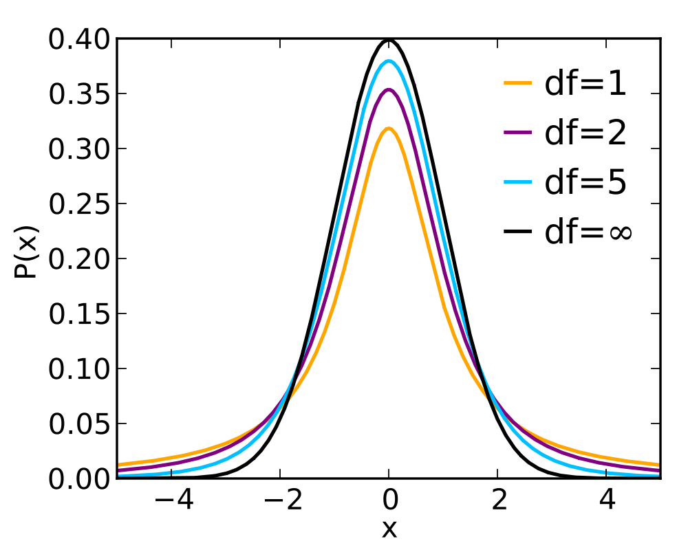
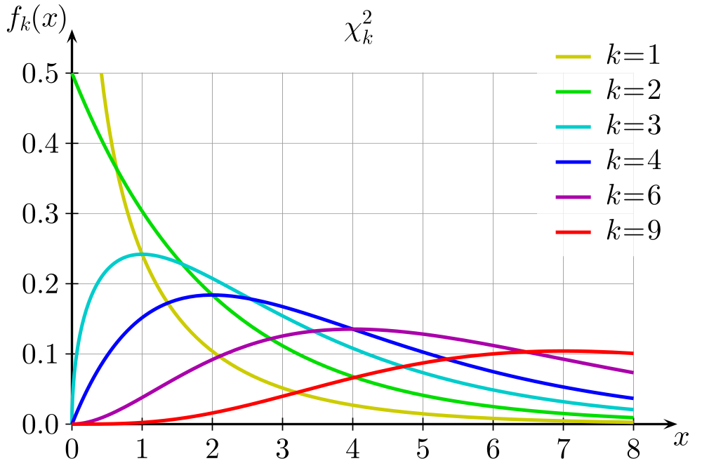
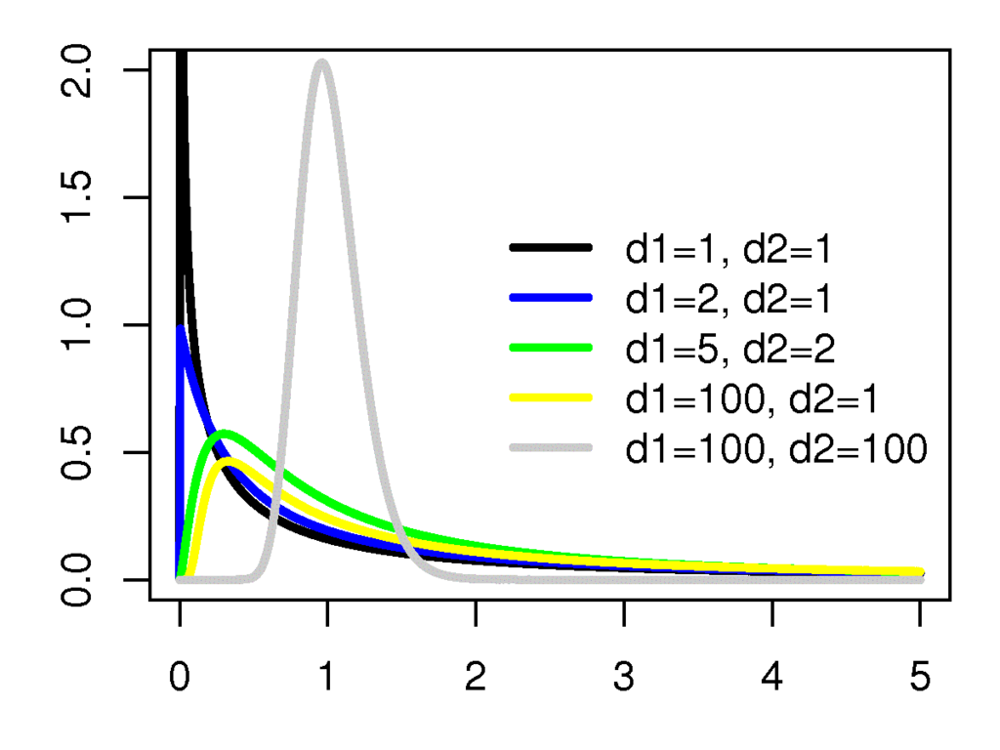
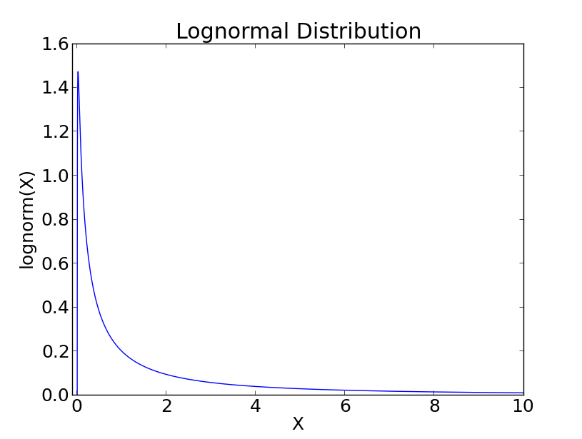
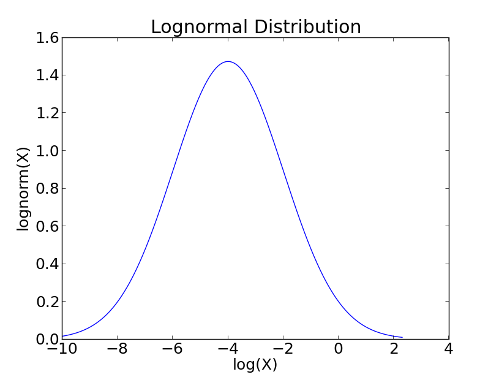
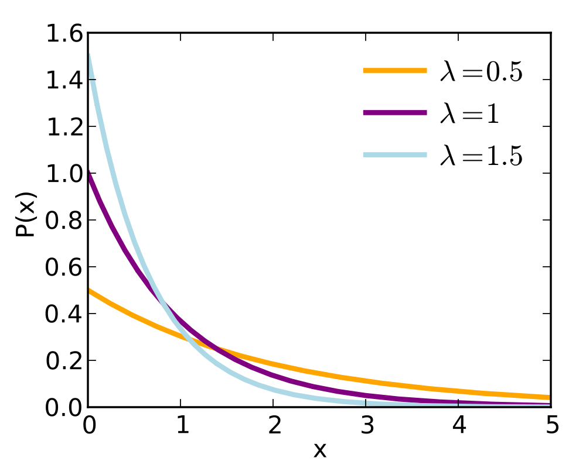
.. |image17| image:: ../Images/Uniform_Distribution_PDF.png
    :scale: 40 %
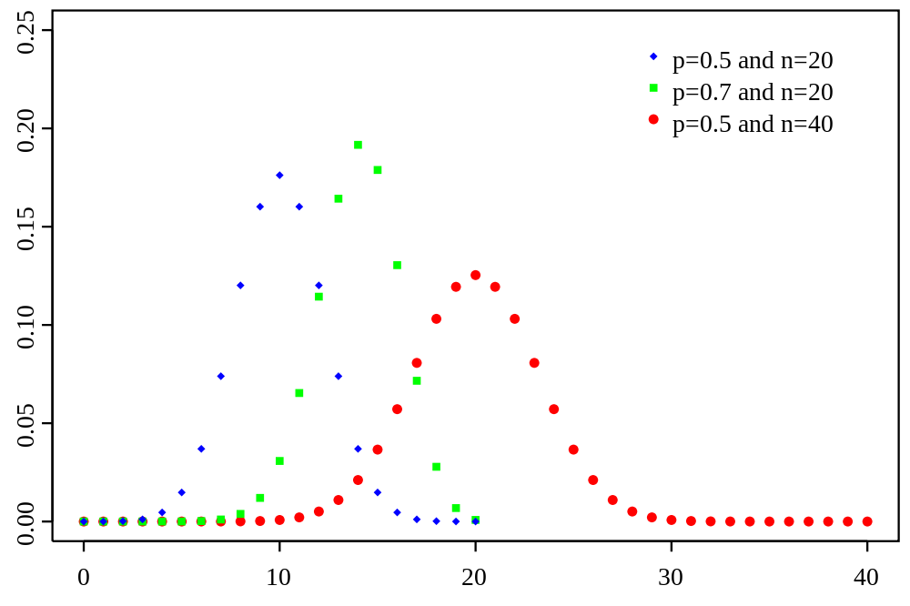
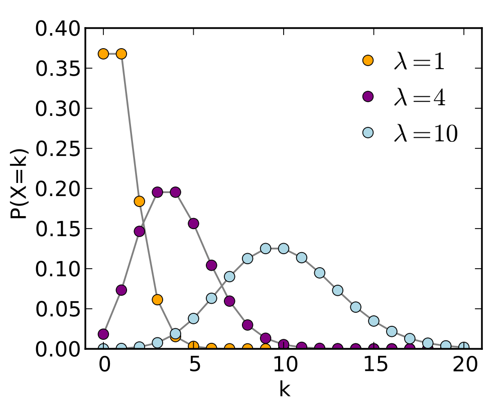

.. |ipynb| image:: ../Images/IPython.jpg
    :scale: 50 % 
.. |python| image:: ../Images/python.jpg
    :scale: 50 % 

