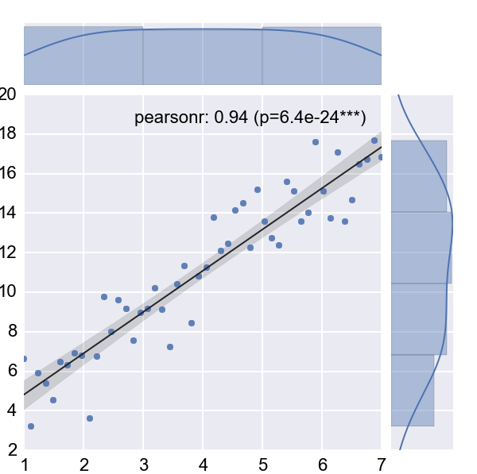

*"Statistics ist the explanation of variance in the light of what
remains unexplained."*

Statistics was originally invented - as so many other things - by the
famous mathematician C.F. Gauss, who said about his own work *"Ich habe
fleissig sein müssen; wer es gleichfalls ist, wird eben so weit
kommen"*. Even if your aspirations are not that high, you can get a lot
out of statistics. In fact, if your work with real data, you probably
won't be able to avoid it. Statistics can

-  Describe variation.

-  Make quantitative statements about populations.

-  Make predictions.

**Books:** There are a number of good books about statistics:

*Douglas G. Altman. Practical Statistics for Medical Research. Chapman & Hall/CRC, 1999* 
    This is my favorite stats book. It does not talk a lot about computers
    and modeling, but gives you a terrific introduction into the field.
    Many formulations and examples in this manuscript have been taken from
    that book.

*R.H. Riffenburgh. Statistics in Medicine. Academic Press, 3rd edition, 2012* .
    A more modern book, which is more voluminous and in my opinion a bit harder to read.

*Daniel Kaplan. Statistical Modeling: A Fresh Approach. Macalester College, 2009*
    If you are interested in a simple introduction to modern regression modeling, check out

*Dobson AJ & Barnett AG: "An Introduction to Generalized Linear Models", 3rd ed, CRC Press(2008)*
    A very good introduction to "Generalized Linear Models". If you know
    your basic statistics, this is a good, advanced starter into statistical
    modeling.

**WWW:** On the web, you find good very extensive statistics
information in English under

-  http://www.statsref.com/

-  http://www.vassarstats.net/

-  http://udel.edu/~mcdonald/statintro.html

-  http://onlinestatbook.com/2/index.html

A good German webpage on statistics and regulatory issues is
http://www.reiter1.com/.

**Exercises:** Many examples are already solved in the text. For the use in
lectures (or for self-test), additional exercises are provided at the end of
most chapters. For lecturers, solutions to these exercises can be provided
on demand. Please contact me directly for that via email.

**PDF-Version:** A complete PDF-version of this introduction is available
from `here <http://work.thaslwanter.at/Stats/StatsIntro.pdf>`_

Why Statistics?
---------------

Statistics will help you to

-  Clarify the question.

-  Identify the variable and the measure of that variable that will
   answer that question.

-  Determine the required sample size.

-  Find the correct analysis for your data.

-  Make predictions based on your data.

Without statistics, your interpretation of your data can be massively
flawed. Take for example the estimated number of German tanks during
World War II, also known as the *German tank problem*
(http://en.wikipedia.org/wiki/German_tank_problem): from standard
intelligence data, the estimate for the number of German tanks produced
per month was :math:`1550`; in contrast, the statistical estimate from
the tanks observed led to a number of :math:`327`, which was very close
to the actual production number of :math:`342`.

What you should already know
----------------------------

From previous courses on math, quality control, signal analysis, etc.,
you are probably already familiar with a number of statistical concepts.
While they will be dealt with in detail later on, let me list them here
to make sure we start at the same level:

-  mean

-  median

-  mode

-  standard deviation

-  variance

-  confidence intervals

-  t-test

-  boxplot

-  normal distribution

-  regression coefficient

-  correlation coefficient

Projects
--------

The biggest problems in statistics do *not* arise from a faulty
analysis, but from a faulty experimental design. If you have a suitable
topic of interest, you can select to do a project instead of the final
exam. For this you will have to

#. Read up on the problem.

#. Design the study:

   #. Determine the parameter to analyze.

   #. Decide on the requirements of the sample population.

   #. Plan the randomization.

   #. Decide which test you want to use for the analysis.

#. Analyze some data.

#. Generate the appropriate graphs.

#. Write up a summary of your project.

Programming Matters
-------------------

Python
~~~~~~

There are three reasons why I have decided to use Python for this
lecture.

#. It is the most elegant programming language that I know.

#. It is free.

#. It is powerful.

I have not seen many books on Python that I really liked. My favorite
introductory book is . A good free book, which introduces Python with a
focus on statistics, is `"Introduction to Python for Econometrics,
Statistics and Data Analysis", by Kevin Sheppard, Oxford
University <http://www.kevinsheppard.com/images/0/09/Python_introduction.pdf>`__.

In general, I suggest that you start out by installing a Python
distribution which includes the most important libraries. I
suggest that you use Python :math:`>3.3` for this course, All the Python packages required for this
course are now available for Python 3, so I don't see a good reason to
stay with Python 2.7 . My favorites Python 3.3 distributions are

#.  http://winpython.sourceforge.net/  No admin-rights required. Recommended for Windows users.

#.  https://store.continuum.io/cshop/anaconda/  From Continuum. For Windows, Mac, and Linux. By default installs to Python 2.7.x, but can upgrade to Python 3.x.

which are very good starting points when you are using Windows.
*winpython* does not require administrator rights, and *anaconda* is a
more recent distribution, which is free for educational purposes.

Mac and Unix users should check out the installations tips from
Johansson (see Table below).

There are also many tutorials available on the internet. Personally,
most of the time I just google; thereby I stick primarily a) to the official
pages, and b) to
http://stackoverflow.com/. Also, I have found user groups surprisingly
active and helpful!

**Links**

* http://scipy-lectures.github.com/ *Python Scientific Lecture Notes. Pretty comprehensive.*

* http://www.scipy.org/NumPy_for_Matlab_Users  *Start here if you have Matlab experience.*

* http://docs.python.org/2/tutorial/ *The Python tutorial. The official introduction.*

* https://github.com/jrjohansson/scientific-python-lectures/  *Lectures on scientific computing with Python. Great ipython notebooks!*

* http://learnpythonthehardway.org/book/  *Learn Python the Hard Way, 3rd Ed. A popular, free book that you can work through*

* http://www.greenteapress.com/thinkpython/ *ThinkPython: A free book on Python, for advanced programmers.*

If you decide to install things manually, you need the following modules
in addition to the Python standard library:

-  *ipython* ... For interactive work.

-  *numpy* ... For working with vectors and arrays.

-  *scipy* ... All the essential scientific algorithms, including those
   for statistics.

-  *matplotlib* ... The de-facto standard module for plotting and
   visualization.

-  *pandas* ... Adds *DataFrames* (imagine powerful spreadsheets) to
   Python.

-  *patsy* ... For working with statistical formulas.

-  *statsmodels* ... For statistical modeling and advanced analysis.

-  *seaborn* ... For visualization of statistical data.

IPython
^^^^^^^

Make sure that you have a good programming environment! Currently, my
favorite way of programming is similar to my old Matlab style: I first get
the individual steps worked out interactively in `ipython
<http://ipython.org/>`_ *qtconsole*. Ipython provides interactive computing
with Python, similar to the commandline in Matlab. It comes with a command
history, interactive data visualization, command completion, and a lot of
features that make it quick and easy to try out code. When ipython is
started in *pylab mode* (which is the typical configuration), it
automatically loads numpy and matplotlib.pyplot into the active workspace,
and provides a very convenient, Matlab-like programming environment. A very
helpful new addition is the browser-based *ipython notebook*, with support
for code, text, mathematical expressions, inline plots and other rich media.
Please check out the links to the ipython notebooks in this statistics
introduction. I believe that it will  help you to get up to speed with
python much more quickly.

To write a program, I then go to either `Spyder <http://code.google.com/p/spyderlib/>`_
(which is free) or `Wing <http://wingware.com/>`_ (which is very good, but commercial).

The flexibility of Python has the "disadvantage" that it can come in
differnt flavors or coding styles. When you know the different approaches,
they are great to use. But when you get started, it can be a bit confusing.
The following section from the Matplotlib documentation may help to clarify
these things:

Matplotlib, pylab, and pyplot: how are they related?
^^^^^^^^^^^^^^^^^^^^^^^^^^^^^^^^^^^^^^^^^^^^^^^^^^^^

**Matplotlib** is the whole package; *pylab* is a Matlab-like module in matplotlib that gets installed alongside matplotlib; and *matplotlib.pyplot* is a module in matplotlib.

**Pyplot** provides the state-machine interface to the underlying plotting library in matplotlib. This means that figures and axes are implicitly and automatically created to achieve the desired plot. For example, calling *plot* from pyplot will automatically create the necessary figure and axes to achieve the desired plot. Setting a *title* will then automatically set that title to the current axes object:

::

    import matplotlib.pyplot as plt

    plt.plot(np.range(10))
    plt.title("Simple Plot")
    plt.show()

**Pylab** combines the pyplot functionality (for plotting) with the numpy functionality (for mathematics and for working with arrays) in a single namespace, making that namespace (or environment) even more MATLAB-like. For example, one can call the sin and cos functions just like you could in MATLAB, as well as having all the features of pyplot.

The pyplot interface is generally preferred for non-interactive plotting (i.e., scripting). The pylab interface is convenient for interactive calculations and plotting, as it minimizes typing. Note that this is what you get if you use the ipython shell with the -pylab option, which imports everything from pylab and makes plotting fully interactive.

Coding Styles in Python
^^^^^^^^^^^^^^^^^^^^^^^
In Python you will find different coding styles and usage patterns. These styles are all perfectly valid, and each have their pros and cons. Just about all of the examples can be converted into another style and achieve the same results. The only caveat is to avoid mixing the coding styles for your own code.

Of the different styles, there are two that are officially supported. Therefore, these are the preferred ways to use matplotlib.

For the preferred pyplot style, the imports at the top of your scripts will typically be:

::

    import matplotlib.pyplot as plt
    import numpy as np

Then one calls, for example, np.arange, np.zeros, np.pi, plt.figure, plt.plot, plt.show, etc. So, a simple example in this style would be:

::

    import matplotlib.pyplot as plt
    import numpy as np
    x = np.arange(0, 10, 0.2)
    y = np.sin(x)
    plt.plot(x, y)
    plt.show()

Note that this example used pyplot's state-machine to automatically and implicitly create a figure and an axes. For full control of your plots and more advanced usage, use the pyplot interface for creating figures, and then use the object methods for the rest:

::

    import matplotlib.pyplot as plt
    import numpy as np
    x = np.arange(0, 10, 0.2)
    y = np.sin(x)
    fig = plt.figure()
    ax = fig.add_subplot(111)
    ax.plot(x, y)
    plt.show()

Next, the same example using a pure MATLAB-style:

::

    from pylab import *
    x = arange(0, 10, 0.2)
    y = sin(x)
    plot(x, y)

So, why all the extra typing as one moves away from the pure MATLAB-style? For very simple things like this example, the only advantage is academic: the wordier styles are more explicit, more clear as to where things come from and what is going on. For more complicated applications, this explicitness and clarity becomes increasingly valuable, and the richer and more complete object-oriented interface will likely make the program easier to write and maintain.

For interactive work, it is simplest to use the *pylab mode*.

|ipynb| `10_getting_started.ipynb <http://nbviewer.ipython.org/url/raw.github.com/thomas-haslwanter/statsintro/master/ipynb/10_getting_started.ipynb>`_
shows you how to get started with the Python.

Pandas
~~~~~~
`pandas <http://pandas.pydata.org/>`_ is a Python module which provides suitable data structures for
statistical analysis. It significantly enhances the abilities of Python for
data input, data organization, and data manipulation. In the following, I assume
that pandas has been imported with

::

    import pandas as pd

A good introduction to pandas can be found under
http://www.randalolson.com/2012/08/06/statistical-analysis-made-easy-in-python/

Data Input
^^^^^^^^^^

Pandas offers tools for reading and writing data between in-memory data
structures and different formats, e.g. CSV and text files, Microsoft Excel,
and SQL databases. For example, if you have data in your clipboard, you can
import them directly with

::

    data = pd.read_clipboard()

Or data from "Sheet1" in an Excel-file "data.xls" can be read in easily with

::

    xls = pd.io.parsers.ExcelFile('data.xls')
    data = xls.parse('Sheet1')

Data Handling and Manipulation
^^^^^^^^^^^^^^^^^^^^^^^^^^^^^^

To handle labeled data, pandas introduces \emph{DataFrame} objects. A
DataFrame is a 2-dimensional labeled data structure with columns of
potentially different types. You can think of it like a spreadsheet or SQL
table. It is generally the most commonly used pandas object. At first,
handling data with Pandas feels a bit unusual. To get you started, let me
give you a specific example:

::

    import numpy as np
    import pandas as pd
    
    t = np.arange(0,10,0.1)
    x = np.sin(t)
    y = np.cos(t)

    df = pd.DataFrame({'Time':t, 'x':x, 'y':y})

In Pandas, rows are addressed through "indices", and columns through their "column" name.
To address the first column only, you have two options:

::

    df.Time
    df['Time']

If you want to extract two columns at the same time, you have to use a Python-list:

::

    data = df[['Time', 'y']]

To display the first or last rows, use

::

    data.head()
    data.tail()

For e.g. rows 5-10 (note that this are 6 numbers), use

::

    data[4:10]

as *10-4=6*. (I know, the array indexing takes some time to get used to.
Just keep in mind that Python addresses the *locations between*
entries, not the entries, and that it starts at *0*!!) To do this in one go,
use

::

    df[['Time', 'y']][4:10]

You can also apply the standard row/column notation, by using the method "ix":

::

    df.ix[[0,2],4:10]

Finally, sometimes you want to have direct access to the data, not to the DataFrame. You can do this with

::

    data.values

Pandas offers powerful functions to handle missing data and "nans", and
other kinds of data manipulation like pivoting. For example, you can use
data-frames to efficiently group objects, and do a statistical evaluation of
each group. The following data are simulated (but realistic) data of a
survey on how many hours a day people watch on the TV, grouped into "m"ale
and "f"emale responses:

::

    data = pd.DataFrame({
        'Gender': ['f', 'f', 'm', 'f', 'm', 'm', 'f', 'm', 'f', 'm'],
        'TV': [3.4, 3.5, 2.6, 4.7, 4.1, 4.0, 5.1, 4.0, 3.7, 2.1]
        })
    
    # Group the data
    grouped = data.groupby('Gender')
    
    # Get the groups as DataFrames
    df_female = grouped.get_group('f')
    
    # Get the corresponding numpy-array
    values_female = grouped.get_group('f').values

    # or equivalently
    groups = grouped.groups
    values_female = groups['f']
    
    # Do some overview statistics
    print(grouped.describe())

produces

::

    .                   TV
    Gender
    f      count  5.000000
           mean   4.080000
           std    0.769415
           min    3.400000
           25%    3.500000
           50%    3.700000
           75%    4.700000
           max    5.100000
    m      count  5.000000
           mean   3.360000
           std    0.939681
           min    2.100000
           25%    2.600000
           50%    4.000000
           75%    4.000000
           max    4.100000

For statistical analysis, pandas becomes really powerful if you combine
it with *statsmodels* (see below).

Statsmodels
~~~~~~~~~~~

`statsmodels <http://statsmodels.sourceforge.net/>`_ is a Python module that
provides classes and functions for the estimation of many different
statistical models, as well as for conducting statistical tests, and
statistical data exploration. An extensive list of result statistics are
available for each estimator. In its latest release (version 0.5),
statsmodels also allows the formulation of models with the popular formula
language also used by *R*, the leading statistics package. For example, data
on the connection between academic "success", "intelligence" and "diligence"
can be described with the model *'success ~ intelligence * diligence'*,
which would capture the direct effect of "intelligence" and "diligence", as
well as the interaction. You find more information on that topic in the
section "Statistical Models".

While for complex statistical models R still has an edge, python has a much clearer and more
readable syntax, and is arguably more powerful for the data manipulation often required for
statistical analysis.

The following piece of code shows you how shows you how the combination of pandas and statsmodels can be used for data analysis.

|ipynb| `11_statsmodels_intro.ipynb <http://nbviewer.ipython.org/url/raw.github.com/thomas-haslwanter/statsintro/master/ipynb/11_statsmodels_intro.ipynb>`_

Seaborn
~~~~~~~

is a Python visualization library based on matplotlib. Its primary goal
is to provide a concise, high-level interface for drawing statistical
graphics that are both informative and attractive.

::

            x = linspace(1, 7, 50)
            y = 3 + 2*x + 1.5*randn(len(x))
            sns.regplot(x,y)

already produces a nice and informative regression plot

General Routines
~~~~~~~~~~~~~~~~

Here is also a good place to introduce the short function that we will
use a number of times to simplify the reading in of data:

|python| `getdata.py <https://github.com/thomas-haslwanter/statsintro/blob/master/Code3/getdata.py>`_

Exercises
---------

-  Read in data from different sources:

   -  A CVS-file with a header ('Data\\Swimming\\swimming\_100m.csv')

   -  An MS-Excel file ("Data\\data\_dobson\\GLM\_data\\Table 2.8 Waist
      loss.xls")

   -  Data from the WWW (see "readZip.py")

-  

   -  Generate a pandas dataframe, with the x-column time stamps from 0
      to 10 sec, at a rate of 10 Hz, the y-column data values with a
      sine with 1.5 Hz, and the z-column the corresponding cosine
      values. Label the x-column "Xvals" and the y-column "YVals" and
      the z-column "ZVals"

   -  Show the head of this dataframe

   -  Extract the data in lines 10-15 from "Yvals" and "ZVals", and
      write them to the file "out.txt".

.. |ipynb| image:: ../Images/IPython.jpg
    :scale: 50 % 
.. |python| image:: ../Images/python.jpg
    :scale: 50 % 

