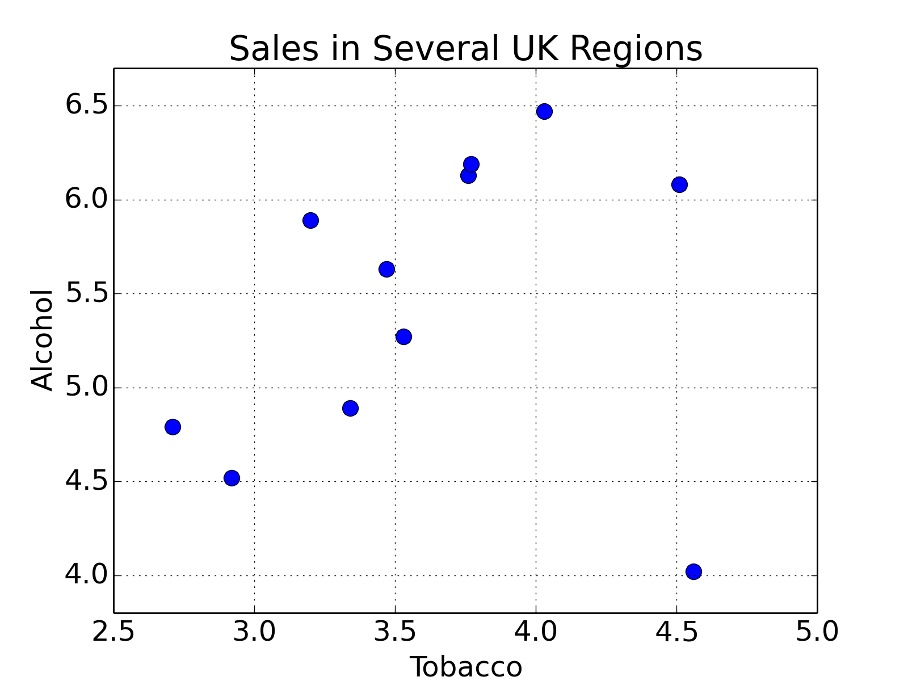
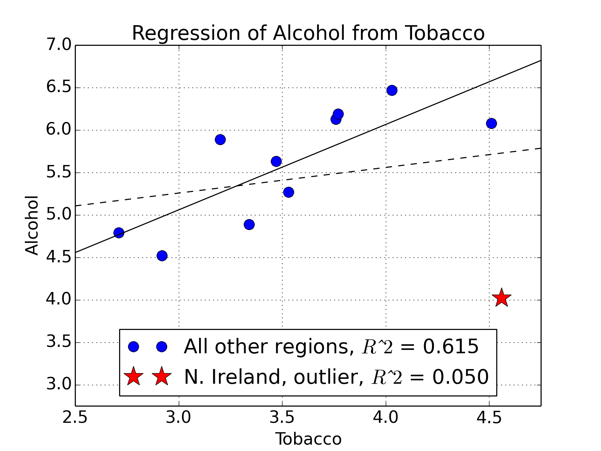
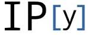

.. image:: ..\Images\title_models.png
    :height: 100 px

.. Statistical Models

Model language 
----------------

The mini-language commonly used now in statistics to describe formulas
was first used in the languages :math:`R` and :math:`S`, but is now also
available in Python through the module *patsy*.

For instance, if we have some variable :math:`y`, and we want to regress
it against some other variables :math:`x, a, b`, and the interaction of
a and b, then we simply write

.. math:: y \sim x + a + b + a:b

The symbols in Table are used on the right hand side to
denote different interactions.

A complete set of the description is found under http://patsy.readthedocs.org/

Design Matrix 
~~~~~~~~~~~~~~~

Definition
^^^^^^^^^^

In a regression model, written in matrix-vector form as

.. math:: y=X\beta+ \epsilon,

the matrix :math:`X` is the *design matrix*.

Examples
^^^^^^^^

Simple Regression
'''''''''''''''''

Example of *simple linear regression* with 7 observations. Suppose there
are 7 data points :math:`\left\{ {{y_i},{x_i}} \right\}`, where
:math:`i=1,2,…,7`. The simple linear regression model is

.. math:: y_i = \beta_0 + \beta_1 x_i +\epsilon_i, \,

where :math:`\beta_0` is the y-intercept and :math:`\beta_1` is the
slope of the regression line. This model can be represented in matrix
form as

.. math::

   \begin{bmatrix}y_1 \\ y_2 \\ y_3 \\ y_4 \\ y_5 \\ y_6 \\ y_7 \end{bmatrix}
     =
     \begin{bmatrix}1 & x_1  \\1 & x_2  \\1 & x_3  \\1 & x_4  \\1 & x_5  \\1 & x_6 \\ 1 & x_7  \end{bmatrix}
     \begin{bmatrix} \beta_0 \\ \beta_1  \end{bmatrix}
     +
     \begin{bmatrix} \epsilon_1 \\ \epsilon_2 \\ \epsilon_3 \\ \epsilon_4 \\ \epsilon_5 \\ \epsilon_6 \\ \epsilon_7 \end{bmatrix}

where the first column of ones in the design matrix represents the
y-intercept term while the second column is the x-values associated with
the y-value.

Multiple Regression
'''''''''''''''''''

Example of *multiple regression* with covariates (i.e. independent
variables) :math:`w_i` and :math:`x_i`. Again suppose that the data are
7 observations, and for each observed value to be predicted
(:math:`y_i`), there are two covariates that were also observed
:math:`w_i` and :math:`x_i`. The model to be considered is

.. math:: y_i = \beta_0 + \beta_1 w_i + \beta_2 x_i + \epsilon_i

This model can be written in matrix terms as

.. math::

   \begin{bmatrix}y_1 \\ y_2 \\ y_3 \\ y_4 \\ y_5 \\ y_6 \\ y_7 \end{bmatrix} =
       \begin{bmatrix} 1 & w_1 & x_1  \\1 & w_2 & x_2  \\1 & w_3 & x_3  \\1 & w_4 & x_4  \\1 & w_5 & x_5  \\1 & w_6 & x_6 \\ 1& w_7  & x_7  \end{bmatrix}
       \begin{bmatrix} \beta_0 \\ \beta_1 \\ \beta_2  \end{bmatrix}
       +
       \begin{bmatrix} \epsilon_1 \\ \epsilon_2 \\ \epsilon_3 \\ \epsilon_4 \\ \epsilon_5 \\ \epsilon_6 \\ \epsilon_7 \end{bmatrix}

One-way ANOVA (Cell Means Model)
''''''''''''''''''''''''''''''''

Example with a one-way analysis of variance (ANOVA) with 3 groups and 7
observations. The given data set has the first three observations
belonging to the first group, the following two observations belong to
the second group and the final two observations are from the third
group. If the model to be fit is just the mean of each group, then the
model is

.. math:: y_{ij} = \mu_i + \epsilon_{ij}

which can be written

.. math::

   \begin{bmatrix}y_1 \\ y_2 \\ y_3 \\ y_4 \\ y_5 \\ y_6 \\ y_7 \end{bmatrix} =
     \begin{bmatrix}1 & 0 & 0 \\1 &0  &0 \\ 1 & 0 & 0 \\  0 & 1 & 0 \\  0 & 1 & 0 \\  0 & 0 & 1 \\  0 & 0 & 1\end{bmatrix}
     \begin{bmatrix}\mu_1 \\ \mu_2 \\ \mu_3  \end{bmatrix}
     +
     \begin{bmatrix} \epsilon_1 \\ \epsilon_2 \\ \epsilon_3 \\ \epsilon_4 \\ \epsilon_5 \\ \epsilon_6 \\ \epsilon_7 \end{bmatrix}

It should be emphasized that in this model :math:`\mu_i` represents the
mean of the :math:`i`\ th group.

One-way ANOVA (offset from reference group)
'''''''''''''''''''''''''''''''''''''''''''

The ANOVA model could be equivalently written as each group parameter
:math:`\tau_i` being an offset from some overall reference. Typically
this reference point is taken to be one of the groups under
consideration. This makes sense in the context of comparing multiple
treatment groups to a control group and the control group is considered
the "reference". In this example, group 1 was chosen to be the reference
group. As such the model to be fit is:

.. math:: y_{ij} = \mu + \tau_i + \epsilon_{ij}

with the constraint that :math:`\tau_1` is zero.

.. math::

   \begin{bmatrix}y_1 \\ y_2 \\ y_3 \\ y_4 \\ y_5 \\ y_6 \\ y_7 \end{bmatrix} =
     \begin{bmatrix}1 &0 &0 \\1 &0  &0 \\ 1 & 0 & 0 \\ 1 & 1 & 0 \\ 1 & 1 & 0 \\ 1 & 0 & 1 \\ 1  & 0 & 1\end{bmatrix}
     \begin{bmatrix}\mu \\  \tau_2 \\ \tau_3 \end{bmatrix}
     +
     \begin{bmatrix} \epsilon_1 \\ \epsilon_2 \\ \epsilon_3 \\ \epsilon_4 \\ \epsilon_5 \\ \epsilon_6 \\ \epsilon_7 \end{bmatrix}

In this model :math:`\mu` is the mean of the reference group and
:math:`\tau_i` is the difference from group :math:`i` to the reference
group. :math:`\tau_1` and is not included in the matrix because its
difference from the reference group (itself) is necessarily zero.

Example 1: Program Effectiveness
~~~~~~~~~~~~~~~~~~~~~~~~~~~~~~~~

In this rather simple example we use data from Spector and Mazzeo (1980), to estimate a linear regression model with statsmodels.

.. literalinclude:: ..\Code\regSpector.py

Example 2: Linear Models
~~~~~~~~~~~~~~~~~~~~~~~~

This second set of examples is based heavily on Jonathan Taylor's class notes that use R. The following notebook introduces the use of pandas and the formula framework in statsmodels in the context of linear modeling:

Ipython notebook `100_statsIntro_linearModels.ipynb <http://nbviewer.ipython.org/url/raw.github.com/thomas-haslwanter/statsintro/master/ipynb/100_statsIntro_linearModels.ipynb>`_

Linear Regression Analysis with Python
--------------------------------------

The following is based on the `blog of Connor
Johnson <http://connor-johnson.com/2014/02/18/linear-regression-with-python/>`__.

We will use Python to explore measures of fit for linear regression: the
coefficient of determination (:math:`R^2`), hypothesis tests (F, t,
Omnibus), AIC, BIC, and other measures.

First we will look at a small data set from `DASL
library <http://lib.stat.cmu.edu/DASL/Stories/AlcoholandTobacco.html>`__,
regarding the correlation between tobacco and alcohol purchases in
different regions of the United Kingdom. The interesting feature of this
data set is that Northern Ireland is reported as an outlier.
Notwithstanding, we will use this data set to describe two tools for
calculating a linear regression. We will alternatively use the
*statsmodels* and *sklearn* modules for calculating the linear
regression, while using *pandas* for data management, and *matplotlib*
for plotting. To begin, we will import the modules, get the data into
Python, and have a look at them:

::

        import numpy as np
        import pandas as pd
        import matplotlib.pyplot as plt
        import statsmodels.formula.api as sm
        from sklearn.linear_model import LinearRegression
        from scipy import stats

        data_str = '''Region Alcohol Tobacco
        North 6.47 4.03
        Yorkshire 6.13 3.76
        Northeast 6.19 3.77
        East_Midlands 4.89 3.34
        West_Midlands 5.63 3.47
        East_Anglia 4.52 2.92
        Southeast 5.89 3.20
        Southwest 4.79 2.71
        Wales 5.27 3.53
        Scotland 6.08 4.51
        Northern_Ireland 4.02 4.56'''

        # Read in the data. Note that for Python 2.x, you have to change the "import" statement
        from io import StringIO
        df = pd.read_csv(StringIO(data_str), sep=r'\s+')

        # Plot the data
        df.plot('Tobacco', 'Alcohol', style='o')
        plt.ylabel('Alcohol')
        plt.title('Sales in Several UK Regions')
        plt.show()

    Sales of Alcohol vs Tobacco in the UK. We notice that there seems to be a linear trend, and one outlier, which corresponds to North Ireland.

Fitting the model, leaving the outlier for the moment away is then very
easy:

::

        result = smf.ols('Alcohol ~ Tobacco', df[:-1]).fit()
        print(result.summary())

Note that using the formula API from statsmodels, an intercept is
automatically added. This gives us

::

                                OLS Regression Results
    ==============================================================================
    Dep. Variable:                Alcohol   R-squared:                       0.615
    Model:                            OLS   Adj. R-squared:                  0.567
    Method:                 Least Squares   F-statistic:                     12.78
    Date:                Sun, 27 Apr 2014   Prob (F-statistic):            0.00723
    Time:                        13:19:51   Log-Likelihood:                -4.9998
    No. Observations:                  10   AIC:                             14.00
    Df Residuals:                       8   BIC:                             14.60
    Df Model:                           1
    ==============================================================================
                     coef    std err          t      P>|t|      [95.0% Conf. Int.]
    ------------------------------------------------------------------------------
    Intercept      2.0412      1.001      2.038      0.076        -0.268     4.350
    Tobacco        1.0059      0.281      3.576      0.007         0.357     1.655
    ==============================================================================
    Omnibus:                        2.542   Durbin-Watson:                   1.975
    Prob(Omnibus):                  0.281   Jarque-Bera (JB):                0.904
    Skew:                          -0.014   Prob(JB):                        0.636
    Kurtosis:                       1.527   Cond. No.                         27.2
    ==============================================================================

And now we have a very nice table of mostly meaningless numbers. I will
go through and explain each one. The left column of the first table is
mostly self explanatory. The degrees of freedom of the model are the
number of predictor, or explanatory variables. The degrees of freedom of
the residuals is the number of observations minus the degrees of freedom
of the model, minus one (for the offset).

Most of the values listed in the summary are available via the
*result* object. For instance, the :math:`R^2` value is obtained by
*result.rsquared*. If you are using IPython, you may type
*result.* and hit the TAB key, and a list of attributes for the
*result* object will drop down.

Model Results
~~~~~~~~~~~~~

Definitions for Regression with Intercept
^^^^^^^^^^^^^^^^^^^^^^^^^^^^^^^^^^^^^^^^^

:math:`n` is the number of observations, :math:`p` is the number of
regression parameters. For example, if you fit a straight line,
:math:`k=2`. In the following :math:`\hat{y}_i` will indicate the fitted
model values, and :math:`\bar{y}` will indicate the mean.

-  :math:`SSM = \sum_{i=1}^n (\hat{y}_i-\bar{y})^2` is the *Sum of
   Square for Model*, or the sum of squares for the regression.

-  :math:`SSE = \sum_{i=1}^n (y_i-\hat{y}_i)^2` is the *sum of Squares
   for Error*, or the sum of squares for the residuals.

-  :math:`SST = \sum_{i=1}^n (y_i-\bar{y})^2` is the *Sum of Squares
   Total*, and is equivalent to the sample variance multiplied by
   :math:`n-1`.

For multiple regression models, :math:`SSM + SSE = SST`

-  :math:`DFM = k - 1` is the *(Corrected) Degrees of Freedom for
   Model*. (The “-1” comes from the fact that we are only interested in
   the correlation, not in the absolute offset of the data.)

-  :math:`DFE = n - k` is the *Degrees of Freedom for Error*

-  :math:`DFT = n - 1` is the *(Corrected) Degrees of Freedom Total*.
   The Horizontal line regression is the null hypothesis model.

For multiple regression models with intercept, DFM + DFE = DFT.

-  :math:`MSM = SSM / DFM` : *Mean of Squares for Model*

-  :math:`MSE = SSE / DFE` : *Mean of Squares for Error*. MSE is an
   unbiased estimate for :math:`\sigma^2` for multiple regression
   models.

-  :math:`MST = SST / DFT` : *Mean of Squares Total*, which is the
   sample variance of the y-variable.

The :math:`R^2` Value
^^^^^^^^^^^^^^^^^^^^^

The :math:`R^2` value indicates the proportion of variation in the
y-variable that is due to variation in the x-variables. For simple
linear regression, the :math:`R^2` value is the square of the sample
correlation :math:`r_{xy}`. For multiple linear regression with
intercept (which includes simple linear regression), the :math:`R^2`
value is defined as

.. math:: R^2 = \frac{SSM}{SST}

The *adjusted* :math:`R^2` Value
~~~~~~~~~~~~~~~~~~~~~~~~~~~~~~~~

Many researchers prefer the adjusted :math:`\bar{R}^2` value (Eq
[eq:adjustedR2]), which is penalized for having a large number of
parameters in the model:

Here is the logic behind the definition of :math:`\bar{R}^2`:
:math:`R^2` is defined as :math:`R^2 = 1 - SSE/SST` or
:math:`1 - R^2 = SSE/SST`. To take into account the number of regression
parameters :math:`p`, define the *adjusted R-squared* value as

.. math:: 1- \bar{R}^2 = \frac{Variance for Error}{Variance Total}

where *(Sample) Variance for Error* is estimated by
:math:`SSE/DFE = SSE/(n-k)`, and *(Sample) Variance Total* is estimated
by :math:`SST/DFT = SST/(n-1)`. Thus,

.. math::

   \begin{aligned}
       1 - \bar{R}^2 &=& \frac{SSE/(n - k)}{SST/(n - 1)} \\
             	&=& \frac{SSE}{SST}\frac{n - 1}{n - k}\end{aligned}

so

.. math::

   \begin{aligned}
     \bar{R}^2 &=& 1 - \frac{SSE}{SST} \frac{n - 1}{(n - k} \\
       &=& 1 - (1 - R^2)\frac{n - 1}{n - k}\end{aligned}

The F-test
^^^^^^^^^^

If :math:`t_1, t_2, ... , t_m` are independent, :math:`N(0, \sigma^2)`
random variables, then :math:`\sum_{i=1}^m \frac{t_i^2}{\sigma^2}` is a
:math:`\chi^2` (chi-squared) random variable with :math:`m` degrees of
freedom.

For a multiple regression model with intercept,

.. math:: Y_j = \alpha + \beta_1 X_{1j} + ... + \beta_n X_{nj} + \epsilon_i = \alpha + \sum_{i=1}^n \beta_i X_{ij} + \epsilon_j = E(Y_j | X) + \epsilon_j

we want to test the following null hypothesis and alternative
hypothesis:

:math:`H_0`: :math:`\beta_1` = :math:`\beta_2` = , ... , =
:math:`\beta_n` = 0

:math:`H_1`: :math:`\beta_j \neq 0`, for at least one value of j

This test is known as the overall *F-test for regression*.

It can be shown that if :math:`H_0` is true and the residuals are
unbiased, homoscedastic, independent, and normal (see section
[sec:Assumptions] ):

#. :math:`SSE / \sigma^2` has a :math:`\chi^2` distribution with DFE
   degrees of freedom.

#. :math:`SSM / \sigma^2` has a :math:`\chi^2` distribution with DFM
   degrees of freedom.

#. SSE and SSM are independent random variables.

If :math:`u` is a :math:`\chi^2` random variable with :math:`n` degrees
of freedom, :math:`v` is a :math:`\chi^2` random variable with :math:`m`
degrees of freedom, and :math:`u` and :math:`v` are independent, then if
:math:`F = \frac{u/n}{v/m}` has an F distribution with :math:`(n,m)`
degrees of freedom.

If H0 is true,

.. math:: F = \frac{(SSM/\sigma^2)/DFM}{(SSE/\sigma^2)/DFE} = \frac{SSM/DFM}{SSE/DFE} = \frac{MSM}{MSE},

has an F distribution with :math:`(DFM, DFE)` degrees of freedom, and is
independent of :math:`\sigma`.

We can test this directly in Python with

::

        N = result.nobs
        k = result.df_model+1
        dfm, dfe = k-1, N - k
        F = result.mse_model / result.mse_resid
        p = 1.0 - stats.f.cdf(F,dfm,dfe)
        print('F-statistic: {:.3f},  p-value: {:.5f}'.format( F, p ))

which gives us

::

        F-statistic: 12.785,  p-value: 0.00723

Here, *stats.f.cdf( F, m, n )* returns the cumulative sum of the
F-distribution with shape parameters *m = k-1 = 1*, and *n = N - k
= 8*, up to the F-statistic :math:`F`. Subtracting this quantity from
one, we obtain the probability in the tail, which represents the
probability of observing F-statistics more extreme than the one
observed.

Log-Likelihood Function
^^^^^^^^^^^^^^^^^^^^^^^

A very common approach in statistics is the idea of *Maximum Likelihood*
estimation. The basic idea is quite different from the *minimum square*
approach: there, the model is constant, and the errors of the response
are variable; in contrast, in the maximum likelihood approach, the data
response values are regarded as constant, and the likelihood of the
model is maximised.

For the Classical Linear Regression Model (with normal errors) we have

.. math:: \epsilon = y_i - \sum_{k=1}^n \beta_k x_{ik} = y_i - \hat{y}_i \; in \; N(0, \sigma^2)

so the probability density is given by

.. math:: p(\epsilon_i) =  \Phi (\frac{y_i - \hat{y}_i}{\sigma})

where :math:`\Phi(z)` is the standard normal probability distribution
function. The probability of independent samples is the product of the
individual probabilities

.. math:: \Pi_{total} = \prod_{i=1}^n p(\epsilon_i)

The *Log Likelihood function* is defined as

.. math::

   \begin{aligned}
     ln(\mathfrak{L}) &=& ln(\Pi_{total}) \\
     &=& ln\left[\prod_{i=1}^n \frac{1}{\sigma\sqrt{2 \pi}} \exp \left(\frac{(y_i - \hat{y}_i)^2}{2 \sigma^2}\right)\right] \\
     &=& \sum_{i=1}^n\left[log\left(\frac{1}{\sigma \sqrt{2 \pi}}\right)- \left(\frac{(y_i - \hat{y}_i)^2}{2 \sigma^2}\right)\right]\end{aligned}

It can be shown that the maximum likelihood estimator of
:math:`\sigma^2` is

.. math:: E(\sigma^2) = \frac{SSE}{n}

We can calculate this in Python as follows:

::

        N = result.nobs
        SSR = result.ssr
        s2 = SSR / N
        L = ( 1.0/np.sqrt(2*np.pi*s2) ) ** N * np.exp( -SSR/(s2*2.0) )
        print('ln(L) =', np.log( L ))

        >>> ln(L) = -4.99975869739

Information Content of Statistical Models - AIC and BIC
^^^^^^^^^^^^^^^^^^^^^^^^^^^^^^^^^^^^^^^^^^^^^^^^^^^^^^^

To judge the quality of your model, you should first visually inspect
the residuals. In addition, you can also use a number of numerical
criteria to assess the quality of a statistical model. These criteria
represent various approaches for balancing model accuracy with
parsimony.

We have already encountered the :math:`adjusted\; R^2` value (Eq
[eq:adjustedR2]), which - in contrast to the :math:`R^2` value -
decreases if there are too many regressors in the model.

Other commonly encountered criteria are the *Akaike Information
Criterion (AIC)* and the Schwartz or *Bayesian Information Criterion
(BIC)* , which are based on the log-likelihood described in the previous
section. Both measures introduce a penalty for model complexity, but the
AIC penalizes complexity less severely than the BIC. The *Akaike
Information Criterion AIC* is given by

.. math:: AIC = 2*k - 2*ln(\mathfrak{L})

and the Schwartz or *Bayesian Information Criterion BIC* by

.. math:: BIC = k*ln(N) - 2*ln(\mathfrak{L})

are other commonly encountered criteria. Here, :math:`N` is the number
of observations, :math:`k` is the number of parameters, and
:math:`\mathcal{L}` is the likelihood. We have two parameters in this
example, the slope and intercept. The AIC is a relative estimate of
information loss between different models. The BIC was initially
proposed using a Bayesian argument, and does not related to ideas of
information. Both measures are only used when trying to decide between
different models. So, if you have one regression for alcohol sales based
on cigarette sales, and another model for alcohol consumption that
incorporated cigarette sales and lighter sales, then you would be
inclined to choose the model that had the lower AIC or BIC value.

Model Coefficients and Their Interpretation
~~~~~~~~~~~~~~~~~~~~~~~~~~~~~~~~~~~~~~~~~~~

Coefficients
^^^^^^^^^^^^

The *coefficients* or weights of the linear regression are contained in
*result.params*, and returned as a pandas Series object, since we
used a pandas DataFrame as input. This is nice, because the coefficients
are named for convenience.

::

        result.params
        >>> Intercept    2.041223
        >>> Tobacco      1.005896
        >>> dtype: float64

We can obtain this directly by computing

.. math:: \beta = (X^{T}X)^{-1}X^{T}y.

Here, :math:`X` is the matrix of predictor variables as columns, with an
extra column of ones for the constant term, :math:`y` is the column
vector of the response variable, and :math:`\beta` is the column vector
of coefficients corresponding to the columns of :math:`X`. In Python:

::

        df['Eins'] = np.ones(( len(df), ))
        Y = df.Alcohol[:-1]
        X = df[['Tobacco','Eins']][:-1]

Standard Error
^^^^^^^^^^^^^^

To obtain the *standard errors of the coefficients* we will calculate
the covariance-variance matrix, also called the covariance matrix, for
the estimated coefficients :math:`\beta` of the predictor variables
using

.. math:: C = cov(\beta) = \sigma^{2} ( X X^{T} )^{-1}.

Here, :math:`\sigma^{2}` is the variance, or the MSE (mean squared
error) of the residuals. The standard errors are the square roots of the
elements on the main diagonal of this covariance matrix. We can perform
the operation above, and calculate the element-wise square root using
the following Python code,

::

        X = df.Tobacco[:-1]

        # add a column of ones for the constant intercept term
        X = np.vstack(( np.ones(X.size), X ))

        # convert the NumPy arrray to matrix
        X = np.matrix( X )

        # perform the matrix multiplication,
        # and then take the inverse
        C = np.linalg.inv( X * X.T )

        # multiply by the MSE of the residual
        C *= result.mse_resid

        # take the square root
        SE = np.sqrt(C)

        print(SE)

        >>> [[ 0.28132158         nan]
        >>> [        nan  1.00136021]]

t-statistic
^^^^^^^^^^^

We use the t-test to test the null hypothesis that the coefficient of a
given predictor variable is zero, implying that a given predictor has no
appreciable effect on the response variable. The alternative hypothesis
is that the predictor does contribute to the response. In testing we set
some threshold, :math:`\alpha = 0.05,\;or\; 0.01`, and if
:math:`\Pr(T \ge \vert t \vert) < \alpha`, then we reject the
null hypothesis at our threshold :math:`\alpha`, otherwise we fail to
reject the null hypothesis. The t-test generally allows us to evaluate
the importance of different predictors, *assuming that the residuals of
the model are normally distributed about zero*. If the residuals do not
behave in this manner, then that suggests that there is some
non-linearity between the variables, and that their t-tests should not
be used to assess the importance of individual predictors. Furthermore,
it might be best to try to modify the model so that the residuals do
tend the cluster normally about zero.

The t statistic is given by the ratio of the coefficient (or factor) of
the predictor variable of interest, and its corresponding standard
error. If :math:`\beta` is the vector of coefficients or factors of our
predictor variables, and SE is our standard error, then the t statistic
is given by,

.. math:: t_{i} = \beta_{i} / SE_{i,i}

So, for the first factor, corresponding to the slope in our example, we
have the following code,

::

        i = 1
        beta = result.params[i]
        se = SE[i,i]
        t = beta / se
        print('t =', t)

        >>> t = 3.5756084542390316

Once we have a t statistic, we can (sort of) calculate the probability
of observing a statistic at least as extreme as what we’ve already
observed, given our assumptions about the normality of our errors by
using the code,

::

        N = result.nobs
        k = result.df_model + 1
        dof = N - k
        p_onesided = 1.0 - stats.t( dof ).cdf( t )
        p = p_onesided * 2.0
        print('p = {0:.3f}'.format(p))

        >>> p = 0.007

Here, *dof* are the degrees of freedom, which should be eight, which
is the number of observations, N, minus the number of parameters, which
is two. The CDF is the cumulative sum of the PDF. We are interested in
the area under the right hand tail, beyond our t statistic, t, so we
subtract the cumulative sum up to that statistic from one in order to
obtain the tail probability on the other side. We then multiply this
tail probability by two to obtain a two-tailed probability.

Confidence Interval
^^^^^^^^^^^^^^^^^^^

The confidence interval is built using the standard error, the p-value
from our T-test, and a critical value from a T-test having :math:`N-k`
degrees of freedom, where :math:`k` is the number of observations and
:math:`P` is the number of model parameters, i.e., the number of
predictor variables. The confidence interval is the range of values
we would expect to find the parameter of interest, based on what we have
observed. You will note that we have a confidence interval for the
predictor variable coefficient, and for the constant term. A smaller
confidence interval suggests that we are confident about the value of
the estimated coefficient, or constant term. A larger confidence
interval suggests that there is more uncertainty or variance in the
estimated term. Again, let me reiterate that hypothesis testing is only
one perspective. Furthermore, it is a perspective that was developed in
the late nineteenth and early twentieth centuries when data sets were
generally smaller and more expensive to gather, and data scientists were
using books of logarithm tables for arithmetic.

The confidence interval is given by,

.. math:: CI =  \beta_{i} \pm z \cdot SE_{i,i}

Here, :math:`\beta` is one of the estimated coefficients, :math:`z` is a
*critical-value*, which is the t-statistic required to obtain a
probability less than the alpha significance level, and :math:`SE_{i,i}`
is the standard error. The critical value is calculated using the
inverse of the cumulative distribution function. (The cumulative
distribution function is the cumulative sum of the probability
distribution.) In code, the confidence interval using a t-distribution
looks like,

::

        i = 0

        # the estimated coefficient, and its variance
        beta, c = result.params[i], SE[i,i]

        # critical value of the t-statistic
        N = result.nobs
        P = result.df_model
        dof = N - P - 1
        z = stats.t( dof ).ppf(0.975)

        # the confidence interval
        print(beta - z * c, beta + z * c)

Analysis of Residuals
~~~~~~~~~~~~~~~~~~~~~

The command from provides some additional information about the
residuals of the model: Omnibus, Skewness, Kurtosis, Durbin-Watson,
Jarque-Bera, and the Condition number. In the following we will briefly
describe these parameters.

Skewness and Kurtosis
^^^^^^^^^^^^^^^^^^^^^

Skew and kurtosis refer to the shape of a distribution. *Skewness* is a
measure of the asymmetry of a distribution, and *kurtosis* is a measure
of its curvature, specifically how pointed the curve is. (For normally
distributed data approximately 3.) These values are calculated by hand
as

.. math::

   \begin{aligned}
       S &= \dfrac{\hat{\mu}_{3}}{\hat{\sigma}^{3}} = \dfrac{ \frac{1}{N} \displaystyle \sum_{i=1}^{N} ( y_{i} - \hat{y}_{i} )^{3} }{ \biggl( \frac{1}{N} \displaystyle \sum_{i=1}^{N} ( y_{i} - \hat{y}_{i} )^{2} \biggr)^{3/2}}, \\
       K &= \dfrac{\hat{\mu}_{4}}{\hat{\sigma}^{4}} = \dfrac{ \frac{1}{N} \displaystyle \sum_{i=1}^{N} ( y_{i} - \hat{y}_{i} )^{4} }{ \biggl( \frac{1}{N} \displaystyle \sum_{i=1}^{N} ( y_{i} - \hat{y}_{i} )^{2} \biggr)^{2}}\end{aligned}

As you see, the :math:`\hat{\mu}_3` and :math:`\hat{\mu}_4` are the
third and fourth central moments of a distribution. One possible Python
implementation would be,

::

        d = Y - result.fittedvalues

        S = np.mean( d**3.0 ) / np.mean( d**2.0 )**(3.0/2.0)
        # equivalent to:
        # S = stats.skew(result.resid, bias=True)

        K = np.mean( d**4.0 ) / np.mean( d**2.0 )**(4.0/2.0)
        # equivalent to:
        # K = stats.kurtosis(result.resid, fisher=False, bias=True)
        print('Skewness: {:.3f},  Kurtosis: {:.3f}'.format( S, K ))

        >>> Skewness: -0.014,  Kurtosis: 1.527

Omnibus Test
^^^^^^^^^^^^

The Omnibus test uses skewness and kurtosis to test the null hypothesis
that a distribution is normal. In this case, we’re looking at the
distribution of the residual. If we obtain a very small value for
:math:`\Pr( \mbox{ Omnibus } )`, then the residuals are not normally
distributed about zero, and we should maybe look at our model more
closely. The *statsmodels* OLS function uses the
*stats.normaltest()* function:

::

        (K2, p) = stats.normaltest(result.resid)
        print('Omnibus: {0}, p = {1}'.format(K2, p))

        >>> Omnibus: 2.5418981690649174, p = 0.28056521527106976

Thus, if either the skewness or kurtosis suggests non-normality, this
test should pick it up.

Durbin-Watson
^^^^^^^^^^^^^

The Durbin-Watson test is used to detect the presence of autocorrelation
(a relationship between values separated from each other by a given time
lag) in the residuals. Here the lag is one.

.. math:: DW = \dfrac{ \displaystyle \sum_{i=2}^{N} ( ( y_{i} - \hat{y}_i ) - ( y_{i-1} - \hat{y}_{i-1} ) )^{2} }{ \displaystyle \sum_{i=1}^{N} ( y_{i} - \hat{y}_{i} )^{2}}

::

        DW = np.sum( np.diff( result.resid.values )**2.0 ) / result.ssr
        print('Durbin-Watson: {:.5f}'.format( DW ))

        >>> Durbin-Watson: 1.97535

Jarque-Bera Test
^^^^^^^^^^^^^^^^

The Jarque-Bera test is another test that considers skewness (S), and
kurtosis (K). The null hypothesis is that the distribution is normal,
that both the skewness and excess kurtosis equal zero, or alternatively,
that the skewness is zero and the regular run-of-the-mill kurtosis is
three. Unfortunately, with small samples the Jarque-Bera test is prone
rejecting the null hypothesis -– that the distribution is normal–when it
is in fact true.

.. math:: JB = \dfrac{N}{6} \biggl( S^{2} + \dfrac{1}{4}(K-3)^{2} \biggr)

Calculating the JB-statistic using the :math:`\chi^{2}` distribution
with two degrees of freedom we have,

::

        JB = (N/6.0) * ( S**2.0 + (1.0/4.0)*( K - 3.0 )**2.0 )
        p = 1.0 - stats.chi2(2).cdf(JB)
        print('JB-statistic: {:.5f},  p-value: {:.5f}'.format( JB, p ))

        >>> JB-statistic: 0.90421,  p-value: 0.63629

Condition Number
^^^^^^^^^^^^^^^^

The *condition number* measures the sensitivity of a function’s output
to its input. When two predictor variables are highly correlated, which
is called multicollinearity, the coefficients or factors of those
predictor variables can fluctuate erratically for small changes in the
data, or the model. Ideally, similar models should be similar, i.e.,
have approximately equal coefficients. Multicollinearity can cause
numerical matrix inversion to crap out, or produce inaccurate results.
One approach to this problem in regression is the technique of *ridge
regression*, which is available in the *sklearn* Python module.

We calculate the condition number by taking the eigenvalues of the
product of the predictor variables (including the constant vector of
ones) and then taking the square root of the ratio of the largest
eigenvalue to the least eigenvalue. If the condition number is greater
than thirty, then the regression may have multicollinearity.

::

        X = np.matrix( X )
        EV = np.linalg.eig( X * X.T )
        print(EV)

        >>> (array([   0.18412885,  136.51527115]), matrix([[-0.96332746, -0.26832855],
        >>> [ 0.26832855, -0.96332746]]))

Note that :math:`X.T * X` should be :math:`( P + 1 ) \times ( P + 1 )`,
where :math:`P` is the number of degrees of freedom of the model (the
number of predictors) and the +1 represents the addition of the constant
vector of ones for the intercept term. In our case, the product should
be a :math:`2 \times 2` matrix, so we’ll have two eigenvalues. Then our
condition number is given by,

::

        CN = np.sqrt( EV[0].max() / EV[0].min() )
        print('Condition No.: {:.5f}'.format( CN ))

        >>> Condition No.: 27.22887

Our condition number is juuust below 30, so we can sort of sleep okay.

Comparison
~~~~~~~~~~

Now that we have seen an example of linear regression with a reasonable
degree of linearity, compare that with an example of one with a
significant outlier. In practice, outliers should be understood before
they are discarded, because they might turn out to be very important.
They might signify a new trend, or some possibly catastrophic event.

::

        X = df[['Tobacco','Eins']]
        Y = df.Alcohol
        result = sm.OLS( Y, X ).fit()
        result.summary()

::

                                OLS Regression Results
    ==============================================================================
    Dep. Variable:                Alcohol   R-squared:                       0.050
    Model:                            OLS   Adj. R-squared:                 -0.056
    Method:                 Least Squares   F-statistic:                    0.4735
    Date:                Sun, 27 Apr 2014   Prob (F-statistic):              0.509
    Time:                        12:58:27   Log-Likelihood:                -12.317
    No. Observations:                  11   AIC:                             28.63
    Df Residuals:                       9   BIC:                             29.43
    Df Model:                           1
    ==============================================================================
                     coef    std err          t      P>|t|      [95.0% Conf. Int.]
    ------------------------------------------------------------------------------
    Intercept      4.3512      1.607      2.708      0.024         0.717     7.986
    Tobacco        0.3019      0.439      0.688      0.509        -0.691     1.295
    ==============================================================================
    Omnibus:                        3.123   Durbin-Watson:                   1.655
    Prob(Omnibus):                  0.210   Jarque-Bera (JB):                1.397
    Skew:                          -0.873   Prob(JB):                        0.497
    Kurtosis:                       3.022   Cond. No.                         25.5
    ==============================================================================

Regression Using Sklearn
~~~~~~~~~~~~~~~~~~~~~~~~

`*Scikit-learn (sklearn)* <http://scikit-learn.org/>`__ is an open
source machine learning library for the Python programming language. It
features various classification, regression and clustering algorithms.

In order to use *sklearn*, we need to input our data in the form of
vertical vectors. Whenever one slices off a column from a NumPy array,
NumPy stops worrying whether it is a vertical or horizontal vector.
MATLAB works differently, as it is primarily concerned with matrix
operations. NumPy, however has a matrix class for whenever the
verticallness or horizontalness of an array is important. Therefore, in
our case, we’ll cast the DataFrame as Numpy matrix so that vertical
arrays stay vertical once they are sliced off the data set.

::

        data = np.matrix( df )

Next, we create the regression objects, and fit the data to them. In
this case, we’ll consider a clean set, which will fit a linear
regression better, which consists of the data for all of the regions
except Northern Ireland, and an original set consisting of the original
data

::

        cln = LinearRegression()
        org = LinearRegression()

        X, Y = data[:,2], data[:,1]
        cln.fit( X[:-1], Y[:-1] )
        org.fit( X, Y )

        clean_score = '{0:.3f}'.format( cln.score( X[:-1], Y[:-1] ) )
        original_score = '{0:.3f}'.format( org.score( X, Y ) )

The next piece of code produces a scatter plot of the regions, with all
of the regions plotted as empty blue circles, except for Northern
Ireland, which is depicted as a red star.

::

        mpl.rcParams['font.size']=16

        plt.plot( df.Tobacco[:-1], df.Alcohol[:-1], 'bo', markersize=10,
            label='All other regions, $Rˆ2$ = '+clean_score )

        plt.hold(True)
        plt.plot( df.Tobacco[-1:], df.Alcohol[-1:], 'r*', ms=20, lw=10,
            label='N. Ireland, outlier, $Rˆ2$ = '+original_score)

The next part generates a set of points from 2.5 to 4.85, and then
predicts the response of those points using the linear regression object
trained on the clean and original sets, respectively.

::

        test = np.arange( 2.5, 4.85, 0.1 )
        test = np.array( np.matrix( test ).T )

        plot( test, cln.predict( test ), 'k' )
        plot( test, org.predict( test ), 'k--' )

Finally, we limit and label the axes, add a title, overlay a grid, place
the legend at the bottom, and then save the figure.

::

        xlabel('Tobacco') ; xlim(2.5,4.75)
        ylabel('Alcohol') ; ylim(2.75,7.0)
        title('Regression of Alcohol from Tobacco')
        grid()
        legend(loc='lower center')

Conclusion
~~~~~~~~~~

Before you do anything, visualize your data. If your data is highly
dimensional, then at least examine a few slices using boxplots. At the
end of the day, use your own judgement about a model based on your
knowledge of your domain. Statistical tests should guide your reasoning,
but they shouldn’t dominate it. In most cases, your data will not align
itself with the assumptions made by most of the available tests.
`Here <http://www.nature.com/news/scientific-method-statistical-errors-1.14700>`__
is a very interesting article from Nature on classical hypothesis
testing. A more intuitive approach to hypothesis testing is Bayesian
analysis.

Assumptions 
-------------

Standard linear regression models with standard estimation techniques
make a number of assumptions about the predictor variables, the response
variables and their relationship. Numerous extensions have been
developed that allow each of these assumptions to be relaxed (i.e.
reduced to a weaker form), and in some cases eliminated entirely. Some
methods are general enough that they can relax multiple assumptions at
once, and in other cases this can be achieved by combining different
extensions. Generally these extensions make the estimation procedure
more complex and time-consuming, and may also require more data in order
to get an accurate model.

The following are the major assumptions made by standard linear
regression models with standard estimation techniques (e.g. ordinary
least squares):

-  **Weak exogeneity**. This essentially means that the predictor
   variables :math:`x` can be treated as fixed values, rather than
   random variables. This means, for example, that the predictor
   variables are assumed to be error-free, that is they are not
   contaminated with measurement errors. Although not realistic in many
   settings, dropping this assumption leads to significantly more
   difficult errors-in-variables models.

-  **Linearity**. This means that the mean of the response variable is a
   linear combination of the parameters (regression coefficients) and
   the predictor variables. Note that this assumption is much less
   restrictive than it may at first seem. Because the predictor
   variables are treated as fixed values (see above), linearity is
   really only a restriction on the parameters. The predictor variables
   themselves can be arbitrarily transformed, and in fact multiple
   copies of the same underlying predictor variable can be added, each
   one transformed differently. This trick is used, for example, in
   polynomial regression, which uses linear regression to fit the
   response variable as an arbitrary polynomial function (up to a given
   rank) of a predictor variable. This makes linear regression an
   extremely powerful inference method. In fact, models such as
   polynomial regression are often "too powerful", in that they tend to
   overfit the data. As a result, some kind of regularization must
   typically be used to prevent unreasonable solutions coming out of the
   estimation process. Common examples are ridge regression and lasso
   regression. Bayesian linear regression can also be used, which by its
   nature is more or less immune to the problem of overfitting. (In
   fact, ridge regression and lasso regression can both be viewed as
   special cases of Bayesian linear regression, with particular types of
   prior distributions placed on the regression coefficients.)

-  **Constant variance** (aka *homoscedasticity*). This means that
   different response variables have the same variance in their errors,
   regardless of the values of the predictor variables. In practice this
   assumption is invalid (i.e. the errors are heteroscedastic) if the
   response variables can vary over a wide scale. In order to determine
   for heterogeneous error variance, or when a pattern of residuals
   violates model assumptions of homoscedasticity (error is equally
   variable around the ’best-fitting line’ for all points of x), it is
   prudent to look for a "fanning effect" between residual error and
   predicted values. This is to say there will be a systematic change in
   the absolute or squared residuals when plotted against the predicting
   outcome. Error will not be evenly distributed across the regression
   line. Heteroscedasticity will result in the averaging over of
   distinguishable variances around the points to get a single variance
   that is inaccurately representing all the variances of the line. In
   effect, residuals appear clustered and spread apart on their
   predicted plots for larger and smaller values for points along the
   linear regression line, and the mean squared error for the model will
   be wrong. Typically, for example, a response variable whose mean is
   large will have a greater variance than one whose mean is small. For
   example, a given person whose income is predicted to be $100,000 may
   easily have an actual income of $80,000 or $120,000 (a standard
   deviation]] of around $20,000), while another person with a predicted
   income of $10,000 is unlikely to have the same $20,000 standard
   deviation, which would imply their actual income would vary anywhere
   between -$10,000 and $30,000. (In fact, as this shows, in many cases
   – often the same cases where the assumption of normally distributed
   errors fails – the variance or standard deviation should be predicted
   to be proportional to the mean, rather than constant.) Simple linear
   regression estimation methods give less precise parameter estimates
   and misleading inferential quantities such as standard errors when
   substantial heteroscedasticity is present. However, various
   estimation techniques (e.g. weighted least squares and
   heteroscedasticity-consistent standard errors) can handle
   heteroscedasticity in a quite general way. Bayesian linear regression
   techniques can also be used when the variance is assumed to be a
   function of the mean. It is also possible in some cases to fix the
   problem by applying a transformation to the response variable (e.g.
   fit the logarithm of the response variable using a linear regression
   model, which implies that the response variable has a log-normal
   distribution rather than a normal distribution).

-  **Independence of errors**. This assumes that the errors of the
   response variables are uncorrelated with each other. (Actual
   statistical independence is a stronger condition than mere lack of
   correlation and is often not needed, although it can be exploited if
   it is known to hold.) Some methods (e.g. generalized least squares)
   are capable of handling correlated errors, although they typically
   require significantly more data unless some sort of regularization is
   used to bias the model towards assuming uncorrelated errors. Bayesian
   linear regression is a general way of handling this issue.

-  **Lack of multicollinearity in the predictors**. For standard least
   squares estimation methods, the design matrix :math:`X` must have
   full column rank :math:`p`; otherwise, we have a condition known as
   multicollinearity in the predictor variables. This can be triggered
   by having two or more perfectly correlated predictor variables (e.g.
   if the same predictor variable is mistakenly given twice, either
   without transforming one of the copies or by transforming one of the
   copies linearly). It can also happen if there is too little data
   available compared to the number of parameters to be estimated (e.g.
   fewer data points than regression coefficients). In the case of
   multicollinearity, the parameter vector :math:`\beta` will be
   non-identifiable, it has no unique solution. At most we will be able
   to identify some of the parameters, i.e. narrow down its value to
   some linear subspace of :math:`R^p`. Methods for fitting linear
   models with multicollinearity have been developed. Note that the more
   computationally expensive iterated algorithms for parameter
   estimation, such as those used in generalized linear models, do not
   suffer from this problem — and in fact it’s quite normal to when
   handling categorical data\|categorically-valued predictors to
   introduce a separate indicator variable predictor for each possible
   category, which inevitably introduces multicollinearity.

Beyond these assumptions, several other statistical properties of the
data strongly influence the performance of different estimation methods:

-  The statistical relationship between the error terms and the
   regressors plays an important role in determining whether an
   estimation procedure has desirable sampling properties such as being
   unbiased and consistent.

-  The arrangement, or probability distribution of the predictor
   variables :math:`x` has a major influence on the precision of
   estimates of :math:`\beta`. Sampling and design of experiments are
   highly-developed subfields of statistics that provide guidance for
   collecting data in such a way to achieve a precise estimate of
   :math:`\beta`.

Interpretation
~~~~~~~~~~~~~~

A fitted linear regression model can be used to identify the
relationship between a single predictor variable :math:`x_j` and the
response variable :math:`y` when all the other predictor variables in
the model are “held fixed”. Specifically, the interpretation of
:math:`\beta_j` is the expected change in :math:`y` for a one-unit
change in :math:`x_j` when the other covariates are held fixed—that is,
the expected value of the partial derivative of :math:`y` with respect
to :math:`x_j`. This is sometimes called the ”unique effect” of
:math:`x_j` on ”y”. In contrast, the ”marginal effect” of :math:`x_j` on
:math:`y` can be assessed using a correlation coefficient or simple
linear regression model relating :math:`x_j` to :math:`y`; this effect
is the total derivative of :math:`y` with respect to :math:`x_j`.

Care must be taken when interpreting regression results, as some of the
regressors may not allow for marginal changes (such as dummy variables,
or the intercept term), while others cannot be held fixed (recall the
example from the introduction: it would be impossible to “hold
:math:`t_j` fixed” and at the same time change the value of
:math:`t_i^2`.

It is possible that the unique effect can be nearly zero even when the
marginal effect is large. This may imply that some other covariate
captures all the information in :math:`x_j`, so that once that variable
is in the model, there is no contribution of :math:`x_j` to the
variation in :math:`y`. Conversely, the unique effect of :math:`x_j` can
be large while its marginal effect is nearly zero. This would happen if
the other covariates explained a great deal of the variation of
:math:`y`, but they mainly explain variation in a way that is
complementary to what is captured by :math:`x_j`. In this case,
including the other variables in the model reduces the part of the
variability of :math:`y` that is unrelated to :math:`x_j`, thereby
strengthening the apparent relationship with :math:`x_j`.

The meaning of the expression “held fixed” may depend on how the values
of the predictor variables arise. If the experimenter directly sets the
values of the predictor variables according to a study design, the
comparisons of interest may literally correspond to comparisons among
units whose predictor variables have been “held fixed” by the
experimenter. Alternatively, the expression “held fixed” can refer to a
selection that takes place in the context of data analysis. In this
case, we “hold a variable fixed” by restricting our attention to the
subsets of the data that happen to have a common value for the given
predictor variable. This is the only interpretation of “held fixed” that
can be used in an observational study.

The notion of a “unique effect” is appealing when studying a complex
system where multiple interrelated components influence the response
variable. In some cases, it can literally be interpreted as the causal
effect of an intervention that is linked to the value of a predictor
variable. However, it has been argued that in many cases multiple
regression analysis fails to clarify the relationships between the
predictor variables and the response variable when the predictors are
correlated with each other and are not assigned following a study
design.

|ipynb| `101_modeling.ipynb <http://nbviewer.ipython.org/url/raw.github.com/thomas-haslwanter/statsintro/master/ipynb/101_modeling.ipynb>`_

|python| `modeling.py <https://github.com/thomas-haslwanter/statsintro/blob/master/Code3/modeling.py>`_

Bootstrapping
-------------

Another type of modelling is *bootstrapping*/. Sometimes you have data
describing a distribution, but do not know what type of distribution it
is. So what can you do if you want to find out e.g. confidence values
for the mean?

The answer is bootstrapping. Bootstrapping is a scheme of *resampling*,
i.e. taking additional samples repeatedly from the initial sample, to
provide estimates of its variability. In a case where the distribution
of the initial sample is unknown, bootstrapping is of especial help in
that it provides information about the distribution.

|ipynb| `102_bootstrap.ipynb <http://nbviewer.ipython.org/url/raw.github.com/thomas-haslwanter/statsintro/master/ipynb/102_bootstrap.ipynb>`_

|python| `bootstrap.py <https://github.com/thomas-haslwanter/statsintro/blob/master/Code3/bootstrap.py>`_

