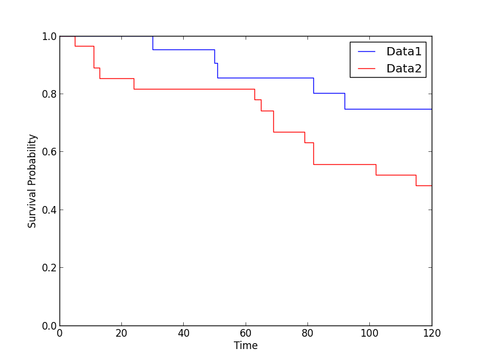

.. Analysis of Survival Times
.. ==========================

When analyzing survival times, different problems come up than the ones
discussed so far. One question is how do we deal with subjects dropping
out of a study. For example, assume that we test a new cancer drug.
While some subjects die, others may believe that the new drug is not
effective, and decide to drop out of the study before the study is
finished. A similar problem would be faced when we investigate how long
a machine lasts before it breaks down.

Survival Probabilities
----------------------

Kaplan-Meier survival curve
~~~~~~~~~~~~~~~~~~~~~~~~~~~

A clever way to deal with these problems is described in detail in .
First, the time is subdivided into small periods. Then the likelihood is
calculated that a subject survives a given period. The survival
probability is given by

.. math:: p_k = p_{k-1} * \frac{r_k-f_k}{r_k}

where :math:`p_k` is the probability to survive period :math:`k`;
:math:`r_k` is the number of subjects still at risk (i.e. still being
followed up) immediately before the :math:`k^{th}` day, and :math:`f_k`
is the number of observed failures on the day :math:`k`. The curve
describing the resulting survival probability is called *life table*,
*survival curve*, or *Kaplan-Meier curve* (see Figure
[fig:SurvivalCurve]).

| |image31|

*Survival curve corresponding to a motion sickness experiment, described in more
detail in [Altman(1999)], chapter 13*

Note that the survival curve changes only when a "failure" occurs, i.e.
when a subject dies. *Censored* entries, describing either when a
subject drops out of the study or when the study finishes, are taken
into consideration at the "failure" times, but otherwise do not affect
the survival curve.

Comparing Survival Curves in Two Groups
---------------------------------------

The most common test for comparing independent groups of survival times
is the *logrank test*. This test is a non-parametric hypothesis test,
testing the probability that both groups come from the same underlying
population. Since to my knowledge this test is not yet implemented in a
Python library, I have included an implementation based on the equations
given by (see program [py:survival]).

To explore the effect of different variables on survival, more advanced
methods are required. The *Cox regression model* introduced by Cox in
1972 is used widely when it is desired to investigate several variables
at the same time. For details, check or other statistic textbooks.

|ipynb| `110_survival.ipynb <http://nbviewer.ipython.org/url/raw.github.com/thomas-haslwanter/statsintro/master/ipynb/110_survival.ipynb>`_

|python| `survival.py <https://github.com/thomas-haslwanter/statsintro/blob/master/Code3/survival.py>`_

.. |ipynb| image:: ../Images/IPython.jpg
    :scale: 50 % 
.. |python| image:: ../Images/python.jpg
    :scale: 50 % 
