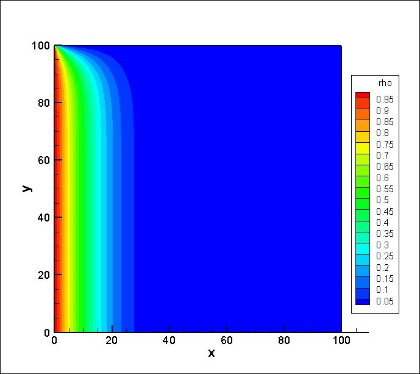
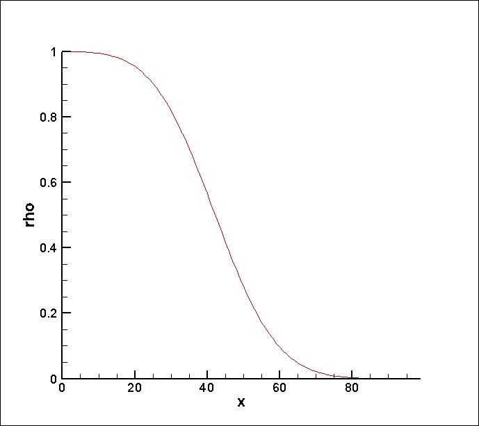
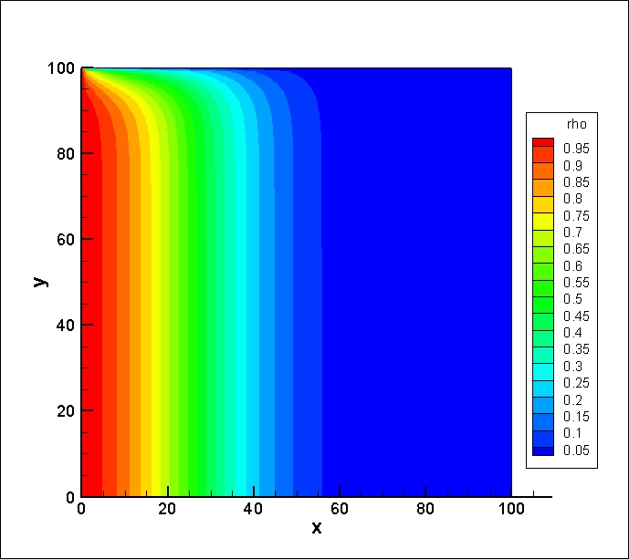
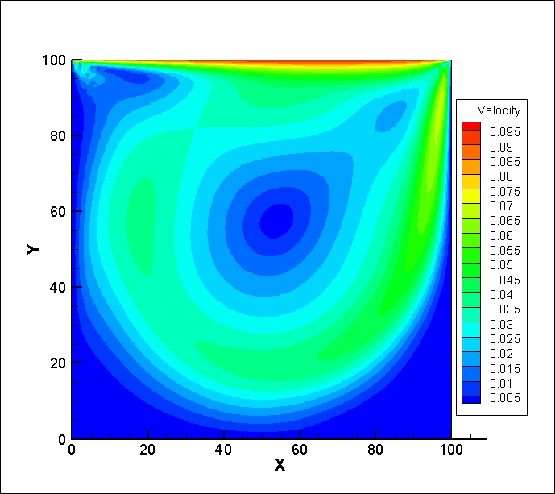
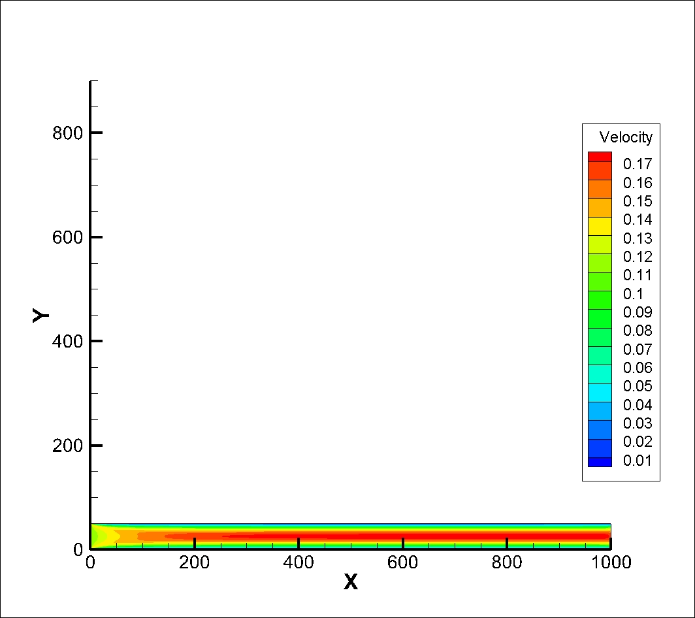
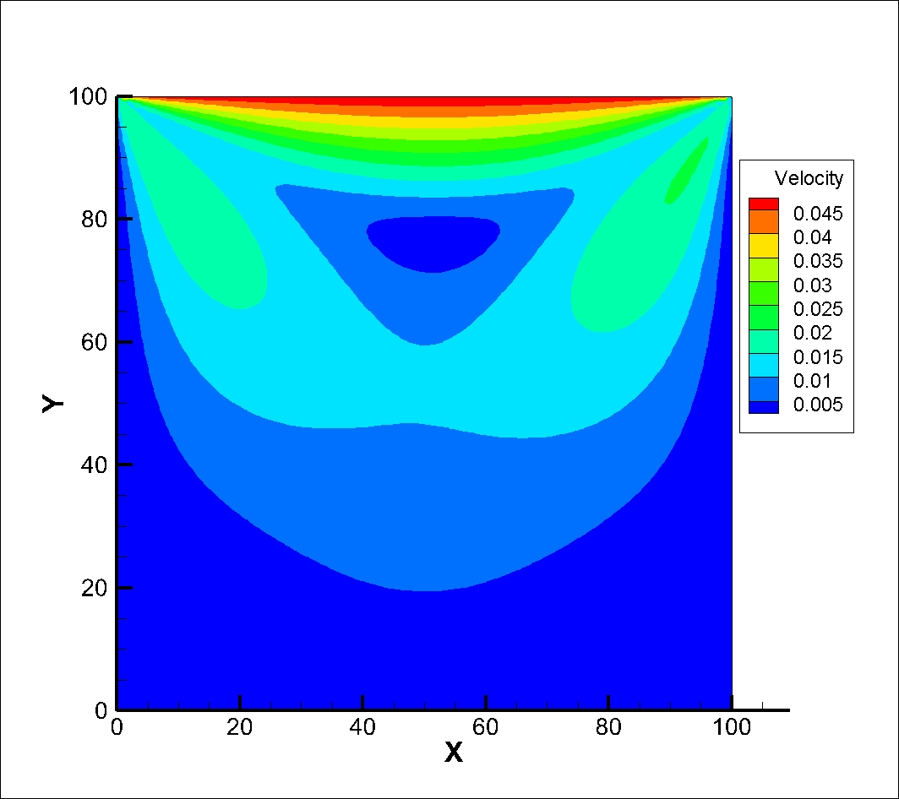

# LBM-Cplusplus-A.A.Mohamad

[The code repository]( https://github.com/zmhhaha/LBM-Cplusplus-A.A.Mohamad )

The C++ version code of "Lattice Boltzmann Method Fundamentals and
Engineering Applications with Computer Codes".

All cases can export data.dat which the software named Tecplot can
open and paraview.

The code was wrote in 2018-7-21~2018-7-28. The code will be update
when I have time.

All code is shared for beginner learning LBM.

| Name |                           Picture                            |
| :--: | :----------------------------------------------------------: |
| A1_1 |    |
| A1_3 |    |
| A1_5 |    |
| A2_1 |    |
| A2_3 |    |
|  A3  |        |
| A4_1 |  |
| A4_2 |   |
| A4_2 |  |
| A4_3 |   |
| A4_3 |  |
|  A5  |  |

