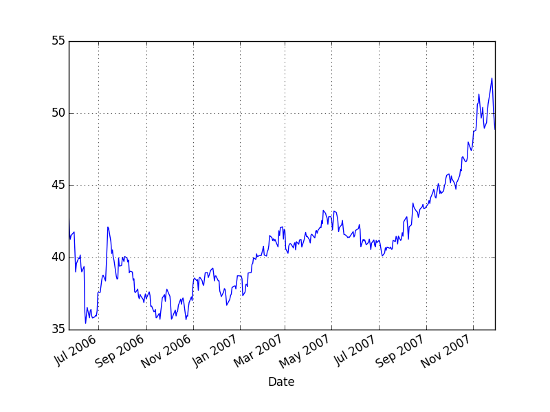
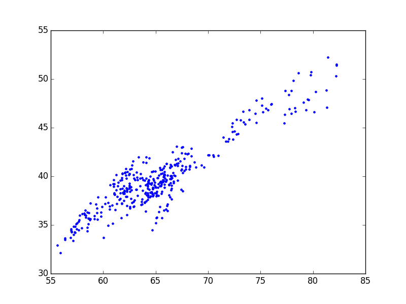

```python
import pandas as pd
import pandas.io.excel as xl
gld = xl.read_excel('GLD.xls',parse_dates=True,index_col='Date')
gdx = xl.read_excel('GDX.xls',parse_dates=True,index_col='Date')
df = pd.DataFrame(index=gld.index)
df['gld'] = gld['Adj Close']
df['gdx'] = gdx['Adj Close']
df = df.dropna()
```

```python
import statsmodels.formula.api as smf
results = smf.ols('gdx ~ gld', data=df).fit()
hedgeRatio = results.params['gld']
print hedgeRatio
```

```text
0.613232143393
```

```python
df['spread'] = df['gld'] - hedgeRatio*df['gdx']
trainset = df[0:251]
testset = df[252:-1]
df['spread'].plot()
plt.savefig('example3_6_01.png'); plt.hold(False)
```



```python
print len(trainset), len(testset)
```

```text
251 132
```

```python
plt.plot(df['gld'],df['gdx'],'.')
plt.savefig('example3_6_02.png'); plt.hold(False)
```




```python
spreadMean = trainset['spread'].mean()
spreadStd = trainset['spread'].std()
zscore = (trainset['spread'] - spreadMean) / spreadStd
longs = zscore<=-2
shorts = zscore>=2
exits = np.abs(zscore)<=1
positions 
print spreadMean, spreadStd
print exits[:4]
```

```text
42.4792017125 3.18705806732
Date
2007-11-30    False
2007-11-29    False
2007-11-28    False
2007-11-27    False
Name: spread, dtype: bool
```


