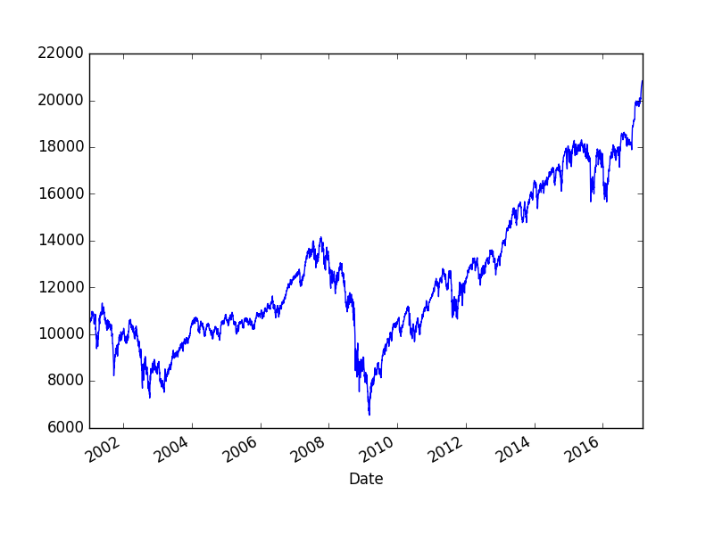

Main equation

$$ 
\ln(p(t)) = A + B(t_c - t)^\beta 
\big[ 1 + C \cos (\omega \ln(t_c-t) + \phi )  \big] 
\mlabel{1}
$$

Simplified form derivation below: start with logistic equation,

$$ \frac{dp}{dt} = rp(t) [ K - p(t) ] $$

$$ \frac{dp}{dt} = r [p(t)]^{1+\delta} $$

$$ \int \frac{dp}{p(t)^{1+\delta}} = \int rt$$

$$ \int p(t)^{-1-\delta} \ud p = rt + C $$

Define $C = -rt_c$

$$ \frac{p(t)^{-\delta}}{-\delta} = rt - rt_c $$

$$ p(t)^{-\delta}= -\delta r(t - t_c) $$

Because $t-t_c = -(t_c-t)$ the subtraction inside paren is

$$ p(t)^{-\delta}= \delta r(t_c - t) $$

Define $\alpha = -\frac{1}{\delta}$, take $\alpha$'th power of both sides

$$ (p(t)^{-\delta})^\alpha= (\delta r )^\alpha (t_c - t)^\alpha $$

Let $p(0) = p_0 = (\delta r )^\alpha$

$$ p(t) = p_0 (t_c - t)^\alpha $$

For fitting it is better to use

$$ p(t) = A + B(t_c - t)^z \mlabel{2} $$

Install lmfit==0.8.3

```python
import pandas as pd, datetime
from pandas_datareader import data
start=datetime.datetime(2001, 1, 1)
end=datetime.datetime(2018, 1, 1)
df = data.DataReader('^GSPC', 'yahoo', start, end)
df.to_csv('sp500201702.csv')
df = data.DataReader('^DJI', 'yahoo', start, end)
df.to_csv('dji201702.csv')
```

```python
import pandas as pd, datetime
#df = pd.read_csv('sp500201702.csv', index_col=0,parse_dates=True)
df = pd.read_csv('dji201702.csv', index_col=0,parse_dates=True)
```

```python
import pandas as pd
from lmfit import Parameters, minimize
from lmfit.printfuncs import report_fit

def init_fit(min, max, init):
    fit_params = Parameters()
    fit_params.add('tc', value=init, max=max, min=min)
    fit_params.add('A', value=2.0, max=10.0, min=0.1)
    fit_params.add('m', value=0.5, max=1.0, min=0.01)
    fit_params.add('C', value=0.0, max=2.0, min=-2)
    fit_params.add('beta', value=0.5, max=1.0, min=0.1)
    fit_params.add('omega', value=20., max=40.0, min=0.1)
    fit_params.add('phi', value=np.pi, max=2*np.pi, min=0.1)
    return fit_params

def f(pars,x):
    tc = pars['tc'].value
    A = pars['A'].value
    m = pars['m'].value
    C = pars['C'].value
    beta = pars['beta'].value
    omega = pars['omega'].value
    phi = pars['phi'].value
    tmp1 = (1 + C*np.cos(omega*np.log(tc-x) + phi))
    model = A - ((m*((tc-x)**beta))*tmp1)
    return model
    
def residual(pars,y,t):
    return y-f(pars,t)

beg_date = df.head(1).index[0].timetuple()
beg_date_dec = beg_date.tm_year + (beg_date.tm_yday / 367.)
end_date = df.tail(1).index[0].timetuple()
end_date_dec = end_date.tm_year + (end_date.tm_yday / 367.)
df['Year'] = np.linspace(beg_date_dec,end_date_dec,len(df))

fit_params = init_fit(2001.0,2100.0,2050.)

y = np.log(df['Adj Close'])
t = df['Year']
out = minimize(residual, fit_params, args=(y,t,))

report_fit(fit_params)
```

```text
[[Variables]]
    tc:      2018.01977 +/- 0.059571 (0.00%) (init= 2050)
    A:       10         +/- 0.007098 (0.07%) (init= 2)
    m:       0.19663441 +/- 0.019641 (9.99%) (init= 0.5)
    C:      -0.14243083 +/- 0.007036 (4.94%) (init= 0)
    beta:    0.53262341 +/- 0.026568 (4.99%) (init= 0.5)
    omega:   13.1485152 +/- 0.151282 (1.15%) (init= 20)
    phi:     6.28318530 +/- 0.049456 (0.79%) (init= 3.141593)
[[Correlations]] (unreported correlations are <  0.100)
    C(omega, phi)                = -0.994 
    C(m, beta)                   = -0.993 
    C(A, m)                      =  0.972 
    C(tc, phi)                   = -0.940 
    C(A, beta)                   = -0.940 
    C(tc, omega)                 =  0.911 
    C(A, C)                      =  0.801 
    C(m, C)                      =  0.766 
    C(C, beta)                   = -0.729 
    C(tc, C)                     =  0.200 
    C(C, phi)                    = -0.178 
    C(tc, A)                     =  0.173 
    C(C, omega)                  =  0.164 
    C(beta, omega)               =  0.147 
    C(A, phi)                    = -0.128 
    C(beta, phi)                 = -0.121 
    C(A, omega)                  =  0.101 
```

Analyze residuals for stationarity, if there, fit was good.

```python
import statsmodels.tsa.stattools as st
res = list(st.adfuller(out.residual,maxlag=1))
print res[0], '%1,%5,%10', res[4]['1%'], res[4]['5%'], res[4]['10%']
```

```text
-2.90299578531 %1,%5,%10 -3.43196089051 -2.86225180324 -2.56714889993
```

```python
df['Adj Close'].plot()
plt.savefig('bubble_01.png')
```




