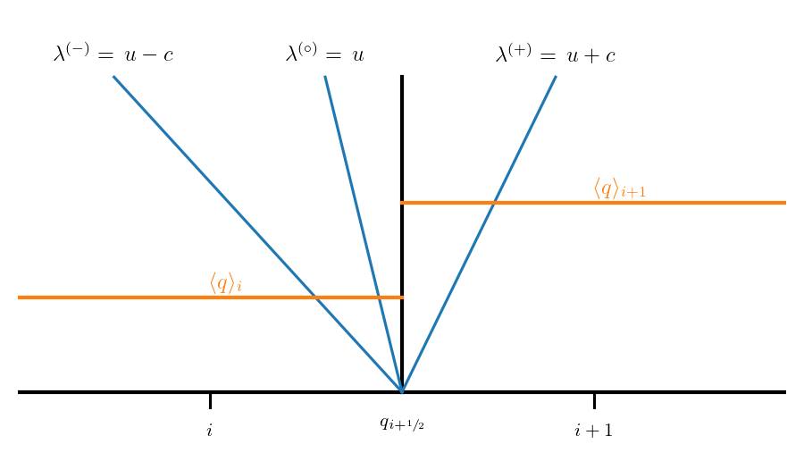
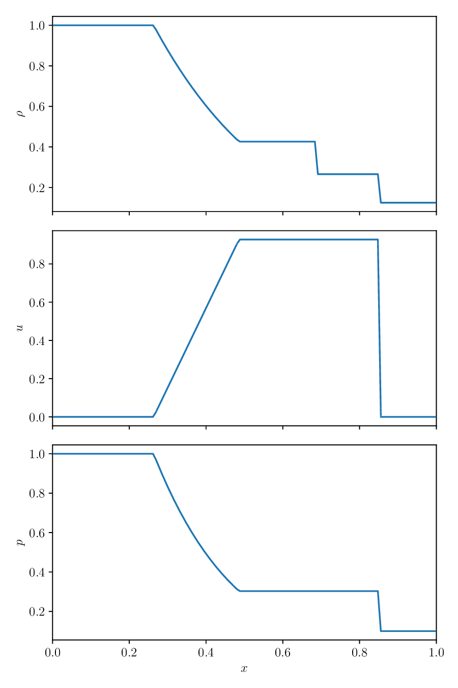

# Euler Equations

The Euler equations describe compressible flow in the absence of
dissipative effects (like viscosity).  In one-dimension, they appear
as:

$$
\begin{align*}
\frac{\partial \rho}{\partial t} + \frac{\partial (\rho u)}{\partial x} &= 0 \\
\frac{\partial (\rho u)}{\partial t} + \frac{\partial}{\partial x} (\rho u^2 + p) &= 0 \\
\frac{\partial (\rho E)}{\partial t} + \frac{\partial}{\partial x} \left [ (\rho E + p) u \right ] &= 0
\end{align*}
$$

Here, $E$ is the specific total energy which is related to the specific internal energy as:

$$
\rho E = \rho e + \frac{1}{2} \rho u^2
$$

and the system is closed by an equation of state:

$$p = p(\rho, e)$$

A common equation of state is a *gamma-law EOS*:

$$ p = \rho e (\gamma - 1)$$

where $\gamma$ is a constant.  For an ideal gas, $\gamma$ is the ratio of specific heats, $c_p / c_v$.

## Conservative form

As expressed above, the Euler equations are in conservative form.  We can define the conservative
state, ${\bf U}$ as:

$${\bf U} = \left ( \begin{array}{c} \rho \\ \rho u \\ \rho E \end{array} \right )$$

and the flux, ${\bf F}({\bf U})$ as:

$${\bf F} = \left ( \begin{array}{c} \rho u \\ \rho u^2 + p  \\ (\rho E + p) u \end{array} \right )$$

and then our system in conservative form is:

$${\bf U}_t + [{\bf F}({\bf U})]_x = 0$$

and we can do the same technique of discretizing the domain into cells
and integrating over the volume of a cell to get the finite-volume
conservative update for the system:

$$\frac{\partial {\bf U}_i}{\partial t} =
  - \frac{1}{\Delta x} \left [ {\bf F}({\bf U}_{i+1/2}) - {\bf F}({\bf U}_{i+1/2}) \right ]$$

This means that we will be able to use the same basic solution methodology
from advection and Burgers' equation with the Euler equations, so long
as we can find the fluxes.  This primarily means that we need to understand the Riemann
problem for the Euler equations.

## Primitive variable form

We can alternately express the Euler equations in terms of the primitive variables, ${\bf q}$:

$${\bf q} = \left ( \begin{array}{c} \rho \\ u \\ p \end{array} \right )$$

and the evolution equations are:

$$
\left ( \begin{array}{c} \rho \\ u \\ p \end{array} \right )_t +
   \left ( \begin{array}{c} u & \rho & 0 \\ 0 & u & 1/\rho \\ 0 & \Gamma_1 p & u \end{array} \right )
   \left ( \begin{array}{c} \rho \\ u \\ p \end{array} \right )_x = 0
$$

where $\Gamma_1 = d \log p/d \log \rho |_s$

or compactly:

$${\bf q}_t + {\bf A}({\bf q}) {\bf q}_x = 0$$

Another useful quantity is the speed of sound, defined as:

$$c = \sqrt{\frac{\Gamma_1 p}{\rho}}$$

## Characteristic form

We call a system *hyperbolic* if the eigenvalues are real and finite.
For our matrix ${\bf A}({\bf q})$ above, the eigenvalues are:

$$
\begin{align}
\lambda^{(-)} &= u - c \\
\lambda^{(0)} &= u \\
\lambda^{(+)} &= u + c \\
\end{align}
$$

These are the speeds at which information propagates in our system.

We can also find the right and left eigenvectors:

$${\bf A} {\bf r}^{(\nu)} = \lambda^{(\nu)} {\bf r}^{(\nu)}$$

$${\bf l}^{(\nu)} {\bf A}  = \lambda^{(\nu)} {\bf l}^{(\nu)}$$

giving:

$$
{\bf r}^{(-)} = \left ( \begin{array}{c} 1 \\ -c/\rho \\ c^2 \end{array} \right )
%
\qquad
{\bf r}^{(0)} = \left ( \begin{array}{c} 1 \\ 0 \\ 0  \end{array} \right )
%
\qquad
{\bf r}^{(+)} = \left ( \begin{array}{c} 1 \\ c/\rho \\ c^2 \end{array} \right )
$$

and

$$
\begin{align*}
{\bf l}^{(-)} &= \left ( \begin{array}{ccc} 0 & -\frac{\rho}{2c} & \frac{1}{2c^2} \end{array} \right ) \\
{\bf l}^{(0)} &= \left ( \begin{array}{ccc} 1 & 0 & -\frac{1}{c^2} \end{array} \right ) \\
{\bf l}^{(+)} &= \left ( \begin{array}{ccc} 0 & \frac{\rho}{2c} & \frac{1}{2c^2} \end{array} \right ) \\
\end{align*}
$$

These are normalized such that

$${\bf l}^{(i)} \cdot {\bf r}^{(j)} = \delta_{ij}$$

The final form of the Euler equations we will need is the *characteristic form*.  We can 
construct square matrices ${\bf R}$ and ${\bf L}$ by grouping together the eigenvectors:

$${\bf R} = \left ( {\bf r}^{(-)} | {\bf r}^{(0)} | {\bf r}^{(+)} \right )$$

$${\bf L} = \left ( \begin{array}{c} {\bf l}^{(-)} \\
                                     {\bf l}^{(0)} \\
                                     {\bf l}^{(+)} \end{array} \right )$$

These satisfy:

$${\bf L}{\bf R} = {\bf R} {\bf L} = {\bf I}$$

We then define the characteristic variables via:

$$d{\bf w} = {\bf L} d{\bf q}$$

Since we are nonlinear, we cannot simply integrate this.  Using this definition, we can
rewrite our system as:

$${\bf w}_t + {\bf \Lambda} {\bf w}_x = 0$$

where ${\bf \Lambda}$ is a diagonal matrix with the eigenvalues on the diagonal:

$$
{\bf \Lambda} = {\bf LAR} =
   \left ( \begin{array}{ccc}
             \lambda^{(-)} &              & \\
                          & \lambda^{(0)} & \\
                          &              & \lambda^{(+)} \end{array} \right )
$$

In this form, the 3 equations are decoupled and are just advection
equations for each of the characteristic variables.  If our system
were linear, we'd be done -- each characteristic variable would advect
at its given wave speed without interacting with one-another.

Since we are nonlinear, our solution is more difficult, but the
characteristic system still tells us a lot.  

> Consider an initial discontinuity in the primitive variables.  Each
> of the 3 characteristic waves will carry a jump in their associated
> characteristic quantity away from the discontinuity at their
> characteristic speed.

The corresponding jump in the primitive variable is then just 

$$d{\bf q} = {\bf L}^{-1} d{\bf w} = {\bf R}d{\bf w}$$

Looking at the right eigenvectors, we see that all primitive variables
jump across the left and right waves, but only density jumps across
the middle wave.

* The middle wave is called a *contact discontinuity*.  Since the velocity
  does not jump across it, there can be no compression or expansion, so
  shocks and rarefactions are not allowed.
  
* The left and right waves can be either a shock or a rarefaction.

Here's an example of the solution of a Riemann problem for the Euler equations.
The state on the left is initialized to:

$$
\begin{align*}
\rho_L &= 1 \\
u_L &= 0 \\
p_L &= 1 \\
\end{align*}
$$

and on the right:

$$
\begin{align*}
\rho_R &= 1/8 \\
u_R &= 0 \\
p_R &= 1/10 \\
\end{align*}
$$

The jumps we see are just as the right eigenvectors indicated.  Only
the density jumps across the middle wave.  The left wave is a shock
and the right wave is a rarefaction.

