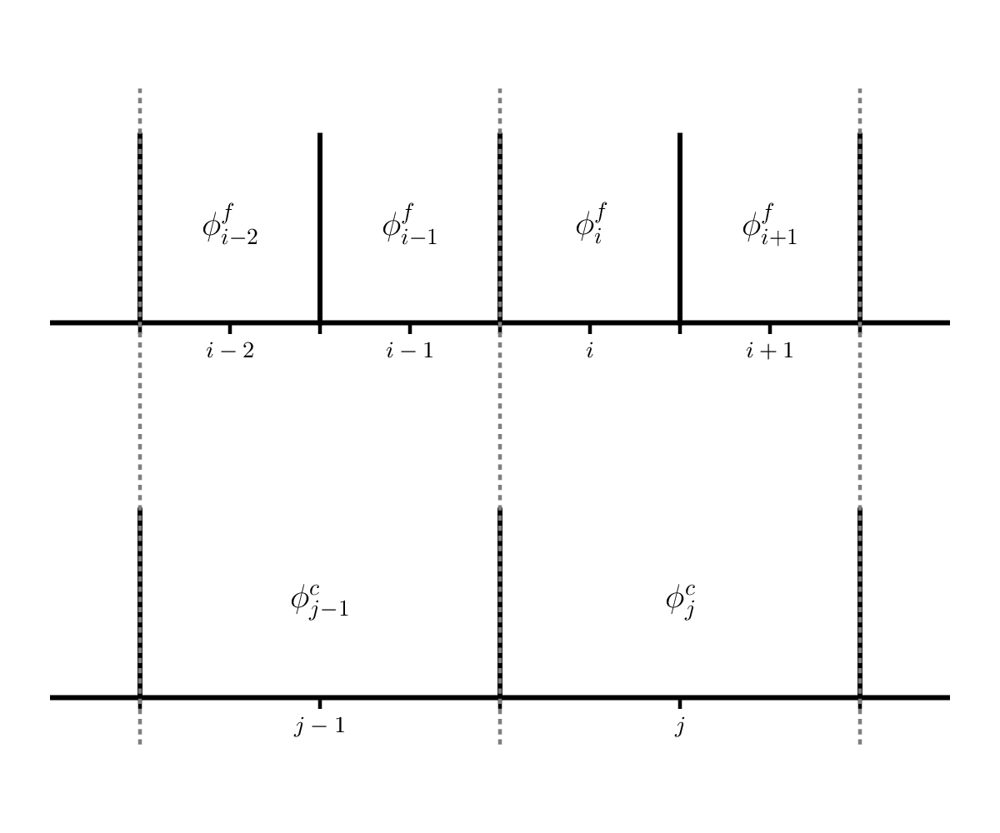
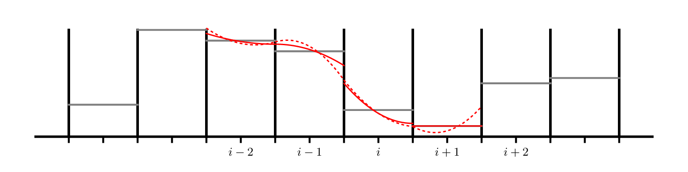
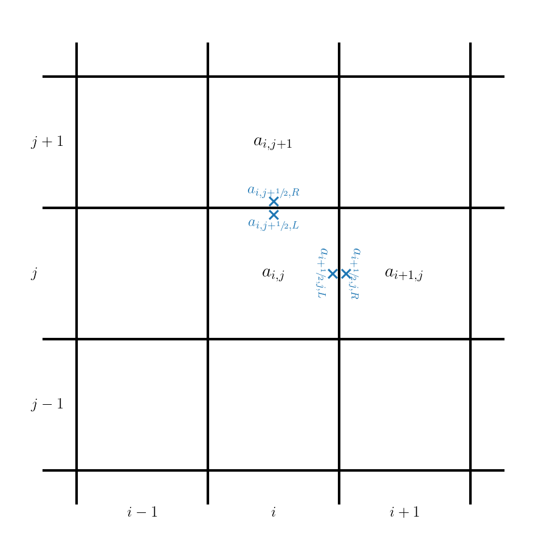

# Practice Projects

Here are some project ideas to help reinforce this material.

## 1. Measuring convergence of our Euler solver

We measured convergence with advection by comparing to the exact
solution.  But what about the case when we don't know the exact
solution?  We can use a grid convergence study to assess the
convergence.  Here's how it works.

1. Pick a smooth problem -- a good problem is the acoustic pulse
   described in this paper:

   [A high-order
   finite-volume method for conservation laws on locally refined
   grids](https://msp.org/camcos/2011/6-1/p01.xhtml)

   See section 4.2.  You'll do this in 1-d in our solver with periodic
   BCs.

2. Run the problem at 4 different resolutions, each varying by a
   factor of 2, e.g., 32, 64, 128, and 256 zones.

3. Compute an error between the run with N zones and the run with 2N
   zones as follows:

   * Coarsen the problem with 2N zones down to N zones by averaging
     2 fine zones into a single coarse zone.  This is shown below:

     

     Here, $\phi^f$ is a variable on the finer resolution grid and
     $\phi^c$ is the variable on the coarse grid.  We see that $\phi^c_j$
     has two fine grid counterparts: $\phi^f_i$ and $\phi^f_{i+1}$, so
     we would do:

     $$\phi^c_j = \frac{1}{2} \left ( \phi^f_i + \phi^f_{i+1} \right )$$

   * Compute the $L_2$norm of the difference between the
     coarsened 2N zone run and the N zone run.

   * Do this for all pairs, so for the 4 runs proposed above, you'd
     have 3 errors corresponding to 64-128, 128-256, and 256-512.

4. Plot the errors along with a line representing ideal 2nd order convergence.

optional: try a different integrator, like 4th order Runge-Kutta and
see how that changes the convergence.

## 2. Sedov explosion and spherical symmetry

We solved the equations of hydrodynamics in 1-d Cartesian coordinates.
If we want to model something that is spherically symmetric, we can do
1-d spherical coordinates.

In 1-d spherical coordinates, the equations of hydrodynamics are:

$$
\begin{align*}
\frac{\partial \rho}{\partial t} + \frac{1}{r^2} \frac{\partial (r^2 \rho u)}{\partial r} &= 0 \\
\frac{\partial (\rho u)}{\partial t} + \frac{1}{r^2} \frac{\partial (r^2 \rho u^2)}{\partial r} + \frac{\partial p}{\partial r} &= 0 \\
\frac{\partial (\rho E)}{\partial t} + \frac{1}{r^2} \frac{\partial }{\partial r} \left [ r^2 (\rho E + p) u \right ] &= 0
\end{align*}
$$

The main difference is that the divergence has area and volume terms now.

A good problem to try with this is the Sedov blast wave explosion.  In
this problem, you put a lot of energy into a point at the center (the
origin of our spherical coordinates) and watch a spherical blast wave
move outward.  There is an analytic solution for a gamma-law gas that
can be compared to.

To solve this with the method-of-lines approach, we would need to:

1. Add the $r$ terms to the conservative update.

2. Implement reflecting boundary conditions at the origin of coordinates.

   Reflecting boundary conditions mean that each zone in the ghost
   cells has the same value as the corresponding zone in the interior
   (e.g., same distance away from the boundary).  But for the
   velocity, we switch the sign, such that the velocity moving toward
   the interface will go to zero.

   This would look like:

   $$\begin{align*}
      \rho_{\mathrm{lo}-1} &= \rho_{\mathrm{lo}} \\
      \rho_{\mathrm{lo}-2} &= \rho_{\mathrm{lo+1}} \\
   \end{align*}$$

   $$\begin{align*}
      (\rho u)_{\mathrm{lo}-1} &= -(\rho u)_{\mathrm{lo}} \\
      (\rho u)_{\mathrm{lo}-2} &= -(\rho u)_{\mathrm{lo+1}} \\
   \end{align*}$$

   $$\begin{align*}
      (\rho E)_{\mathrm{lo}-1} &= (\rho E)_{\mathrm{lo}} \\
      (\rho E)_{\mathrm{lo}-2} &= (\rho E)_{\mathrm{lo+1}} \\
   \end{align*}$$

3. Setup the Sedov problem (I give a common implementation of the initial conditions below)
   and run and compare to the exact solution.

   For the initial conditions, it is common to specify an initial radius of the explosion, $r_0$.  Then
   initialize the pressure as:

   $$p = \left \{ \begin{array}{cc} p_\mathrm{expl} & r \le r_0 \\
                                    p_\mathrm{ambient} & r > r_0 \end{array} \right . $$

   with

   $$p_\mathrm{ambient} = 10^{-5}$$

   and

   $$p_\mathrm{expl} = (\gamma -1) \frac{E_\mathrm{Sedov}}{(4/3) \pi r_0^3}$$

   and $E_\mathrm{Sedov} = 1$ is the initial explosion energy.  This
   formulation finds the pressure corresponding to spreading that
   energy over a sphere of radius $r_0$.
   
   The initial velocity is set to 0.0.

   The density everywhere is 1.0.
    
   Here's the analytic solution for a case with $\gamma = 1.4$:
   {download}`spherical_sedov.txt`

## 3. HLL Riemann solver

We solved the Riemann problem for the Euler equations exactly, but
many times in practice we use approximate Riemann solvers.  The HLL
solver is a popular solver.  Research this method and implement it in
the Euler code and compare the solutions you get with it to those with
the exact solver.

## 4. Piecewise parabolic reconstruction for advection

In class, we considered piecewise constant and piecewise linear
reconstruction with advection.  The next step is piecewise parabolic
reconstruction.  This is described originally here:

[The Piecewise Parabolic Method (PPM) for Gas-Dynamical Systems](https://crd.lbl.gov/assets/pubs_presos/AMCS/ANAG/A141984.pdf)

We want to try this with our method-of-lines integration scheme, which
considerably simplifies things compared to that original paper.

Here's an example of piecewise parabolic reconstruction of data in each zone:

As with piecewise linear, we will need to limit the parabola to
prevent overshoots.  The dotted lines in the figure above are
unlimited parabolas and the solid lines are the limited parabola.

The basic idea is as follows:

1. In each zone, we construct a parabola, given by CW Eq. 1.4.  The CW
   paper uses $\xi$ as the space coordinate, were $\xi_i$ is a zone
   center and $\xi_{i-1/2}$ and $\xi_{i+1/2}$ are the left and right
   edges.  It also allows for a non-uniformly spaced grid.

   The parabola has the form:

   $$a(\xi) = a_{L,i} + x [ \Delta a_i + a_{6,i} (1 - x) ]$$

   where

   $$x = \frac{\xi - \xi_{i-1/2}}{\Delta \xi}$$

   and

   $$\Delta a_i = a_{R,i} - a_{L,i}$$

   $$a_{6,i} = 6 \left [ a_i - \frac{1}{2} (a_{L,i} + a_{R,i}) \right ]$$

   Eqs. 1.5 through 1.10 give the method for computing the 3
   coefficients of the parabola for each cell as well as limiting them
   so as to not introduce any new extrema.

   For a uniform grid, the steps are:

   * Find the first guess at the interface values:

     $$a_{i+1/2} = \frac{1}{2} (a_i + a_{i+1}) + \frac{1}{6} (\delta a_i - \delta a_{i+1} )$$

     with

     $$\delta a_i = \left \{ \begin{array}{cc}
              \min\left (\frac{1}{2}|a_{i+1} - a_{i-1}|, 2 |a_{i+1} - a_i|, 2 |a_i - a_{i-1}|\right )
               \mathrm{sign}(a_{i+1} - a_{i-1})  & \mbox{if}\ (a_{i+1} - a_i)(a_i - a_{i-1}) > 0  \\
              0 & \mbox{otherwise} \end{array} \right .$$

    * Next, for zone $i$, set the left and right interface values using the above:
    
      $$a_{L,i} = a_{i-1/2}$$
      $$a_{R,i} = a_{i+1/2}$$
      
    * Now limit the data according to Eq. 1.10.

   Note: you'll need 3 ghost cells in order to compute all of the information needed.

2. For the method-of-lines scheme we are using, we simply evaluate the parabola
   on each interface and this gives that's zones edge state.    For a parabolic reconstruction
   in zone $i$ of the form $a(\xi)$, our interface states are:

   $$a_{i-1/2,R} = a(\xi_{i-1/2}) = a_{L,i}$$

   $$a_{i+1/2,L} = a(\xi_{i+1/2}) = a_{R,i}$$

3. Compare the solution you get with PPM for the Sod problem to the
   one we got with piecewise linear slopes.

## 5. Two-dimensional advection

The linear advection equation in 2-d is:

$$a_t + u a_x + v a_y = 0$$

In conservative form, we'd write this as:

$$\frac{\partial a}{\partial t} + \frac{\partial (u a)}{\partial x} + \frac{\partial (v a)}{\partial y} = 0$$

We can develop a finite volume method by defining an average as:

$$\langle a \rangle_{i,j} = \frac{1}{\Delta x \Delta y} \int_{x_{i-1/2}}^{x_{i+1/2}} \int_{y_{j-1/2}}^{y_{j+1/2}} a(x, y) dx dy$$

and our final update would look like (dropping the $\langle \rangle$):

$$\frac{\partial}{\partial t} a_{i,j} = - \frac{1}{\Delta x} (F^{(x)}_{i+1/2,j} - F^{(x)}_{i-1/2,j}) - \frac{1}{\Delta y} (F^{(y)}_{i,j+1/2} - F^{(y)}_{i,j-1/2})$$

where $F^{(x)} = u a$ and $F^{(y)} = v a$.

This can be solved using the same method-of-lines technique we did in
1-d, but now we need to create and manage a 2-d grid, fill ghost cells
on both $x$ and $y$ boundaries, and compute fluxes through both $x$
and $y$ interfaces.

The flux computations are done simply by
reconstructing in one coordinate direction and solving the Riemann
problem in that direction.

Code up a 2-d advection solver and test it on advecting a Gaussian.

The timestep limiter needs to be adapted a bit, and is now:

$$\Delta t = C \left [ \frac{u}{\Delta x} + \frac{v}{\Delta y} \right ]^{-1}$$

## 6. Non-conservation?

Suppose instead of solving the total energy equation in the Euler
solver, you instead discretized the internal energy evolution
equation:

$$\frac{\partial (\rho e)}{\partial t} + \frac{\partial (\rho e u)}{\partial x} + p \frac{\partial u}{\partial x} = 0$$

You can compute the flux and the $p \partial u/\partial x$ term using the solution from the Riemann problem as:

$$p_i \frac{u_{i+1/2} - u_{i-1/2}}{\Delta x}$$

Note that the pressure here is the cell-center (average) pressure.

Code this up and run the Sod problem -- how well do you agree with the exact solution?

## 7. Explore pyro

Look at the python hydro solver pyro:

[https://pyro2.readthedocs.io/en/latest/](https://pyro2.readthedocs.io/en/latest/)

Look at the list of solvers and work on running it and exploring the
problems that it provides.  Then add a problem to the solver, based on
something you find in the literature.
