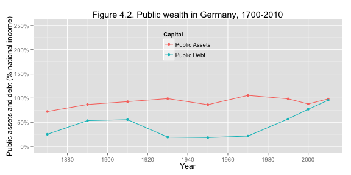
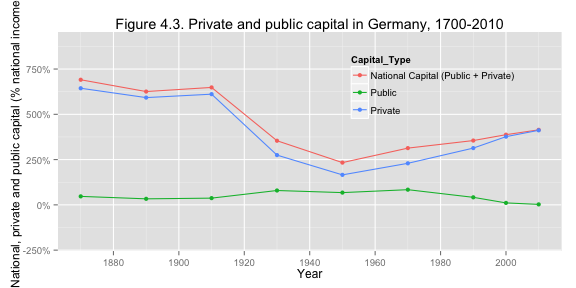
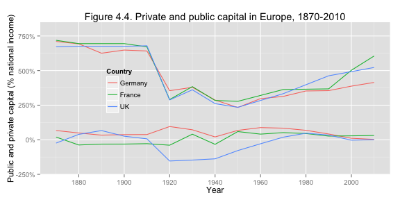
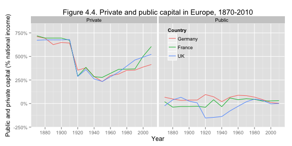
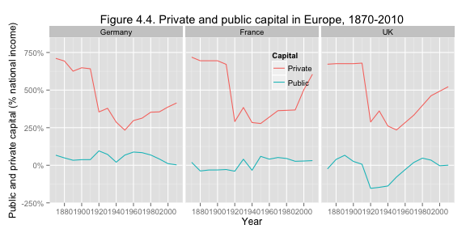
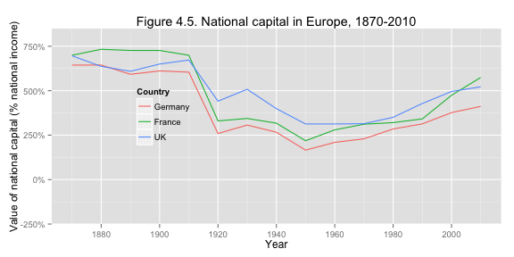
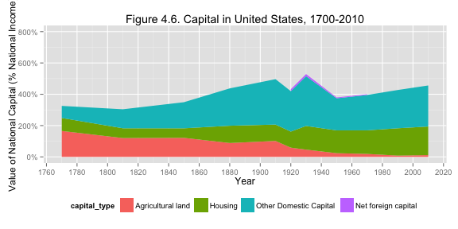
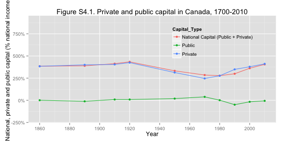
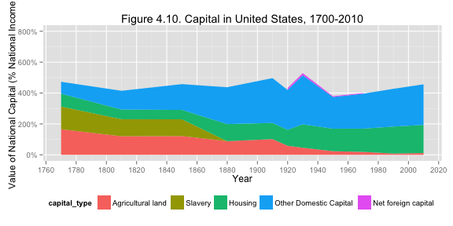

From Old Europe to the New World: Chapter 4
========================================================

### Data provenance

The data were downloaded as Excel files from: http://piketty.pse.ens.fr/en/capital21c2. 

### Loading relevant libraries and data

This document depends on the [xlsx](http://cran.r-project.org/web/packages/xlsx/index.html), [reshape2](http://cran.r-project.org/web/packages/reshape2/index.html), [scales](http://cran.r-project.org/web/packages/scales/index.html), [plyr](http://cran.r-project.org/web/packages/plyr/index.html), and [ggplot2](http://cran.r-project.org/web/packages/ggplot2/index.html) packages.


```r
library(ggplot2)
library(xlsx)
library(reshape2)
### scales for percent of the axes
library(scales)
library(plyr)
```


## Figures 4.1, 4.2, and 4.3 - Germany

These figures are based on Table TS4.1. Here we read
data from the excel file and name the data series.


```r
## Table TS4.1
tab = read.xlsx("../Piketty2014FiguresTables/Chapter4TablesFigures.xlsx", sheetName = "TS4.1", 
    rowIndex = 9:17, colIndex = 1:10, header = FALSE)
names(tab) = c("year", "nat", "nat_land", "nat_house", "nat_dom", "nat_foreign", 
    "public", "public_ass", "public_debt", "private")
```


The caption of the table lists the sources for this table
as 

> Source: Piketty-Zucman 2013, Germany.xls, links frozen on 01-24-2013.       		  				

Let's make a function that will plot our data

```r
run41 = function(tab, num, country) {
    fdat <- tab[, c("year", "nat_land", "nat_house", "nat_dom", "nat_foreign")]
    names(fdat) <- c("year", "Agricultural land", "Housing", "Other Domestic Capital", 
        "Net foreign capital")
    
    # Make the data long for stacking
    fdat <- melt(fdat, id.var = "year")
    names(fdat) <- c("year", "capital_type", "percent")
    
    qplot(year, percent, data = fdat, geom = "ribbon", position = "stack", fill = capital_type, 
        xlab = "Year", ylab = "Value of National Capital (% National Income)") + 
        scale_y_continuous(labels = percent, limits = c(0, 8)) + ggtitle(paste0("Figure ", 
        num, ". Capital in ", country, ", 1700-2010")) + theme(legend.position = "bottom", 
        legend.background = element_rect(fill = "transparent")) + scale_x_continuous(breaks = seq(1700, 
        2020, by = 20))
}
```


Now we make Figure F4.1:


```r
run41(tab, num = "4.1", "Germany")
```

```
## Warning: Removed 2 rows containing missing values (position_stack).
```

```
## ymax not defined: adjusting position using y instead
```

 


Let's make another function to create the plot for F4.2

```r
run42 = function(tab, num, country) {
    fdat <- tab[, c("year", "public_ass", "public_debt")]
    names(fdat) <- c("year", "Public Assets", "Public Debt")
    fdat <- melt(fdat, id.var = "year")
    names(fdat) <- c("year", "Capital", "percent")
    
    qplot(year, percent, data = fdat, geom = c("line", "point"), colour = Capital, 
        xlab = "Year", ylab = "Public assets and debt (% national income)") + 
        scale_y_continuous(labels = percent, limits = c(0, 2.5), oob = squish) + 
        ggtitle(paste0("Figure ", num, ". Public wealth in ", country, ", 1700-2010")) + 
        theme(legend.position = c(0.5, 0.8), legend.background = element_rect(fill = "transparent")) + 
        scale_x_continuous(breaks = seq(1700, 2020, by = 20))
}
```


```r
run42(tab, "4.2", "Germany")
```

 


```r
run43 = function(tab, num, country) {
    fdat <- tab[, c("year", "nat", "public", "private")]
    names(fdat) <- c("year", "National Capital (Public + Private)", "Public", 
        "Private")
    fdat <- melt(fdat, id.var = "year")
    names(fdat) <- c("year", "Capital_Type", "percent")
    
    qplot(year, percent, data = fdat, geom = c("line", "point"), colour = Capital_Type, 
        xlab = "Year", ylab = "National, private and public capital (% national income)") + 
        scale_y_continuous(labels = percent, limits = c(-2, 9)) + ggtitle(paste0("Figure ", 
        num, ". Private and public capital in ", country, ", 1700-2010")) + 
        theme(legend.position = c(0.75, 0.75), legend.background = element_rect(fill = "transparent")) + 
        scale_x_continuous(breaks = seq(1700, 2020, by = 20))
}
```


```r
run43(tab, "4.3", "Germany")
```

 


## Figures 4.4 and 4.5 - Europe

These figures are based on Table TS4.5. Here we read
data from the excel file and name the data series.

According to the table:
> Source: Links to PZ 2013  frozen on 2-8-2013


```r
## Table TS4.5
tab45 = read.xlsx("../Piketty2014FiguresTables/Chapter4TablesFigures.xlsx", 
    sheetName = "TS4.5", rowIndex = 6:20, colIndex = 1:16, header = FALSE)
countries = c("USA", "Germany", "France", "UK", "Europe")
types = c("Private", "National", "Public")
cn = c(sapply(types, paste, countries, sep = "_"))
names(tab45) = c("year", cn)
long45 = melt(tab45, id.vars = "year")
long45$Capital = gsub("(.*)_(.*)", "\\1", long45$variable)
long45$Country = gsub("(.*)_(.*)", "\\2", long45$variable)
long45$variable = NULL
long45$Country = factor(long45$Country, levels = countries)
```


### Figure 4.4


```r
l3 = long45[long45$Country %in% c("Germany", "France", "UK"), ]
l3 = l3[l3$Capital %in% c("Public", "Private"), ]
num = "4.4"
country = "Europe"
qplot(year, value, data = l3, geom = c("line"), colour = Country, shape = Capital, 
    xlab = "Year", ylab = "Public and private capital (% national income)") + 
    scale_y_continuous(labels = percent, limits = c(-2, 8)) + ggtitle(paste0("Figure ", 
    num, ". Private and public capital in ", country, ", 1870-2010")) + theme(legend.position = c(0.25, 
    0.55), legend.background = element_rect(fill = "transparent")) + scale_x_continuous(breaks = seq(1700, 
    2020, by = 20))
```

 


Or we could visualize the countries this faceted by private or public capital

```r

p = ggplot(data = l3, aes(x = year, y = value)) + xlab("Year") + ylab("Public and private capital (% national income)") + 
    scale_y_continuous(labels = percent, limits = c(-2, 8)) + ggtitle(paste0("Figure ", 
    num, ". Private and public capital in ", country, ", 1870-2010")) + theme(legend.position = c(0.6, 
    0.8), legend.background = element_rect(fill = "transparent")) + scale_x_continuous(breaks = seq(1700, 
    2020, by = 20))

p + geom_line(aes(colour = Country)) + facet_wrap(~Capital)
```

 


or colored by capital and faceted by country

```r
p + geom_line(aes(colour = Capital)) + facet_wrap(~Country)
```

 


### Figure 4.5

I kept the last vertical axes the same for comparison.  

```r
l3 = long45[long45$Country %in% c("Germany", "France", "UK"), ]
l3 = l3[l3$Capital %in% c("National"), ]
num = "4.5"
country = "Europe"
p45 = qplot(year, value, data = l3, geom = c("line"), colour = Country, shape = Capital, 
    xlab = "Year", ylab = "Value of national capital (% national income)") + 
    ggtitle(paste0("Figure ", num, ". National capital in ", country, ", 1870-2010")) + 
    theme(legend.position = c(0.25, 0.55), legend.background = element_rect(fill = "transparent")) + 
    scale_x_continuous(breaks = seq(1700, 2020, by = 20))
p45 + scale_y_continuous(labels = percent, limits = c(-2, 8))
```

 


Piketty chose a different axis:


```r
p45 + scale_y_continuous(labels = percent, limits = c(1, 8))
```

 


## Figure 4.6, 4.7, and 4.8


These figures are based on Table TS4.2. Here we read
data from the excel file and name the data series.


```r
## Table TS4.2
tab42 = read.xlsx("../Piketty2014FiguresTables/Chapter4TablesFigures.xlsx", 
    sheetName = "TS4.2", rowIndex = 11:21, colIndex = 1:15, header = FALSE)
names(tab42) = c("year", "nat", "nat_land", "nat_house", "nat_dom", "nat_foreign", 
    "public", "public_ass", "public_debt", "private", "slaves", "nat_cap_slaves")
```


The caption of the table lists the sources for this table
as 

> Source: Piketty-Zucman 2013, USA.xls, links frozen on 01-24-2013.           


### Figure 4.6


```r
run41(tab42, num = "4.6", "United States")
```

```
## Warning: Removed 7 rows containing missing values (position_stack).
```

```
## ymax not defined: adjusting position using y instead
```

 


The negative values get masked, so let's do some lines to show the ovarlap:


```r
run_lines = function(tab, num, country) {
    wide42 = tab[, c("nat_land", "nat_house", "nat_dom", "nat_foreign")]
    wide42 = data.frame(t(apply(wide42, 1, cumsum)))
    wide42$year = tab$year
    colnames(wide42) = gsub("nat_", "", colnames(wide42))
    long42 = melt(wide42, id.vars = "year")
    long42 = rename(long42, c(variable = "Capital_Type"))
    long42$Capital_Type = revalue(long42$Capital_Type, c(land = "Agricultural land", 
        house = "Housing", dom = "Other Domestic Capital", foreign = "Net foreign capital"))
    
    qplot(data = long42, x = year, y = value, colour = Capital_Type, geom = "line", 
        xlab = "Year", ylab = "Value of National Capital (% National Income)") + 
        scale_y_continuous(labels = percent, limits = c(0, 8)) + ggtitle(paste0("Figure ", 
        num, ". Capital in ", country, ", 1700-2010")) + theme(legend.position = c(0.8, 
        0.8), legend.background = element_rect(fill = "transparent")) + scale_x_continuous(breaks = seq(1700, 
        2020, by = 20))
}
run_lines(tab42, 4.6, "United States")
```

 


### Figure 4.7

```r
run42(tab42, num = "4.7", "United States")
```

 


### Figure 4.8


```r
run43(tab42, "4.8", "United States")
```

 


## Figure 4.9, FS4.1, FS4.2


These figures are based on Table TS4.3. Here we read
data from the excel file and name the data series.


```r
## Table TS4.3
tab43 = read.xlsx("../Piketty2014FiguresTables/Chapter4TablesFigures.xlsx", 
    sheetName = "TS4.3", rowIndex = 9:18, colIndex = 1:14, header = FALSE)
names(tab43) = c("year", "nat", "nat_land", "nat_house", "nat_dom", "nat_foreign", 
    "public", "public_ass", "public_debt", "private", "private_land", "private_land_house", 
    "private_land_house_other", "private_foreign")
```


The caption of the table lists the sources for this table
as 

> Source: Piketty-Zucman 2013, Canada.xls, links frozen on 24-01-2013   				

### Figure 4.9


```r
run41(tab43, num = "4.9", "Canada")
```

```
## Warning: Removed 10 rows containing missing values (position_stack).
```

```
## ymax not defined: adjusting position using y instead
```

 


But the foreign capital is actually negative, so it is blocked out.

Let's again look at lines


```r
run_lines(tab43, num = "4.9", "Canada")
```

 


### Figure FS4.1


```r
run42(tab43, num = "S4.1", "Canada")
```

 


### Figure FS4.2


```r
run43(tab43, num = "S4.1", "Canada")
```

 


## Figure 4.10

This figure is similar to 4.6 but has slavery included.


```r
num = "4.10"
country = "United States"
fdat <- tab42[, c("year", "nat_land", "slaves", "nat_house", "nat_dom", "nat_foreign")]
names(fdat) <- c("year", "Agricultural land", "Slavery", "Housing", "Other Domestic Capital", 
    "Net foreign capital")

# Make the data long for stacking
fdat <- melt(fdat, id.var = "year")
names(fdat) <- c("year", "capital_type", "percent")

qplot(year, percent, data = fdat, geom = "ribbon", position = "stack", fill = capital_type, 
    xlab = "Year", ylab = "Value of National Capital (% National Income)") + 
    scale_y_continuous(labels = percent, limits = c(0, 8)) + ggtitle(paste0("Figure ", 
    num, ". Capital in ", country, ", 1700-2010")) + theme(legend.position = "bottom", 
    legend.background = element_rect(fill = "transparent")) + scale_x_continuous(breaks = seq(1700, 
    2020, by = 20))
```

```
## Warning: Removed 7 rows containing missing values (position_stack).
```

```
## ymax not defined: adjusting position using y instead
```

 


and with lines instead of filled in:


```r
wide42 = tab42[, c("nat_land", "slaves", "nat_house", "nat_dom", "nat_foreign")]
wide42 = data.frame(t(apply(wide42, 1, cumsum)))
wide42$year = tab42$year
colnames(wide42) = gsub("nat_", "", colnames(wide42))
long42 = melt(wide42, id.vars = "year")
long42 = rename(long42, c(variable = "Capital_Type"))
noslaves = tab42$year[tab42$slaves == 0]
long42 = long42[!(long42$year > 1880 & long42$Capital_Type == "slaves"), ]

long42$Capital_Type = revalue(long42$Capital_Type, c(land = "Agricultural land", 
    slaves = "Slaves", house = "Housing", dom = "Other Domestic Capital", foreign = "Net foreign capital"))

qplot(data = long42, x = year, y = value, colour = Capital_Type, geom = "line", 
    xlab = "Year", ylab = "Value of National Capital (% National Income)") + 
    scale_y_continuous(labels = percent, limits = c(0, 8)) + ggtitle(paste0("Figure ", 
    num, ". Capital in ", country, ", 1700-2010")) + theme(legend.position = c(0.82, 
    0.78), legend.background = element_rect(fill = "transparent")) + scale_x_continuous(breaks = seq(1700, 
    2020, by = 20))
```

 


## Figure 4.11

This figure are based on Table TS4.4. Here we read
data from the excel file and name the data series.


```r
## Table TS4.4
tab44 = read.xlsx("../Piketty2014FiguresTables/Chapter4TablesFigures.xlsx", 
    sheetName = "TS4.4", rowIndex = 9:12, colIndex = 1:7, header = FALSE)
names(tab44) = c("country", "nat", "nat_land", "slaves", "nat_house", "nat_dom", 
    "nat_foreign")
```


The caption of the table lists the sources for this table
as 

> Source: UK, France: links to Tables TS3.1, TS3.2 frozen on 2-8-13.
UK, France: links to Tables TS3.1, TS3.2 frozen on 2-8-13.
(UK: average 1750-1810; France 1780)	(UK: moyenne 1750-1810; France 1780)


```r
## Table TS4.4
l44 <- tab44[, c("country", "nat_land", "slaves", "nat_house", "nat_dom")]
names(l44) <- c("Country", "Agricultural land", "Slavery", "Housing", "Other Domestic Capital")
num = "4.11"
l44 = melt(l44, id.vars = "Country")
l44$Country = factor(l44$Country, levels = tab44$country)
qplot(y = value, x = Country, fill = variable, data = l44) + geom_bar(stat = "identity", 
    xlab = "") + scale_y_continuous(labels = percent, limits = c(0, 8)) + ggtitle("Figure 4.11. Capital around 1770-1810: Old an New World") + 
    theme(legend.position = c(0.89, 0.7), legend.background = element_rect(fill = "transparent")) + 
    scale_fill_discrete(guide = guide_legend(reverse = TRUE, title = NULL)) + 
    ylab("Value of National Capital (% National Income)")
```

 


